RNA_render_test.R
================
mmarcao
2025-02-07

``` r
### Description: from expression matrix (count matrix) to downsteram analysis 
### Technology: bulk RNA-seq

library(DESeq2)
library(sva)
library(dplyr)
library(stringr)
library(EnhancedVolcano)
library(org.Hs.eg.db)
library(ggplot2)
library(UpSetR)

### Differential Expressed Genes -----------
load("/mnt/scratch1/maycon/Larissa_inffibrosarcoma/scripts_git/bulk_RNA/objects/Round1/reviewed_smpID_countmtx_labsheet.rda")
labsheet
```

    ##    tumor_site
    ## 1          ST
    ## 2          ST
    ## 3          ST
    ## 4          ST
    ## 5          ST
    ## 6          ST
    ## 7          ST
    ## 8          ST
    ## 9          ST
    ## 10         ST
    ## 12         ST
    ## 13         ST
    ## 14         ST
    ## 15         ST
    ## 16         ST
    ## 17         ST
    ## 20         ST
    ## 21         ST
    ## 23         ST
    ## 24         ST
    ## 25         ST
    ## 26         BT
    ## 27         ST
    ## 28         ST
    ## 29         ST
    ## 91         ST
    ##                                                                                                              histologic_diagnosis
    ## 1                                                                             Spindle cell neoplasm with NRF1::BRAF rearrangement
    ## 2                                                                                                           Spindle cell neoplasm
    ## 3                                                                                                           Spindle cell neoplasm
    ## 4                                                                 Spindle cell neoplasm with evidence of TPR::NTRK1 rearrangement
    ## 5                                                                              Spindle cell sarcoma with NTRK1 gene rearrangement
    ## 6                                                                                           NTRK-rearranged spindle cell neoplasm
    ## 7                             malignant spindle cell neoplasm with TPR::NTRK1 fusion, most in keeping with infantile fibrosarcoma
    ## 8                                                     low-grade sarcoma with LMNA-NTRK1 fusion and homozygous deletion of CDKN2A,
    ## 9                                                                                                                Lipofibromatosis
    ## 10                                                                           Recurrent/residual variant of infantile fibrosarcoma
    ## 12                                                                                              Infantile fibrosarcoma-like tumor
    ## 13 Congenital NTRK-rearranged spindle cell neoplasm of the gastrointestinal tract with evidence of RBPMS::NTRK3 fusion transcript
    ## 14                                                                              Spindle cell neoplasm with ALK gene rearrangement
    ## 15                  Low-grade fibroblastic neoplasm with neural differentiation suggestive of NTRK1-associated mesenchymal tumor.
    ## 16                                                                                          suspicious for infantile fibrosarcoma
    ## 17                                                 Spindle cell neoplasm with TPM3::NTRK1 fusion, most c/w infantile fibrosarcoma
    ## 20                                                                    NTRK-rearranged sarcoma with evidence of TPM3::NTRK1 fusion
    ## 21                                                                                                                            IFS
    ## 23                                                                                                                            IFS
    ## 24                                                                                                                            IFS
    ## 25                                                                                                                            IFS
    ## 26                                                                                                                            IFS
    ## 27                                                                                                                            IFS
    ## 28                                                                                                                            IFS
    ## 29                                                                                                                            IFS
    ## 91                                                                                                               Lipofibromatosis
    ##                      tumor_location           smpID     smp_type
    ## 1                           forearm   SJST033983_D1         FFPE
    ## 2                       bone, tibia   SJST032767_D1         FFPE
    ## 3                              calf   SJST032767_D2 Fresh/frozen
    ## 4                              foot   SJST034397_D1         FFPE
    ## 5                 soft tissue, back   SJST031920_D1         FFPE
    ## 6       soft tissue, posterior neck   SJST033491_D1         FFPE
    ## 7           soft tissue, chest wall   SJST033389_D1         FFPE
    ## 8        soft tissue, frontal scalp   SJST031690_D1         FFPE
    ## 9                       hip/buttock   SJST031362_D1         FFPE
    ## 10                            thigh   SJST030375_R2 Fresh/frozen
    ## 12                             neck   SJST031792_D1         FFPE
    ## 13        small intestine (jejunum)   SJST033791_D1         FFPE
    ## 14                soft tissue, back   SJST033835_D1         FFPE
    ## 15           soft tissue, abdominal   SJST033308_D1         FFPE
    ## 16      soft tissue, abdominal wall   SJST034534_D1         FFPE
    ## 17                              leg   SJST034036_D1         FFPE
    ## 20                            thigh   SJST034815_D1         FFPE
    ## 21                          buttock   SJST032952_D2 Fresh/frozen
    ## 23                           pelvis   SJST032952_D4 Fresh/frozen
    ## 24                              leg   SJST033312_D1 Fresh/frozen
    ## 25                       chest wall   SJST032838_D1         FFPE
    ## 26 middle fossa, temporal bone/dura   SJBT032721_D1         FFPE
    ## 27                              arm  SJIFS031085_D1         FFPE
    ## 28                             lung   SJST030567_D1         FFPE
    ## 29                      bone, tibia   SJST030433_D1         FFPE
    ## 91                      hip/buttock SJST031362_D1.1         FFPE
    ##                     group
    ## 1      kinase-fused tumor
    ## 2      kinase-fused tumor
    ## 3      kinase-fused tumor
    ## 4      kinase-fused tumor
    ## 5      kinase-fused tumor
    ## 6      kinase-fused tumor
    ## 7      kinase-fused tumor
    ## 8      kinase-fused tumor
    ## 9      kinase-fused tumor
    ## 10     kinase-fused tumor
    ## 12     kinase-fused tumor
    ## 13     kinase-fused tumor
    ## 14     kinase-fused tumor
    ## 15     kinase-fused tumor
    ## 16     kinase-fused tumor
    ## 17     kinase-fused tumor
    ## 20     kinase-fused tumor
    ## 21 ETV6-NTRK3 fused tumor
    ## 23 ETV6-NTRK3 fused tumor
    ## 24 ETV6-NTRK3 fused tumor
    ## 25 ETV6-NTRK3 fused tumor
    ## 26 ETV6-NTRK3 fused tumor
    ## 27 ETV6-NTRK3 fused tumor
    ## 28 ETV6-NTRK3 fused tumor
    ## 29 ETV6-NTRK3 fused tumor
    ## 91     kinase-fused tumor

``` r
count_matrix
```

    ##                   SJBT032721_D1 SJIFS031085_D1 SJST030433_D1
    ## ENSG00000223972.4            18              1             1
    ## ENSG00000227232.4          1325           1164           878
    ## ENSG00000243485.2             4              2             5
    ## ENSG00000237613.2             2              0             3
    ## ENSG00000268020.2             0              0             0
    ## ENSG00000240361.1             0              0             0
    ## ENSG00000186092.4             0              0             0
    ## ENSG00000238009.2            76             25            49
    ## ENSG00000239945.1             0              0             0
    ## ENSG00000233750.3             7              0             0
    ## ENSG00000237683.5           180            145           115
    ## ENSG00000268903.1            12             10             5
    ## ENSG00000269981.1             0              0             0
    ## ENSG00000239906.1           100             52            73
    ## ENSG00000241860.2          1079            574           789
    ## ENSG00000222623.1             3             19            11
    ## ENSG00000241599.1             0              0             0
    ## ENSG00000228463.4           138             63            57
    ## ENSG00000241670.2             0              0             0
    ## ENSG00000237094.7           711            365           679
    ## ENSG00000250575.1            11              3            18
    ## ENSG00000233653.3             5              0             0
    ## ENSG00000224813.2             0              0             2
    ## ENSG00000235249.1            28              0            33
    ## ENSG00000269732.1             0              0             0
    ## ENSG00000256186.1             2              0             0
    ## ENSG00000236601.1             0              0             0
    ## ENSG00000236743.1             6              0            10
    ## ENSG00000236679.2            33             13            42
    ## ENSG00000231709.1             3              0             9
    ## ENSG00000235146.2             0              0             0
    ## ENSG00000239664.2             5              0            10
    ## ENSG00000230021.3            90             40           105
    ## ENSG00000223659.1             6              0            10
    ## ENSG00000225972.1            53             23            52
    ## ENSG00000225630.1          1777            334           515
    ## ENSG00000237973.1         11385           4609          4520
    ## ENSG00000229344.1            84             45            63
    ##                   SJST030567_D1 SJST032838_D1 SJST032952_D2
    ## ENSG00000223972.4            22             2            12
    ## ENSG00000227232.4          1426          2105          1990
    ## ENSG00000243485.2            14             7             9
    ## ENSG00000237613.2             9             3             0
    ## ENSG00000268020.2             0             0             0
    ## ENSG00000240361.1             0             0             0
    ## ENSG00000186092.4             0             0             0
    ## ENSG00000238009.2           149           127            59
    ## ENSG00000239945.1             0             0             0
    ## ENSG00000233750.3             4             0             0
    ## ENSG00000237683.5           330           958           140
    ## ENSG00000268903.1            30            52             4
    ## ENSG00000269981.1             0             0             0
    ## ENSG00000239906.1           145           290            31
    ## ENSG00000241860.2          2333          3658           419
    ## ENSG00000222623.1            16            50             5
    ## ENSG00000241599.1             0             0             0
    ## ENSG00000228463.4           141           141           206
    ## ENSG00000241670.2             0             0             0
    ## ENSG00000237094.7          1477          2218           432
    ## ENSG00000250575.1             4            23             8
    ## ENSG00000233653.3             3             0             0
    ## ENSG00000224813.2             1             0             1
    ## ENSG00000235249.1           102            53             8
    ## ENSG00000269732.1             0             0             0
    ## ENSG00000256186.1             0             0             0
    ## ENSG00000236601.1             0             0             0
    ## ENSG00000236743.1            26             6             4
    ## ENSG00000236679.2            26            33            50
    ## ENSG00000231709.1            17             9             8
    ## ENSG00000235146.2             0             0             0
    ## ENSG00000239664.2             6             4             2
    ## ENSG00000230021.3           337           158            96
    ## ENSG00000223659.1            19            12             0
    ## ENSG00000225972.1           175           452            65
    ## ENSG00000225630.1          3147          4696           883
    ## ENSG00000237973.1         12304         29627         16229
    ## ENSG00000229344.1            52           451           228
    ##                   SJST032952_D4 SJST033312_D1 SJST030375_R2
    ## ENSG00000223972.4            16             0             5
    ## ENSG00000227232.4          2530             9          1701
    ## ENSG00000243485.2             2             0             4
    ## ENSG00000237613.2             2             0             0
    ## ENSG00000268020.2             1             0             0
    ## ENSG00000240361.1             0             0             0
    ## ENSG00000186092.4             1             0             0
    ## ENSG00000238009.2           121             0            73
    ## ENSG00000239945.1             0             0             0
    ## ENSG00000233750.3             4             0             0
    ## ENSG00000237683.5           313             0           296
    ## ENSG00000268903.1            11             2            11
    ## ENSG00000269981.1             0             0             0
    ## ENSG00000239906.1            62             0           106
    ## ENSG00000241860.2           796             6          1570
    ## ENSG00000222623.1             8             0            20
    ## ENSG00000241599.1             1             0             0
    ## ENSG00000228463.4           420             0           168
    ## ENSG00000241670.2             0             0             0
    ## ENSG00000237094.7           803             3           876
    ## ENSG00000250575.1            26             0            37
    ## ENSG00000233653.3             3             0             0
    ## ENSG00000224813.2             0             0             0
    ## ENSG00000235249.1            45             0            11
    ## ENSG00000269732.1             0             0             0
    ## ENSG00000256186.1             0             0             1
    ## ENSG00000236601.1             1             0             2
    ## ENSG00000236743.1            15             0             1
    ## ENSG00000236679.2            90             0           101
    ## ENSG00000231709.1            15             0             2
    ## ENSG00000235146.2             0             0             0
    ## ENSG00000239664.2            12             0             4
    ## ENSG00000230021.3           322             1            90
    ## ENSG00000223659.1            16             0             1
    ## ENSG00000225972.1           275             0            91
    ## ENSG00000225630.1          4377            11          2405
    ## ENSG00000237973.1         23628            23         12264
    ## ENSG00000229344.1           633             0           260
    ##                   SJST031362_D1 SJST031362_D1.1 SJST031690_D1
    ## ENSG00000223972.4             6            9283             6
    ## ENSG00000227232.4           659           29708          1054
    ## ENSG00000243485.2             5            1230             3
    ## ENSG00000237613.2             1            5680             5
    ## ENSG00000268020.2             0               1             0
    ## ENSG00000240361.1             0               0             0
    ## ENSG00000186092.4             0            3656             0
    ## ENSG00000238009.2            31            1032            55
    ## ENSG00000239945.1             0               0             0
    ## ENSG00000233750.3             1             647             0
    ## ENSG00000237683.5           199            8166           287
    ## ENSG00000268903.1             9               7             7
    ## ENSG00000269981.1             0               0             0
    ## ENSG00000239906.1            64              69            71
    ## ENSG00000241860.2           696            1219           941
    ## ENSG00000222623.1             7               6            19
    ## ENSG00000241599.1             0               2             0
    ## ENSG00000228463.4            76             725           177
    ## ENSG00000241670.2             0               0             0
    ## ENSG00000237094.7           548           19957           823
    ## ENSG00000250575.1             7             711             1
    ## ENSG00000233653.3             2             219             0
    ## ENSG00000224813.2             0               2             0
    ## ENSG00000235249.1             1            6537            21
    ## ENSG00000269732.1             0              36             0
    ## ENSG00000256186.1             0               2             0
    ## ENSG00000236601.1             0             527             0
    ## ENSG00000236743.1             1               2             8
    ## ENSG00000236679.2             9            8786            20
    ## ENSG00000231709.1             2               1             9
    ## ENSG00000235146.2             0            1189             0
    ## ENSG00000239664.2             3             116             3
    ## ENSG00000230021.3            33            2591           110
    ## ENSG00000223659.1             0               1             4
    ## ENSG00000225972.1           169             268           316
    ## ENSG00000225630.1          2898            3414          3839
    ## ENSG00000237973.1          7570            9637         15359
    ## ENSG00000229344.1           125             161           208
    ##                   SJST031792_D1 SJST031920_D1 SJST032767_D1
    ## ENSG00000223972.4             6            41             3
    ## ENSG00000227232.4          1297          2843          1952
    ## ENSG00000243485.2             8             9             8
    ## ENSG00000237613.2             8            12            11
    ## ENSG00000268020.2             0             0             0
    ## ENSG00000240361.1             0             0             0
    ## ENSG00000186092.4             0             0             0
    ## ENSG00000238009.2           133           151           160
    ## ENSG00000239945.1             0             0             0
    ## ENSG00000233750.3             0             0             0
    ## ENSG00000237683.5           428           571            92
    ## ENSG00000268903.1            15            12            10
    ## ENSG00000269981.1             0             0             0
    ## ENSG00000239906.1           233           115           111
    ## ENSG00000241860.2          1314          1051          1060
    ## ENSG00000222623.1             6            11             8
    ## ENSG00000241599.1             1             0             0
    ## ENSG00000228463.4           217           270           625
    ## ENSG00000241670.2             0             0             0
    ## ENSG00000237094.7          1676          1491          1030
    ## ENSG00000250575.1            12            13             3
    ## ENSG00000233653.3             0             0             0
    ## ENSG00000224813.2             0             0             0
    ## ENSG00000235249.1           102            67             1
    ## ENSG00000269732.1             0             0             0
    ## ENSG00000256186.1             0             0             0
    ## ENSG00000236601.1             0             2             0
    ## ENSG00000236743.1            20            13             4
    ## ENSG00000236679.2            23            23            75
    ## ENSG00000231709.1            21            13             3
    ## ENSG00000235146.2             0             0             0
    ## ENSG00000239664.2             6            13             0
    ## ENSG00000230021.3           321           331           201
    ## ENSG00000223659.1            38            13             0
    ## ENSG00000225972.1           407          2058            31
    ## ENSG00000225630.1          2700         15318          1627
    ## ENSG00000237973.1          8344         92938          6640
    ## ENSG00000229344.1           192          2172            48
    ##                   SJST032767_D2 SJST033308_D1 SJST033389_D1
    ## ENSG00000223972.4             0            21             6
    ## ENSG00000227232.4          1426          2346           910
    ## ENSG00000243485.2             2             6             4
    ## ENSG00000237613.2             6            10             0
    ## ENSG00000268020.2             0             0             0
    ## ENSG00000240361.1             0             0             0
    ## ENSG00000186092.4             0             0             0
    ## ENSG00000238009.2            43           258            58
    ## ENSG00000239945.1             0             0             0
    ## ENSG00000233750.3             0             5             0
    ## ENSG00000237683.5            61           812           363
    ## ENSG00000268903.1             0            15             9
    ## ENSG00000269981.1             0             0             0
    ## ENSG00000239906.1            21           160           181
    ## ENSG00000241860.2           188          1495          2431
    ## ENSG00000222623.1             0            16             4
    ## ENSG00000241599.1             0             0             0
    ## ENSG00000228463.4           219           332            84
    ## ENSG00000241670.2             0             0             0
    ## ENSG00000237094.7           198          1924          1379
    ## ENSG00000250575.1             0            16            16
    ## ENSG00000233653.3             0             1             0
    ## ENSG00000224813.2             0             0             0
    ## ENSG00000235249.1             0            78            43
    ## ENSG00000269732.1             0             0             0
    ## ENSG00000256186.1             0             0             0
    ## ENSG00000236601.1             0             0             1
    ## ENSG00000236743.1             1            13             6
    ## ENSG00000236679.2            43            61            29
    ## ENSG00000231709.1             0            16             5
    ## ENSG00000235146.2             0             0             0
    ## ENSG00000239664.2             0            12            11
    ## ENSG00000230021.3            38           387           133
    ## ENSG00000223659.1             0            30            18
    ## ENSG00000225972.1            33           830           756
    ## ENSG00000225630.1           899          3507          5707
    ## ENSG00000237973.1          7750         13460         37380
    ## ENSG00000229344.1           106           177           275
    ##                   SJST033491_D1 SJST033791_D1 SJST033835_D1
    ## ENSG00000223972.4            33            49             0
    ## ENSG00000227232.4          1311           868           535
    ## ENSG00000243485.2             9            21             0
    ## ENSG00000237613.2            26            34             0
    ## ENSG00000268020.2             0            20             0
    ## ENSG00000240361.1             0             6             0
    ## ENSG00000186092.4             0             7             0
    ## ENSG00000238009.2           130           101           102
    ## ENSG00000239945.1             0             0             0
    ## ENSG00000233750.3             0           144             0
    ## ENSG00000237683.5           546           345           140
    ## ENSG00000268903.1            12            11             0
    ## ENSG00000269981.1             0             0             0
    ## ENSG00000239906.1            91           132            26
    ## ENSG00000241860.2          1715          1504           666
    ## ENSG00000222623.1            13            29             6
    ## ENSG00000241599.1             0             9             1
    ## ENSG00000228463.4           138           200           125
    ## ENSG00000241670.2             0             0             0
    ## ENSG00000237094.7          1590           945           548
    ## ENSG00000250575.1             7            16             4
    ## ENSG00000233653.3             0           113             0
    ## ENSG00000224813.2             1             0             0
    ## ENSG00000235249.1             7            51            71
    ## ENSG00000269732.1             0             1             0
    ## ENSG00000256186.1             0             5             0
    ## ENSG00000236601.1             2             7             0
    ## ENSG00000236743.1             2            11            19
    ## ENSG00000236679.2            40            13            70
    ## ENSG00000231709.1             3             8            21
    ## ENSG00000235146.2             1             4             0
    ## ENSG00000239664.2             0            18            13
    ## ENSG00000230021.3           165           204           256
    ## ENSG00000223659.1             2            21            19
    ## ENSG00000225972.1           539           158          1178
    ## ENSG00000225630.1          4859          3147          2735
    ## ENSG00000237973.1         25373         13392         26765
    ## ENSG00000229344.1           560           310           312
    ##                   SJST033983_D1 SJST034036_D1 SJST034397_D1
    ## ENSG00000223972.4             4             8            51
    ## ENSG00000227232.4           960          1213          4741
    ## ENSG00000243485.2             1            10            81
    ## ENSG00000237613.2            15            12            55
    ## ENSG00000268020.2             0             0             0
    ## ENSG00000240361.1             0             0             0
    ## ENSG00000186092.4             0             0             0
    ## ENSG00000238009.2           109           111           387
    ## ENSG00000239945.1             0             0             0
    ## ENSG00000233750.3             1             0             1
    ## ENSG00000237683.5           413           566           913
    ## ENSG00000268903.1            10             6            21
    ## ENSG00000269981.1             0             0             0
    ## ENSG00000239906.1            97           111           313
    ## ENSG00000241860.2          1249          1170          5018
    ## ENSG00000222623.1            15            12            13
    ## ENSG00000241599.1             0             0             3
    ## ENSG00000228463.4            85           220           520
    ## ENSG00000241670.2             0             0             0
    ## ENSG00000237094.7          1006          1114          3885
    ## ENSG00000250575.1            12            11            30
    ## ENSG00000233653.3             1             0             0
    ## ENSG00000224813.2             0             1             0
    ## ENSG00000235249.1            45            39            93
    ## ENSG00000269732.1             0             0             0
    ## ENSG00000256186.1             0             0             0
    ## ENSG00000236601.1             0             1             0
    ## ENSG00000236743.1            18             6            23
    ## ENSG00000236679.2            29            28           144
    ## ENSG00000231709.1            13            12            29
    ## ENSG00000235146.2             0             0             0
    ## ENSG00000239664.2             9             3             9
    ## ENSG00000230021.3           159           167           621
    ## ENSG00000223659.1            10             8            18
    ## ENSG00000225972.1            98           392           260
    ## ENSG00000225630.1          2373          5099          6116
    ## ENSG00000237973.1         12607         18396         38198
    ## ENSG00000229344.1           213           588           555
    ##                   SJST034534_D1 SJST034815_D1
    ## ENSG00000223972.4            24             0
    ## ENSG00000227232.4          2970           645
    ## ENSG00000243485.2             6            17
    ## ENSG00000237613.2             5             6
    ## ENSG00000268020.2             0             0
    ## ENSG00000240361.1             0             0
    ## ENSG00000186092.4             0             0
    ## ENSG00000238009.2           272           168
    ## ENSG00000239945.1             0             0
    ## ENSG00000233750.3             0             0
    ## ENSG00000237683.5           583           344
    ## ENSG00000268903.1            10             8
    ## ENSG00000269981.1             0             0
    ## ENSG00000239906.1           179           102
    ## ENSG00000241860.2          1870          1367
    ## ENSG00000222623.1            33            23
    ## ENSG00000241599.1             0             0
    ## ENSG00000228463.4           511           229
    ## ENSG00000241670.2             0             0
    ## ENSG00000237094.7          1938          1020
    ## ENSG00000250575.1             3             5
    ## ENSG00000233653.3             2             0
    ## ENSG00000224813.2             0             0
    ## ENSG00000235249.1            91            76
    ## ENSG00000269732.1             0             0
    ## ENSG00000256186.1             0             0
    ## ENSG00000236601.1             0             0
    ## ENSG00000236743.1             9            14
    ## ENSG00000236679.2            47            31
    ## ENSG00000231709.1            10            14
    ## ENSG00000235146.2             0             0
    ## ENSG00000239664.2             6            14
    ## ENSG00000230021.3           360           315
    ## ENSG00000223659.1            15            18
    ## ENSG00000225972.1           790           307
    ## ENSG00000225630.1         10897          4495
    ## ENSG00000237973.1         63014         19715
    ## ENSG00000229344.1           624           410
    ##  [ reached 'max' / getOption("max.print") -- omitted 63530 rows ]

``` r
labsheet$group<- gsub(' ', '_', labsheet$group)

# Convert gene ID
rownames(count_matrix) <- str_split_fixed(as.character(rownames(count_matrix)), "[.]", 2)[,1] # good it doesn't have duplicates ENSEMBL here
count_matrix <- data.frame(count_matrix)
ens <- rownames(count_matrix) #genes from DE
library(org.Hs.eg.db)
symbols <- mapIds(org.Hs.eg.db, keys = ens,
                  column = c('SYMBOL'), keytype = 'ENSEMBL')
```

    ## 'select()' returned 1:many mapping between keys and columns

``` r
symbols <- symbols[!is.na(symbols)]

symbols <- data.frame(ENSEMBL = names(symbols),
                      SYMBOL = as.vector(symbols))

count_matrix$ENSEMBL <- rownames(count_matrix)

count_matrix <- merge(count_matrix, symbols, by='ENSEMBL')
count_matrix <- count_matrix[!duplicated(count_matrix$SYMBOL), ]
rownames(count_matrix) <- count_matrix$SYMBOL
count_matrix$ENSEMBL <- NULL
count_matrix$SYMBOL <- NULL
head(count_matrix); dim(count_matrix) #33909    26
```

    ##        SJBT032721_D1 SJIFS031085_D1 SJST030433_D1 SJST030567_D1
    ## TSPAN6           660            563           408          1680
    ## TNMD              23            442           343             9
    ## DPM1             397            362           250           846
    ## SCYL3            443            268           310           796
    ## FIRRM            265            404           357           583
    ## FGR              422             63            23           157
    ##        SJST032838_D1 SJST032952_D2 SJST032952_D4 SJST033312_D1
    ## TSPAN6           683          3428          1212             3
    ## TNMD               7           866             1             0
    ## DPM1             492          2099          2209             2
    ## SCYL3            865           692           912             5
    ## FIRRM            756           736           810             1
    ## FGR              801           149           330             1
    ##        SJST030375_R2 SJST031362_D1 SJST031362_D1.1 SJST031690_D1
    ## TSPAN6          1546           136             927           372
    ## TNMD               6            10             685           183
    ## DPM1             949           120            2701           350
    ## SCYL3            966           292            2377           385
    ## FIRRM            693           104            2784           247
    ## FGR              927           224            2161           670
    ##        SJST031792_D1 SJST031920_D1 SJST032767_D1 SJST032767_D2
    ## TSPAN6           510           675          1713          2662
    ## TNMD             103             2           134            31
    ## DPM1             226          1002           654           789
    ## SCYL3            811           816          1068           702
    ## FIRRM            452           647           578           354
    ## FGR               63           177           130           126
    ##        SJST033308_D1 SJST033389_D1 SJST033491_D1 SJST033791_D1
    ## TSPAN6           776          1377          1043           583
    ## TNMD             510          2305           629          1774
    ## DPM1             476           875           546           447
    ## SCYL3            918           915           710           487
    ## FIRRM            511           936           477           322
    ## FGR              360            47           119           121
    ##        SJST033835_D1 SJST033983_D1 SJST034036_D1 SJST034397_D1
    ## TSPAN6           439           480           573          3000
    ## TNMD               0             0           157           296
    ## DPM1             533           381           324          1584
    ## SCYL3            475           534           529          2209
    ## FIRRM            300           327           370          1816
    ## FGR               50           276           131           222
    ##        SJST034534_D1 SJST034815_D1
    ## TSPAN6          1173          1000
    ## TNMD            2218           236
    ## DPM1             996           395
    ## SCYL3           1518           753
    ## FIRRM            698           387
    ## FGR              722           196

    ## [1] 33909    26

``` r
# remove outlier
count_matrix <- count_matrix[, !colnames(count_matrix) %in% "SJST034534_D1"]
dim(count_matrix) #25 smp
```

    ## [1] 33909    25

``` r
labsheet <- labsheet[!labsheet$smpID %in% "SJST034534_D1", ]
dim(labsheet)#25 smp
```

    ## [1] 25  6

``` r
# Create histologic_for_outlier column 
labsheet$histologic_for_outlier <- 'Others'
outlier_smp <- c('SJST033491_D1',
                 'SJST032952_D2',
                 'SJST032952_D4',
                 'SJST032767_D2',
                 'SJST033312_D1',
                 'SJST033835_D1',
                 'SJST031920_D1')
his_diag <- labsheet[labsheet$smpID %in% outlier_smp, ]$histologic_diagnosis

labsheet[labsheet$smpID %in% outlier_smp[1], ]$histologic_for_outlier <- his_diag[1]
labsheet[labsheet$smpID %in% outlier_smp[2], ]$histologic_for_outlier <- his_diag[2]
labsheet[labsheet$smpID %in% outlier_smp[3], ]$histologic_for_outlier <- his_diag[3]
labsheet[labsheet$smpID %in% outlier_smp[4], ]$histologic_for_outlier <- his_diag[4]
labsheet[labsheet$smpID %in% outlier_smp[5], ]$histologic_for_outlier <- his_diag[5]
labsheet[labsheet$smpID %in% outlier_smp[6], ]$histologic_for_outlier <- his_diag[6]
labsheet[labsheet$smpID %in% outlier_smp[7], ]$histologic_for_outlier <- his_diag[7]


# make it identical (same sequence)
count_matrix <- count_matrix[, labsheet$smpID]
identical(colnames(count_matrix), labsheet$smpID) #TRUE
```

    ## [1] TRUE

``` r
# add rownames into labsheet
rownames(labsheet) <- labsheet$smpID


# Differential Expression -----
# make it identical (same sequence)
count_matrix <- count_matrix[, labsheet$smpID]
identical(colnames(count_matrix), labsheet$smpID) #TRUE
```

    ## [1] TRUE

``` r
# add rownames into labsheet
rownames(labsheet) <- labsheet$smpID
# leave labsheet with only variables we want in the matrix design 
labsheet <- labsheet[, c("group", "smp_type") ]

# write.csv(labsheet, "/mnt/scratch1/maycon/Larissa_inffibrosarcoma/scripts_git/round_4/Objects/metadata_RNA_sample_ID.csv")

head(labsheet)
```

    ##                            group     smp_type
    ## SJST033983_D1 kinase-fused_tumor         FFPE
    ## SJST032767_D1 kinase-fused_tumor         FFPE
    ## SJST032767_D2 kinase-fused_tumor Fresh/frozen
    ## SJST034397_D1 kinase-fused_tumor         FFPE
    ## SJST031920_D1 kinase-fused_tumor         FFPE
    ## SJST033491_D1 kinase-fused_tumor         FFPE

``` r
# Create DESEq object 
dds <- DESeqDataSetFromMatrix(count_matrix, colData = labsheet, design = ~ smp_type + group)
```

    ## Warning in DESeqDataSet(se, design = design, ignoreRank): some
    ## variables in design formula are characters, converting to factors

    ##   Note: levels of factors in the design contain characters other than
    ##   letters, numbers, '_' and '.'. It is recommended (but not required) to use
    ##   only letters, numbers, and delimiters '_' or '.', as these are safe characters
    ##   for column names in R. [This is a message, not a warning or an error]

``` r
# Important step for further normalization during DESEq()
dds <- estimateSizeFactors(dds)
```

    ##   Note: levels of factors in the design contain characters other than
    ##   letters, numbers, '_' and '.'. It is recommended (but not required) to use
    ##   only letters, numbers, and delimiters '_' or '.', as these are safe characters
    ##   for column names in R. [This is a message, not a warning or an error]

``` r
# sizeFactors(dds) #Idk what it does ... neither if we need to run it
# Pre-filtering 
smallestGroupSize <- min(as.vector(table(dds$group)))
keep <- rowSums(counts(dds) >= 10) >= smallestGroupSize
dds <- dds[keep,]
# indicate direction for comparison
# dds$condition <- relevel(dds$group, ref = "kinase-fused_tumor")
# dds$group <- relevel(dds$group, ref = "ETV6-NTRK3_fused_tumor")
# dds$group <- relevel(dds$group, ref = "kinase-fused_tumor")

# Run Differential Expression analysis
dds <- DESeq(dds)
```

    ## using pre-existing size factors

    ## estimating dispersions

    ## gene-wise dispersion estimates

    ## mean-dispersion relationship

    ##   Note: levels of factors in the design contain characters other than
    ##   letters, numbers, '_' and '.'. It is recommended (but not required) to use
    ##   only letters, numbers, and delimiters '_' or '.', as these are safe characters
    ##   for column names in R. [This is a message, not a warning or an error]

    ## final dispersion estimates

    ## fitting model and testing

    ##   Note: levels of factors in the design contain characters other than
    ##   letters, numbers, '_' and '.'. It is recommended (but not required) to use
    ##   only letters, numbers, and delimiters '_' or '.', as these are safe characters
    ##   for column names in R. [This is a message, not a warning or an error]

    ## -- replacing outliers and refitting for 1721 genes
    ## -- DESeq argument 'minReplicatesForReplace' = 7 
    ## -- original counts are preserved in counts(dds)

    ## estimating dispersions

    ## fitting model and testing

    ##   Note: levels of factors in the design contain characters other than
    ##   letters, numbers, '_' and '.'. It is recommended (but not required) to use
    ##   only letters, numbers, and delimiters '_' or '.', as these are safe characters
    ##   for column names in R. [This is a message, not a warning or an error]

``` r
res <- results(dds, contrast = c("group", 
                                 "kinase-fused_tumor", #direction
                                 "ETV6-NTRK3_fused_tumor"))
res_kinaseDirection <- as.data.frame(res)

# Filter results for significant genes
# Subset stat. significant genes
res_pos <- subset(res_kinaseDirection, res_kinaseDirection$padj < 0.05 & res_kinaseDirection$log2FoldChange >= 0.5)
res_neg <- subset(res_kinaseDirection, res_kinaseDirection$padj < 0.05 & res_kinaseDirection$log2FoldChange <= -0.5)
res_sig <- rbind(res_pos, res_neg)
dim(res_sig) #617   6
```

    ## [1] 617   6

``` r
# PLOT - FoldChange distribution - histogram
hist(res_sig$log2FoldChange, 
     main = "FoldChange dist. (s.sig DEGs)", 
     xlab = "FoldChange",
     ylab = "N of genes")
```

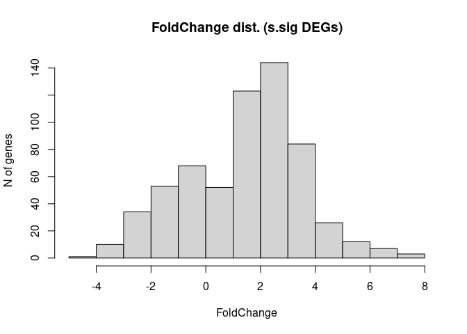<!-- -->

``` r
# saveRDS(res_kinaseDirection, "/mnt/scratch1/maycon/Larissa_inffibrosarcoma/scripts_git/round_4/Objects/DEGs_kinase_direction_noCutoffs.rds")
# saveRDS(res_sig, "/mnt/scratch1/maycon/Larissa_inffibrosarcoma/scripts_git/round_4/Objects/DEGs_kinase_direction_filtered_617genes.rds")
# saveRDS(dds, "/mnt/scratch1/maycon/Larissa_inffibrosarcoma/scripts_git/round_4/Objects/dds_RNA.rds")


## PCA 
dds <- readRDS("/mnt/scratch1/maycon/Larissa_inffibrosarcoma/scripts_git/round_4/Objects/dds_RNA.rds")
normalized_counts <- counts(dds, normalized=TRUE)
pca <- prcomp(t(normalized_counts)) 
aux <- as.data.frame(pca$x[, 1:3]) 
labsheet$smpID <- rownames(labsheet)
scores <- merge(labsheet, aux, by.y=0, by.x="smpID", all.x=T)
# Plot it 
#png(filename = "/mnt/scratch1/maycon/Larissa_inffibrosarcoma/scripts_git/round_4/Plots/RNA_PCA.#png",  width = 8, height = 6, units = "in", res = 300)

library(ggplot2); theme_set(theme_classic())
p <- ggplot(scores, aes(x=PC1, y=PC2, colour=factor(group), shape = smp_type)) +
  geom_point(size = 4) +
  scale_color_manual(values=c('slateblue3', 'wheat3'), name="Group") +
  xlab(paste0("PC1 (", prettyNum(summary(pca)$importance[2,1]*100, digits = 2), "%)")) +
  ylab(paste0("PC2 (", prettyNum(summary(pca)$importance[2,2]*100, digits = 2), "%)")) +
  scale_x_continuous(labels = scales::scientific_format()) +
  scale_y_continuous(labels = scales::scientific_format()) +
  theme(axis.text = element_text(size = 12),
        axis.title = element_text(size = 14, face = "bold"),
        legend.title = element_text(size = 16),  
        legend.text = element_text(size = 14),
        plot.title = element_text(size = 16, color = "black", face = "bold")) +
  #geom_text_repel(aes(label = smpID)) +
  ggtitle("Normalized / batch corrected (mtx design) - whole transcriptome") 

print(p)
```

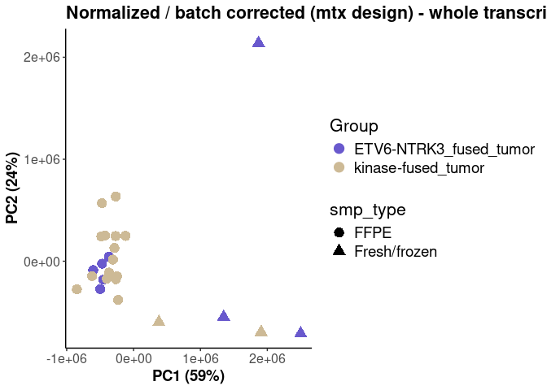<!-- -->

``` r
#dev.off()


## Volcano plot 
res_pos <- subset(res_kinaseDirection, res_kinaseDirection$padj < 0.05 & res_kinaseDirection$log2FoldChange >= 0.5)
res_neg <- subset(res_kinaseDirection, res_kinaseDirection$padj < 0.05 & res_kinaseDirection$log2FoldChange <= -0.5)
res_sig <- rbind(res_pos, res_neg)

dim(res_pos) # 451 genes highly expressed in Kinase tumors
```

    ## [1] 451   6

``` r
dim(res_neg) # 166 genes highly expressed in ETV6-NTRK3 tumors
```

    ## [1] 166   6

``` r
dim(res_sig) # total of 617 genes differentially expressed 
```

    ## [1] 617   6

``` r
top_Kinase <- rownames(res_pos[order(res_pos$log2FoldChange, decreasing = TRUE), ])[1:20]
top_ETV6 <- rownames(res_neg[order(res_neg$log2FoldChange, decreasing = FALSE), ])[1:20]
selected_genes <- c(top_Kinase, top_ETV6)

#png(filename = "/mnt/scratch1/maycon/Larissa_inffibrosarcoma/scripts_git/round_4/Plots/RNA_DEG_Volcano.#png",  width = 8, height = 6, units = "in", res = 300)

library(EnhancedVolcano) # ISSUE: somehow I can't add gene names onto volcano plot using EnhancedVolcano
res_kinaseDirection <- readRDS("/mnt/scratch1/maycon/Larissa_inffibrosarcoma/scripts_git/round_4/Objects/DEGs_kinase_direction_noCutoffs.rds")
#rownames(res_sig) <- res_sig$SYMBOL # don't run it if it doesn't need to
p <- EnhancedVolcano(#res_sig,
  res_kinaseDirection, # DEG output not filtered yet
  #lab = rownames(res_kinaseDirection),
  #lab = as.character(rownames(res_kinaseDirection)),
  lab = '',
  x = 'log2FoldChange',
  y = 'padj',
  selectLab = selected_genes,
  pCutoff = 10e-2, # p-value cutoff line
  FCcutoff = 0.5, # fold change cutoff line
  xlab = paste0("<---- ", "ETV6-NTRK3", "   ", "Log2 FoldChange", "   ", "Kinase", " ---->"),
  pointSize = 4.0,
  labSize = 6.0,
  labCol = 'black',
  labFace = 'bold',
  boxedLabels = TRUE,
  # colAlpha = 4/5,
  legendPosition = 'right',
  legendLabSize = 14,
  legendIconSize = 4.0,
  drawConnectors = TRUE,
  widthConnectors = 1.0,
  colConnectors = 'black',
  max.overlaps = Inf,
  caption = "", # Caption is empty as per your original code
  title = paste0("DEGs ", "Kinase", " vs ", "ETV6-NTRK3"), 
  subtitle = "", # Subtitle should be on the same line as title
)

print(p)
```

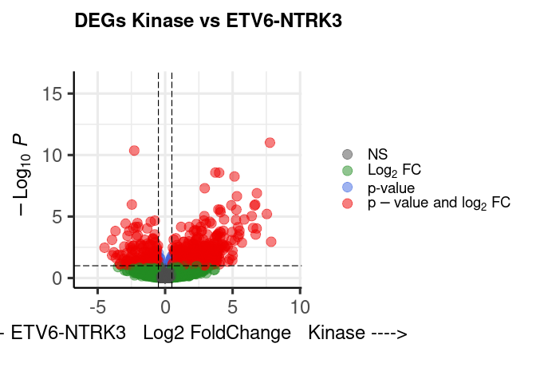<!-- -->

``` r
#dev.off()

### DEGs - Pathway Enrichmemnt (Gene Ontology) -----------
library(clusterProfiler)
library(org.Hs.eg.db)
res_sig <- readRDS("/mnt/scratch1/maycon/Larissa_inffibrosarcoma/scripts_git/round_4/Objects/DEGs_kinase_direction_filtered_617genes.rds")
DEGs <- res_sig #they're all > 0.5 FoldChange
DEGs$gene <- rownames(DEGs)
up_genes_kinase <- DEGs[DEGs$log2FoldChange >= 0.5 & DEGs$padj < 0.05, ]$gene
up_genes_etv6 <- DEGs[DEGs$log2FoldChange <= 0.5 & DEGs$padj < 0.05, ]$gene

# Kinase tumor regulated genes - Gene Ontology
ego2_kinase <- enrichGO(gene = up_genes_kinase,
                    OrgDb         = org.Hs.eg.db,
                    keyType       = 'SYMBOL',
                    # ont   One of "BP", "MF", and "CC" subontologies,                                   # or "ALL" for all three
                    ont           = "BP",
                    pAdjustMethod = "BH",
                    pvalueCutoff  = 0.01,
                    qvalueCutoff  = 0.05)

ego2_kinase@result[order(ego2_kinase@result$Count, decreasing = TRUE),][1:10,]
```

    ##                    ID                                 Description
    ## GO:0044782 GO:0044782                         cilium organization
    ## GO:0060271 GO:0060271                             cilium assembly
    ## GO:0007018 GO:0007018                  microtubule-based movement
    ## GO:0003341 GO:0003341                             cilium movement
    ## GO:0007389 GO:0007389               pattern specification process
    ## GO:0035082 GO:0035082                            axoneme assembly
    ## GO:0001578 GO:0001578                microtubule bundle formation
    ## GO:0003002 GO:0003002                             regionalization
    ## GO:0007409 GO:0007409                                axonogenesis
    ## GO:0010975 GO:0010975 regulation of neuron projection development
    ##            GeneRatio   BgRatio       pvalue     p.adjust
    ## GO:0044782    39/350 407/18870 3.624011e-17 1.114021e-13
    ## GO:0060271    36/350 378/18870 7.761902e-16 7.817809e-13
    ## GO:0007018    36/350 420/18870 2.050303e-14 1.260526e-11
    ## GO:0003341    27/350 203/18870 1.017282e-15 7.817809e-13
    ## GO:0007389    21/350 475/18870 2.311553e-04 2.863065e-02
    ## GO:0035082    20/350  96/18870 8.122295e-16 7.817809e-13
    ## GO:0001578    20/350 125/18870 1.650400e-13 8.455547e-11
    ## GO:0003002    20/350 430/18870 1.673457e-04 2.236611e-02
    ## GO:0007409    19/350 448/18870 7.515089e-04 6.474864e-02
    ## GO:0010975    19/350 453/18870 8.572093e-04 6.934372e-02
    ##                  qvalue
    ## GO:0044782 1.057830e-13
    ## GO:0060271 7.423478e-13
    ## GO:0007018 1.196945e-11
    ## GO:0003341 7.423478e-13
    ## GO:0007389 2.718652e-02
    ## GO:0035082 7.423478e-13
    ## GO:0001578 8.029049e-11
    ## GO:0003002 2.123796e-02
    ## GO:0007409 6.148271e-02
    ## GO:0010975 6.584602e-02
    ##                                                                                                                                                                                                                                                    geneID
    ## GO:0044782 ZMYND10/CLXN/DNAH5/DCX/SPAG6/CFAP61/TEKT2/SPEF1/SPAG1/CEP126/MAK/ARL6/IFT57/DNAH7/DNAL1/DNAI1/BBS2/IFT22/LCA5/DCDC2/GSN/DNAI4/SPAG17/HYDIN/DRC1/CFAP410/CFAP157/UBXN10/CFAP221/IQUB/KIF27/TEKT1/CIMAP3/MAPK15/CFAP91/CFAP54/CFAP43/ODAD4/TCTN1
    ## GO:0060271                    ZMYND10/CLXN/DNAH5/DCX/SPAG6/TEKT2/SPEF1/SPAG1/CEP126/MAK/ARL6/IFT57/DNAH7/DNAL1/DNAI1/BBS2/IFT22/DCDC2/GSN/DNAI4/SPAG17/HYDIN/DRC1/CFAP410/CFAP157/UBXN10/CFAP221/IQUB/KIF27/TEKT1/MAPK15/CFAP91/CFAP54/CFAP43/ODAD4/TCTN1
    ## GO:0007018                  ZMYND10/DNAH9/CLXN/DNAH5/SPAG6/KIF9/CFAP61/TEKT2/SPEF1/CLIP3/MAK/IFT57/TACR1/DNAH6/DNAH7/DNAI1/BBS2/IFT22/LCA5/KIF21A/ENKUR/DNAI4/SPAG17/FMN2/HYDIN/DRC1/DYNC1I1/CFAP157/CFAP221/KIF27/TEKT1/CFAP91/AGBL4/CFAP54/CFAP43/ODAD4
    ## GO:0003341                                                                       ZMYND10/DNAH9/CLXN/DNAH5/SPAG6/KIF9/CFAP61/TEKT2/SPEF1/TACR1/DNAH6/DNAH7/DNAI1/BBS2/ENKUR/DNAI4/SPAG17/HYDIN/DRC1/CFAP157/CFAP221/KIF27/TEKT1/CFAP91/CFAP54/CFAP43/ODAD4
    ## GO:0007389                                                                                                                          DNAH5/ALX4/BMP7/LHX2/TBX18/ARL6/IFT57/DNAI1/HOXC13/PAX8/CHSY1/ENKUR/DRC1/MSX1/SMAD3/CIMAP3/GREM2/RFX8/ARC/ODAD4/TCTN1
    ## GO:0035082                                                                                                                      ZMYND10/CLXN/DNAH5/DCX/SPAG6/TEKT2/SPEF1/SPAG1/DNAH7/DNAL1/DNAI1/BBS2/DNAI4/SPAG17/HYDIN/DRC1/CFAP157/CFAP91/CFAP43/ODAD4
    ## GO:0001578                                                                                                                      ZMYND10/CLXN/DNAH5/DCX/SPAG6/TEKT2/SPEF1/SPAG1/DNAH7/DNAL1/DNAI1/BBS2/DNAI4/SPAG17/HYDIN/DRC1/CFAP157/CFAP91/CFAP43/ODAD4
    ## GO:0003002                                                                                                                               DNAH5/ALX4/LHX2/TBX18/ARL6/IFT57/DNAI1/HOXC13/PAX8/CHSY1/ENKUR/DRC1/MSX1/SMAD3/CIMAP3/GREM2/RFX8/ARC/ODAD4/TCTN1
    ## GO:0007409                                                                                                                                    CNTN1/CDH1/BMP7/EPHB6/LHX2/TNR/NDP/EFNB2/FGF13/OLFM1/STXBP1/CNTN5/DPYSL5/SHOX2/MAP6/CDH4/CNTN2/S100A6/TCTN1
    ## GO:0010975                                                                                                                                    CNTN1/LRRC7/CDH1/BMP7/ZDHHC15/TNR/EFNB2/ATP1B2/FGF13/DPYSL5/SHOX2/ALK/MAP6/KNDC1/NEGR1/CDH4/EFHC2/CNTN2/ARC
    ##            Count
    ## GO:0044782    39
    ## GO:0060271    36
    ## GO:0007018    36
    ## GO:0003341    27
    ## GO:0007389    21
    ## GO:0035082    20
    ## GO:0001578    20
    ## GO:0003002    20
    ## GO:0007409    19
    ## GO:0010975    19

``` r
barplot(ego2_kinase, drop=TRUE, main = "")
```

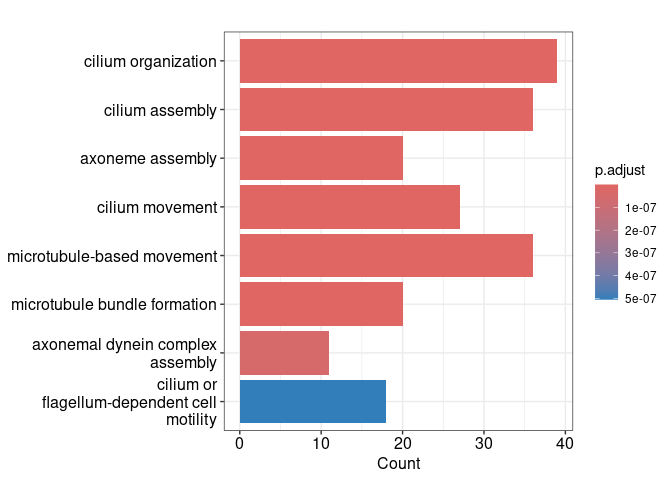<!-- -->

``` r
#clusterProfiler::dotplot(ego2_up, showCategory=30) + ggtitle("")

## Customized barplot 
ego2_kinase_plot <- ego2_kinase@result[ego2_kinase@result$Description %in% 
                                 c("cilium organization", "cilium assembly", "axoneme assembly", 
                                   "cilium movement", "microtubule-based movement", 
                                   "microtubule bundle formation", "axonemal dynein complex assembly",
                                   "cilium or flagellum-dependent cell motility"), ]

#png(filename = "/mnt/scratch1/maycon/Larissa_inffibrosarcoma/scripts_git/round_4/Plots/RNA_Kinase_DEGs_PathEnrichment.#png",  width = 8, height = 6, units = "in", res = 300)

library(ggplot2); theme_set(theme_classic())
p <- ggplot(ego2_kinase_plot, aes(x = Count, y = reorder(Description, Count), fill = p.adjust)) +
  geom_col() +
  labs(x = "Gene Count", y = "", title = "Tumor-Kinase Up Regulated Pathways") +
  scale_fill_gradient(low = "red", high = "blue", name = "p.adjust") 

print(p)
```

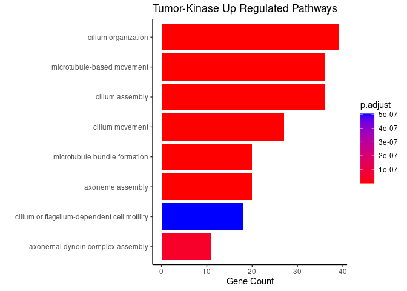<!-- -->

``` r
#dev.off()

## Network plot 
library(UpSetR)
table(unlist(strsplit(ego2_kinase_plot$geneID, "/")))
```

    ## 
    ##   AGBL4    ARL6    BBS2  CEP126 CFAP157 CFAP221 CFAP410  CFAP43 
    ##       1       2       7       2       7       5       2       7 
    ##  CFAP54  CFAP61  CFAP91  CIMAP3   CLIP3    CLXN   DCDC2     DCX 
    ##       5       3       6       1       1       8       2       4 
    ##   DNAH5   DNAH6   DNAH7   DNAH9   DNAI1   DNAI4   DNAL1    DRC1 
    ##       8       3       8       3       8       7       5       8 
    ## DYNC1I1   ENKUR    FMN2     GSN   HYDIN   IFT22   IFT57    IQUB 
    ##       1       3       1       2       6       3       3       2 
    ##  KIF21A   KIF27    KIF9    LCA5     MAK  MAPK15   ODAD4   SPAG1 
    ##       1       4       3       2       3       2       7       5 
    ##  SPAG17   SPAG6   SPEF1   TACR1   TCTN1   TEKT1   TEKT2  UBXN10 
    ##       6       7       6       3       2       5       8       2 
    ## ZMYND10 
    ##       7

``` r
gene_list <- strsplit(ego2_kinase_plot$geneID, "/")
names(gene_list) <- ego2_kinase_plot$Description
UpSetR::upset(fromList(gene_list), 
              order.by = "freq", 
              nsets = 8) # Still need more time to interpret this ...
```

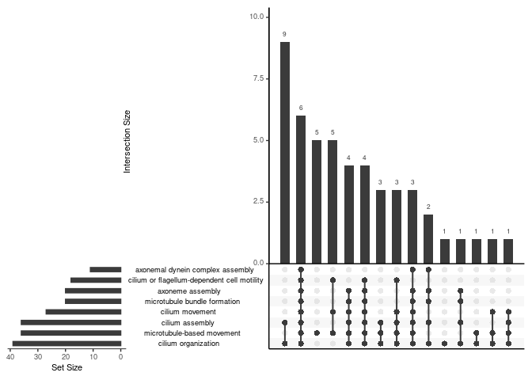<!-- -->

``` r
# # Not doing as commented below
# Remove c("cilium assembly", "axome assembly", "microtubele bundle formation", "axonemal dynein complex assembly", "cillium moviment")
# ego2_kinase_plot[!ego2_kinase_plot$Description %in% c("cilium assembly",), ]

ego2_up_sub <- filter(ego2_kinase, Description %in% ego2_kinase$Description)
edox <- setReadable(ego2_up_sub, 'org.Hs.eg.db', 'ENTREZID')
geneList <- up_genes_kinase

#png(filename = "/mnt/scratch1/maycon/Larissa_inffibrosarcoma/scripts_git/round_4/Plots/RNA_Kinase_DEGs_PathNetwork.#png",  width = 8, height = 6, units = "in", res = 300)

p <- cnetplot(edox, foldChange=geneList, 
               #circular = TRUE, colorEdge = TRUE, 
               #showCategory = "", 
) + ggtitle("Tumor-Kinase Up Regulated Pathways ") 
```

    ## Warning in cnetplot.enrichResult(x, ...): Use 'color.params = list(foldChange = your_value)' instead of 'foldChange'.
    ##  The foldChange parameter will be removed in the next version.

    ## Scale for size is already present.
    ## Adding another scale for size, which will replace the existing
    ## scale.

``` r
print(p)
```

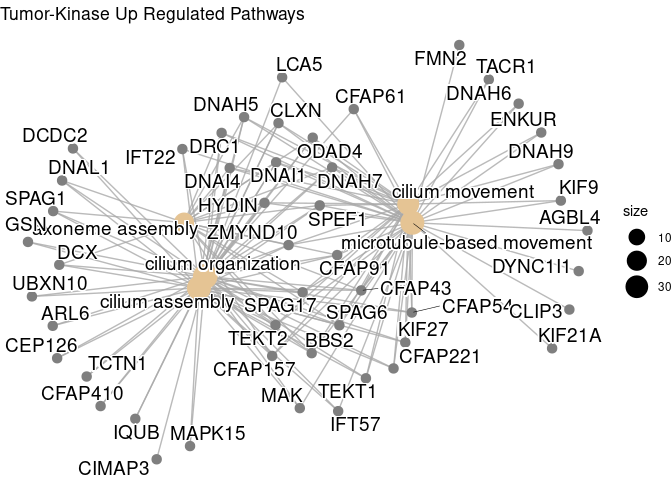<!-- -->

``` r
#dev.off()

## Save enrichment output table 
# write.csv(ego2_kinase_plot, '/mnt/scratch1/maycon/Larissa_inffibrosarcoma/scripts_git/round_4/Objects/ego2_kinase_pathways_table_filtered.csv')


# ETV6 tumor regulated genes - Gene Ontology
ego2_etv6 <- enrichGO(gene = up_genes_etv6,
                      OrgDb         = org.Hs.eg.db,
                      keyType       = 'SYMBOL',
                      # ont One of "BP", "MF", and "CC" subontologies,                                   # or "ALL" for all three
                      ont           = "BP",
                      pAdjustMethod = "BH",
                      pvalueCutoff  = 0.01,
                      qvalueCutoff  = 0.05)

ego2_etv6@result[order(ego2_etv6@result$Count, decreasing = TRUE),][1:10,]
```

    ##                    ID                                 Description
    ## GO:0001503 GO:0001503                                ossification
    ## GO:0050678 GO:0050678 regulation of epithelial cell proliferation
    ## GO:0048732 GO:0048732                           gland development
    ## GO:0016055 GO:0016055                       Wnt signaling pathway
    ## GO:0198738 GO:0198738                  cell-cell signaling by wnt
    ## GO:0050673 GO:0050673               epithelial cell proliferation
    ## GO:0001667 GO:0001667               ameboidal-type cell migration
    ## GO:0060348 GO:0060348                            bone development
    ## GO:0048705 GO:0048705               skeletal system morphogenesis
    ## GO:0001822 GO:0001822                          kidney development
    ##            GeneRatio   BgRatio       pvalue    p.adjust      qvalue
    ## GO:0001503    13/143 444/18870 3.400745e-05 0.017738285 0.015156583
    ## GO:0050678    11/143 407/18870 2.780088e-04 0.047776849 0.040823212
    ## GO:0048732    11/143 443/18870 5.668810e-04 0.052800920 0.045116059
    ## GO:0016055    11/143 459/18870 7.591708e-04 0.060339154 0.051557147
    ## GO:0198738    11/143 461/18870 7.866301e-04 0.060339154 0.051557147
    ## GO:0050673    11/143 480/18870 1.091203e-03 0.060479911 0.051677418
    ## GO:0001667    11/143 497/18870 1.440783e-03 0.068319292 0.058375824
    ## GO:0060348    10/143 215/18870 5.717209e-06 0.007748588 0.006620827
    ## GO:0048705    10/143 230/18870 1.033687e-05 0.008986187 0.007678301
    ## GO:0001822    10/143 314/18870 1.431915e-04 0.034839803 0.029769076
    ##                                                                               geneID
    ## GO:0001503 PTHLH/CLEC11A/MDK/MGP/TWIST1/CREB3L1/STC1/CBS/INPPL1/DCHS1/MN1/SOX11/EXT1
    ## GO:0050678          CEACAM1/SIX4/MDK/TWIST1/TRIM24/SIX1/HTR2B/HLX/DAB2IP/EMC10/SOX11
    ## GO:0048732             CEACAM1/SIX4/MDK/SOCS2/SIX1/PRKCSH/HLX/ASXL1/SCRIB/PLAG1/EXT1
    ## GO:0016055           TMEM132A/WNK1/SMURF2/MDK/MDFI/DAB2IP/DAPK3/NXN/FZD4/SHISA2/EXT1
    ## GO:0198738           TMEM132A/WNK1/SMURF2/MDK/MDFI/DAB2IP/DAPK3/NXN/FZD4/SHISA2/EXT1
    ## GO:0050673          CEACAM1/SIX4/MDK/TWIST1/TRIM24/SIX1/HTR2B/HLX/DAB2IP/EMC10/SOX11
    ## GO:0001667     CEACAM1/SMURF2/TWIST1/RRAS/HTR2B/DAB2IP/MTA2/ANGPT1/STC1/EMC10/CORO1B
    ## GO:0060348                    KAT2A/TWIST1/STC1/CBS/INPPL1/DCHS1/PPIB/ASXL1/EXT1/BGN
    ## GO:0048705                      SIX4/MGP/MDFI/TWIST1/SIX1/STC1/CBS/INPPL1/SOX11/EXT1
    ## GO:0001822                  PROM1/SIX4/SIX1/ANGPT1/DCHS1/ASXL1/SOX11/GPR4/EXT1/GCNT1
    ##            Count
    ## GO:0001503    13
    ## GO:0050678    11
    ## GO:0048732    11
    ## GO:0016055    11
    ## GO:0198738    11
    ## GO:0050673    11
    ## GO:0001667    11
    ## GO:0060348    10
    ## GO:0048705    10
    ## GO:0001822    10

``` r
barplot(ego2_etv6, drop=TRUE, main = "")
```

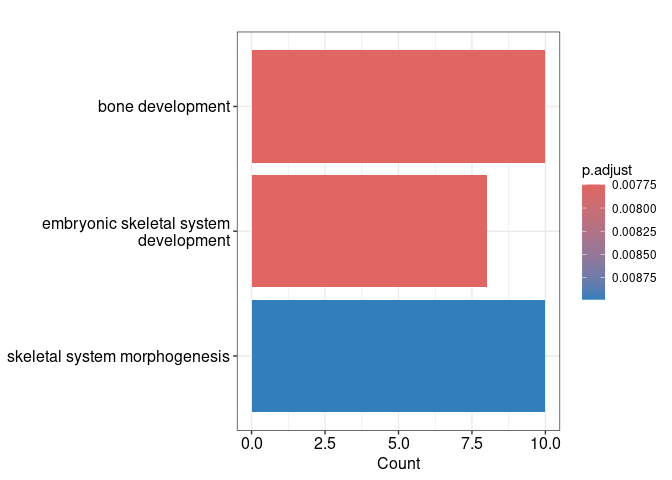<!-- -->

``` r
# clusterProfiler::dotplot(ego2_etv6, showCategory=30) + ggtitle("")

## Customized barplot 
ego2_etv6_plot <- ego2_etv6@result[ego2_etv6@result$Description %in% c("Wnt signaling pathway",
                                                                       "epithelial cell proliferation",
                                                                       "skeletal system morphogenesis",
                                                                       "embryonic skeletal system development",
                                                                       "bone development"), ]


#png(filename = "/mnt/scratch1/maycon/Larissa_inffibrosarcoma/scripts_git/round_4/Plots/RNA_ETV6_DEGs_PathEnrichment.#png",  width = 8, height = 6, units = "in", res = 300)
library(ggplot2); theme_set(theme_classic())
p <- ggplot(ego2_etv6_plot, aes(x = Count, y = reorder(Description, Count), fill = p.adjust)) +
  geom_col() +
  labs(x = "Gene Count", y = "", title = "Tumor-Kinase Down Regulated Pathways") +
  scale_fill_gradient(low = "red", high = "blue", name = "p.adjust") 

print(p)
```

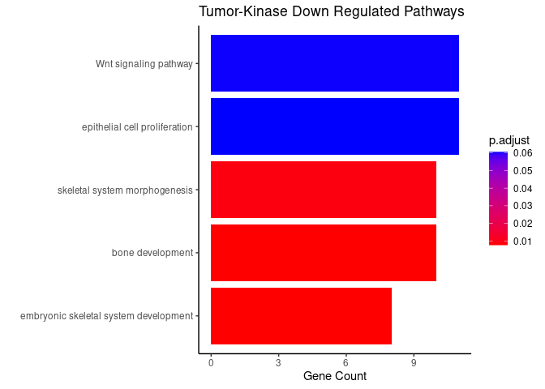<!-- -->

``` r
#dev.off()

ego2_down_sub <- filter(ego2_etv6, Description %in% ego2_etv6_plot$Description) #trying to add wnt pathways into network plot
ego2_down_sub@result$p.adjust <- 0.001 # this is only to make it go to the plot !
ego2_down_sub@result$qvalue <- 0.001 # this is only to make it go to the plot !
edox <- setReadable(ego2_down_sub, 'org.Hs.eg.db', 'ENTREZID')
geneList <- up_genes_etv6

#png(filename = "/mnt/scratch1/maycon/Larissa_inffibrosarcoma/scripts_git/round_4/Plots/RNA_ETV6_DEGs_PathNetwork.#png",  width = 8, height = 6, units = "in", res = 300)
p <- cnetplot(edox, foldChange=geneList, 
               #circular = TRUE, colorEdge = TRUE, 
               #showCategory = "", 
) 
```

    ## Warning in cnetplot.enrichResult(x, ...): Use 'color.params = list(foldChange = your_value)' instead of 'foldChange'.
    ##  The foldChange parameter will be removed in the next version.

    ## Scale for size is already present.
    ## Adding another scale for size, which will replace the existing
    ## scale.

``` r
print(p)
```

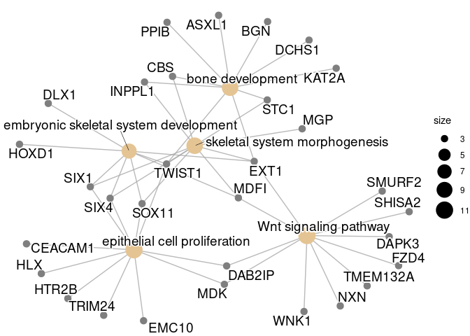<!-- -->

``` r
#dev.off()

## Save enrichment output table 
# write.csv(ego2_etv6_plot, '/mnt/scratch1/maycon/Larissa_inffibrosarcoma/scripts_git/round_4/Objects/ego2_etv6_pathways_table_filtered.csv')


### Most Variable Genes (Heatmap - unsupervised clusters) -----------

# Load expression matrix 
load("/mnt/scratch1/maycon/Larissa_inffibrosarcoma/scripts_git/bulk_RNA/objects/Round1/reviewed_smpID_countmtx_labsheet.rda")
labsheet
```

    ##    tumor_site
    ## 1          ST
    ## 2          ST
    ## 3          ST
    ## 4          ST
    ## 5          ST
    ## 6          ST
    ## 7          ST
    ## 8          ST
    ## 9          ST
    ## 10         ST
    ## 12         ST
    ## 13         ST
    ## 14         ST
    ## 15         ST
    ## 16         ST
    ## 17         ST
    ## 20         ST
    ## 21         ST
    ## 23         ST
    ## 24         ST
    ## 25         ST
    ## 26         BT
    ## 27         ST
    ## 28         ST
    ## 29         ST
    ## 91         ST
    ##                                                                                                              histologic_diagnosis
    ## 1                                                                             Spindle cell neoplasm with NRF1::BRAF rearrangement
    ## 2                                                                                                           Spindle cell neoplasm
    ## 3                                                                                                           Spindle cell neoplasm
    ## 4                                                                 Spindle cell neoplasm with evidence of TPR::NTRK1 rearrangement
    ## 5                                                                              Spindle cell sarcoma with NTRK1 gene rearrangement
    ## 6                                                                                           NTRK-rearranged spindle cell neoplasm
    ## 7                             malignant spindle cell neoplasm with TPR::NTRK1 fusion, most in keeping with infantile fibrosarcoma
    ## 8                                                     low-grade sarcoma with LMNA-NTRK1 fusion and homozygous deletion of CDKN2A,
    ## 9                                                                                                                Lipofibromatosis
    ## 10                                                                           Recurrent/residual variant of infantile fibrosarcoma
    ## 12                                                                                              Infantile fibrosarcoma-like tumor
    ## 13 Congenital NTRK-rearranged spindle cell neoplasm of the gastrointestinal tract with evidence of RBPMS::NTRK3 fusion transcript
    ## 14                                                                              Spindle cell neoplasm with ALK gene rearrangement
    ## 15                  Low-grade fibroblastic neoplasm with neural differentiation suggestive of NTRK1-associated mesenchymal tumor.
    ## 16                                                                                          suspicious for infantile fibrosarcoma
    ## 17                                                 Spindle cell neoplasm with TPM3::NTRK1 fusion, most c/w infantile fibrosarcoma
    ## 20                                                                    NTRK-rearranged sarcoma with evidence of TPM3::NTRK1 fusion
    ## 21                                                                                                                            IFS
    ## 23                                                                                                                            IFS
    ## 24                                                                                                                            IFS
    ## 25                                                                                                                            IFS
    ## 26                                                                                                                            IFS
    ## 27                                                                                                                            IFS
    ## 28                                                                                                                            IFS
    ## 29                                                                                                                            IFS
    ## 91                                                                                                               Lipofibromatosis
    ##                      tumor_location           smpID     smp_type
    ## 1                           forearm   SJST033983_D1         FFPE
    ## 2                       bone, tibia   SJST032767_D1         FFPE
    ## 3                              calf   SJST032767_D2 Fresh/frozen
    ## 4                              foot   SJST034397_D1         FFPE
    ## 5                 soft tissue, back   SJST031920_D1         FFPE
    ## 6       soft tissue, posterior neck   SJST033491_D1         FFPE
    ## 7           soft tissue, chest wall   SJST033389_D1         FFPE
    ## 8        soft tissue, frontal scalp   SJST031690_D1         FFPE
    ## 9                       hip/buttock   SJST031362_D1         FFPE
    ## 10                            thigh   SJST030375_R2 Fresh/frozen
    ## 12                             neck   SJST031792_D1         FFPE
    ## 13        small intestine (jejunum)   SJST033791_D1         FFPE
    ## 14                soft tissue, back   SJST033835_D1         FFPE
    ## 15           soft tissue, abdominal   SJST033308_D1         FFPE
    ## 16      soft tissue, abdominal wall   SJST034534_D1         FFPE
    ## 17                              leg   SJST034036_D1         FFPE
    ## 20                            thigh   SJST034815_D1         FFPE
    ## 21                          buttock   SJST032952_D2 Fresh/frozen
    ## 23                           pelvis   SJST032952_D4 Fresh/frozen
    ## 24                              leg   SJST033312_D1 Fresh/frozen
    ## 25                       chest wall   SJST032838_D1         FFPE
    ## 26 middle fossa, temporal bone/dura   SJBT032721_D1         FFPE
    ## 27                              arm  SJIFS031085_D1         FFPE
    ## 28                             lung   SJST030567_D1         FFPE
    ## 29                      bone, tibia   SJST030433_D1         FFPE
    ## 91                      hip/buttock SJST031362_D1.1         FFPE
    ##                     group
    ## 1      kinase-fused tumor
    ## 2      kinase-fused tumor
    ## 3      kinase-fused tumor
    ## 4      kinase-fused tumor
    ## 5      kinase-fused tumor
    ## 6      kinase-fused tumor
    ## 7      kinase-fused tumor
    ## 8      kinase-fused tumor
    ## 9      kinase-fused tumor
    ## 10     kinase-fused tumor
    ## 12     kinase-fused tumor
    ## 13     kinase-fused tumor
    ## 14     kinase-fused tumor
    ## 15     kinase-fused tumor
    ## 16     kinase-fused tumor
    ## 17     kinase-fused tumor
    ## 20     kinase-fused tumor
    ## 21 ETV6-NTRK3 fused tumor
    ## 23 ETV6-NTRK3 fused tumor
    ## 24 ETV6-NTRK3 fused tumor
    ## 25 ETV6-NTRK3 fused tumor
    ## 26 ETV6-NTRK3 fused tumor
    ## 27 ETV6-NTRK3 fused tumor
    ## 28 ETV6-NTRK3 fused tumor
    ## 29 ETV6-NTRK3 fused tumor
    ## 91     kinase-fused tumor

``` r
labsheet$group<- gsub(' ', '_', labsheet$group)

# Convert gene ID
rownames(count_matrix) <- str_split_fixed(as.character(rownames(count_matrix)), "[.]", 2)[,1] # good it doesn't have duplicates ENSEMBL here
count_matrix <- data.frame(count_matrix)
ens <- rownames(count_matrix) #genes from DE
library(org.Hs.eg.db)
symbols <- mapIds(org.Hs.eg.db, keys = ens,
                  column = c('SYMBOL'), keytype = 'ENSEMBL')
```

    ## 'select()' returned 1:many mapping between keys and columns

``` r
symbols <- symbols[!is.na(symbols)]

symbols <- data.frame(ENSEMBL = names(symbols),
                      SYMBOL = as.vector(symbols))

count_matrix$ENSEMBL <- rownames(count_matrix)

count_matrix <- merge(count_matrix, symbols, by='ENSEMBL')
count_matrix <- count_matrix[!duplicated(count_matrix$SYMBOL), ]
rownames(count_matrix) <- count_matrix$SYMBOL
count_matrix$ENSEMBL <- NULL
count_matrix$SYMBOL <- NULL
head(count_matrix); dim(count_matrix) #33909    26
```

    ##        SJBT032721_D1 SJIFS031085_D1 SJST030433_D1 SJST030567_D1
    ## TSPAN6           660            563           408          1680
    ## TNMD              23            442           343             9
    ## DPM1             397            362           250           846
    ## SCYL3            443            268           310           796
    ## FIRRM            265            404           357           583
    ## FGR              422             63            23           157
    ##        SJST032838_D1 SJST032952_D2 SJST032952_D4 SJST033312_D1
    ## TSPAN6           683          3428          1212             3
    ## TNMD               7           866             1             0
    ## DPM1             492          2099          2209             2
    ## SCYL3            865           692           912             5
    ## FIRRM            756           736           810             1
    ## FGR              801           149           330             1
    ##        SJST030375_R2 SJST031362_D1 SJST031362_D1.1 SJST031690_D1
    ## TSPAN6          1546           136             927           372
    ## TNMD               6            10             685           183
    ## DPM1             949           120            2701           350
    ## SCYL3            966           292            2377           385
    ## FIRRM            693           104            2784           247
    ## FGR              927           224            2161           670
    ##        SJST031792_D1 SJST031920_D1 SJST032767_D1 SJST032767_D2
    ## TSPAN6           510           675          1713          2662
    ## TNMD             103             2           134            31
    ## DPM1             226          1002           654           789
    ## SCYL3            811           816          1068           702
    ## FIRRM            452           647           578           354
    ## FGR               63           177           130           126
    ##        SJST033308_D1 SJST033389_D1 SJST033491_D1 SJST033791_D1
    ## TSPAN6           776          1377          1043           583
    ## TNMD             510          2305           629          1774
    ## DPM1             476           875           546           447
    ## SCYL3            918           915           710           487
    ## FIRRM            511           936           477           322
    ## FGR              360            47           119           121
    ##        SJST033835_D1 SJST033983_D1 SJST034036_D1 SJST034397_D1
    ## TSPAN6           439           480           573          3000
    ## TNMD               0             0           157           296
    ## DPM1             533           381           324          1584
    ## SCYL3            475           534           529          2209
    ## FIRRM            300           327           370          1816
    ## FGR               50           276           131           222
    ##        SJST034534_D1 SJST034815_D1
    ## TSPAN6          1173          1000
    ## TNMD            2218           236
    ## DPM1             996           395
    ## SCYL3           1518           753
    ## FIRRM            698           387
    ## FGR              722           196

    ## [1] 33909    26

``` r
# remove outlier
count_matrix <- count_matrix[, !colnames(count_matrix) %in% "SJST034534_D1"]
dim(count_matrix) #25 smp
```

    ## [1] 33909    25

``` r
labsheet <- labsheet[!labsheet$smpID %in% "SJST034534_D1", ]
dim(labsheet)#25 smp
```

    ## [1] 25  6

``` r
# make it identical (same sequence)
count_matrix <- count_matrix[, labsheet$smpID]
identical(colnames(count_matrix), labsheet$smpID) #TRUE
```

    ## [1] TRUE

``` r
# add rownames into labsheet
rownames(labsheet) <- labsheet$smpID

# Add fusion variable from the labsheet (excel file) into our metadata (the "labsheet" object)
# from the current labsheet shared via One Drive:
smpID <- c("SJST033983_D1", "SJST032767_D1", "SJST032767_D2", "SJST034397_D1", "SJST031920_D1",
           "SJST033491_D1", "SJST033389_D1", "SJST031690_D1", "SJST031362_D1", "STST030375_R2",
           "SJST030375_D1", "SJST031792_D1", "SJST033791_D1", "SJST033835_D1", "SJST033308_D1",
           "SJST034534_D1", "SJST034036_D1", NA, NA, "SJST034815_D1", "SJST032952_D2",
           "SJST032952_D1", "SJST032952_D4", "SJST033312_D1", "SJST032838_D1", "SJBT032721_D1",
           "SJIFS031085_D1", "SJST030567_D1", "SJST030433_D1", NA)

fusion_type <- c("NRF1::BRAF", "PLEKHH2::ALK", "PLEKHH2::ALK", "TPR::NTRK1", "TPM3::NTRK1",
                 "TPM3::NTRK1", "TPR::NTRK1", "LMNA::NTRK1", "LMNA::NTRK1", "PDE4DIP::NTRK1",
                 "PDE4DIP::NTRK1", "EML4::NTRK3", "RBPMS::NTRK3", "RCC1::ALK", 
                 "EML4::NTRK3","TTYH3::BRAF","TPM3::NTRK1","EML4::ALK Outside lab",
                 'TPM3::NTRK1 Outside lab',"TPM3::NTRK1","ETV6:NTRK3","ETV6:NTRK3","ETV6:NTRK3",
                 'ETV6::NTRK3','ETV6::NTRK3','ETV6::NTRK3','ETV6::NTRK3','ETV6::NTRK3',
                 'ETV6::NTRK3','ETV6::NTRK3')

# Create a dataframe
fusion_df <- data.frame(smpID = smpID, fusion_type = fusion_type)
fusion_df <- fusion_df[!fusion_df$smpID %in% NA, ]
fusion_df$smpID[fusion_df$smpID %in% 'STST030375_R2'] <- 'SJST030375_R2'

table(duplicated(fusion_df$smpID))
```

    ## 
    ## FALSE 
    ##    27

``` r
setdiff(rownames(labsheet), fusion_df$smpID) 
```

    ## [1] "SJST031362_D1.1"

``` r
length(intersect(rownames(labsheet), fusion_df$smpID)) #24 #SJST031362_D1.1 we have its annotation for SJST031362_D1. So it's okay move on with these 24 sample ID 
```

    ## [1] 24

``` r
# Merge fusion_type variable into labsheet
labsheet_hm <- merge(labsheet, fusion_df, by = 'smpID')


# Load normalized expression matrix 
dds <- readRDS("/mnt/scratch1/maycon/Larissa_inffibrosarcoma/scripts_git/round_4/Objects/dds_RNA.rds")
normalized_counts <- counts(dds, normalized=TRUE)
# Filter normalized_counts by labsheet
normalized_counts_hm <- normalized_counts[, colnames(normalized_counts) %in% labsheet_hm$smpID]

### PLOT - heatmap - whole RNAseq - focus on NTRK label
library(pheatmap)
library(RColorBrewer)
normalized_counts_hm # exp matrix
```

    ##                           SJST033983_D1 SJST032767_D1 SJST032767_D2
    ## TSPAN6                     4.863232e+02  1.007334e+03  2.028991e+03
    ## TNMD                       0.000000e+00  7.879905e+01  2.362837e+01
    ## DPM1                       3.860190e+02  3.845864e+02  6.013802e+02
    ## SCYL3                      5.410346e+02  6.280402e+02  5.350683e+02
    ## FIRRM                      3.313077e+02  3.398944e+02  2.698208e+02
    ## FGR                        2.796358e+02  7.644684e+01  9.603791e+01
    ## CFH                        6.722405e+03  6.246177e+04  9.016664e+04
    ## FUCA2                      6.636285e+02  1.012627e+03  1.336909e+03
    ## GCLC                       5.937196e+02  5.227788e+02  4.535123e+02
    ## NFYA                       8.682896e+02  1.776507e+03  1.674566e+03
    ## STPG1                      1.124622e+02  1.123180e+02  1.067088e+02
    ## NIPAL3                     1.025331e+03  7.497671e+02  7.164733e+02
    ## LAS1L                      5.997986e+02  7.597640e+02  5.579345e+02
    ## ENPP4                      1.306994e+02  3.645926e+01  5.640321e+01
    ## SEMA3F                     4.913891e+02  8.820789e+01  1.547277e+02
    ## ANKIB1                     1.660591e+03  2.364559e+03  2.553389e+03
    ## CYP51A1                    3.444789e+01  2.705042e+01  8.155600e+01
    ## KRIT1                      1.149952e+03  1.743576e+03  1.368921e+03
    ## RAD52                      5.400214e+02  6.374490e+02  3.117421e+02
    ## BAD                        1.833844e+02  1.952335e+02  9.862941e+02
    ## LAP3                       1.679841e+03  1.597151e+03  2.245458e+03
    ## CD99                       3.176298e+03  2.589196e+03  4.095331e+03
    ## HS3ST1                     8.611973e+01  1.587742e+01  3.125043e+01
    ## HECW1                      7.092213e+01  3.234289e+02  1.981735e+02
    ## MAD1L1                     7.386034e+02  7.150720e+02  5.411660e+02
    ## LASP1                      6.492415e+03  5.582383e+03  5.810293e+03
    ## SNX11                      4.498490e+02  2.634476e+02  4.474147e+02
    ## TMEM176A                   2.928071e+02  7.174242e+01  1.417702e+02
    ## M6PR                       1.734553e+03  1.141410e+03  1.494685e+03
    ## KLHL13                     1.023305e+02  2.178147e+03  3.445932e+03
    ## CYP26B1                    1.246203e+02  4.916120e+02  3.589988e+02
    ## ICA1                       2.198586e+02  7.938710e+01  9.298908e+01
    ## DBNDD1                     3.931113e+02  4.704421e+00  1.829293e+01
    ## ALS2                       1.907805e+03  2.745030e+03  1.573192e+03
    ## CASP10                     8.622105e+02  5.004328e+02  4.801895e+02
    ## CFLAR                      8.503564e+03  5.443015e+03  2.970315e+03
    ## TFPI                       4.047627e+03  4.165765e+03  4.313322e+03
    ## NDUFAF7                    5.309028e+02  5.292473e+02  4.923848e+02
    ## RBM5                       4.990892e+03  6.572076e+03  3.515292e+03
    ## MTMR7                      7.092213e+00  9.408842e+00  4.573234e+00
    ## SLC7A2                     7.071950e+02  3.514202e+03  3.473371e+03
    ##                           SJST034397_D1 SJST031920_D1 SJST033491_D1
    ## TSPAN6                     7.741548e+02  3.321308e+02  7.584634e+02
    ## TNMD                       7.638327e+01  9.840913e-01  4.574051e+02
    ## DPM1                       4.087537e+02  4.930298e+02  3.970480e+02
    ## SCYL3                      5.700360e+02  4.015093e+02  5.163078e+02
    ## FIRRM                      4.686217e+02  3.183535e+02  3.468716e+02
    ## FGR                        5.728745e+01  8.709208e+01  8.653609e+01
    ## CFH                        2.735089e+04  9.826152e+03  2.386942e+04
    ## FUCA2                      7.178995e+02  1.131213e+03  8.624522e+02
    ## GCLC                       4.350750e+02  4.703957e+02  4.246813e+02
    ## NFYA                       1.789588e+03  7.105139e+02  1.758355e+03
    ## STPG1                      4.490098e+01  6.298185e+01  1.214414e+02
    ## NIPAL3                     2.185697e+02  7.424969e+02  7.191949e+02
    ## LAS1L                      6.864172e+02  6.578651e+02  5.810281e+02
    ## ENPP4                      5.806161e+01  5.068070e+01  8.944487e+01
    ## SEMA3F                     1.837327e+02  2.509433e+02  1.388941e+02
    ## ANKIB1                     2.512390e+03  2.073480e+03  2.900777e+03
    ## CYP51A1                    2.167633e+01  3.001479e+01  1.599827e+01
    ## KRIT1                      2.009190e+03  1.376252e+03  1.834711e+03
    ## RAD52                      8.363452e+02  4.723638e+02  6.617466e+02
    ## BAD                        2.110862e+02  2.652126e+02  1.308949e+02
    ## LAP3                       1.327933e+03  2.380517e+03  1.264590e+03
    ## CD99                       2.339496e+03  2.626540e+03  2.701526e+03
    ## HS3ST1                     9.031806e+00  3.936365e+01  2.036143e+01
    ## HECW1                      3.148229e+01  1.180910e+02  2.334293e+02
    ## MAD1L1                     8.110561e+02  6.898480e+02  5.679386e+02
    ## LASP1                      7.939989e+03  8.787936e+03  9.947288e+03
    ## SNX11                      2.957271e+02  3.591933e+02  2.770609e+02
    ## TMEM176A                   4.438487e+01  1.441694e+02  2.465188e+02
    ## M6PR                       1.120202e+03  1.497295e+03  1.179509e+03
    ## KLHL13                     1.274775e+03  7.966219e+02  6.581106e+02
    ## CYP26B1                    1.045109e+02  5.082832e+02  3.083303e+02
    ## ICA1                       7.741548e+01  1.156307e+02  1.236230e+02
    ## DBNDD1                     3.122424e+01  7.823526e+01  1.308949e+01
    ## ALS2                       2.445813e+03  2.900609e+03  2.745158e+03
    ## CASP10                     4.136567e+02  3.222899e+02  6.719273e+02
    ## CFLAR                      5.138581e+03  6.868958e+03  6.195694e+03
    ## TFPI                       4.793566e+03  6.369039e+03  5.645935e+03
    ## NDUFAF7                    5.687457e+02  6.814832e+02  6.312045e+02
    ## RBM5                       6.402776e+03  4.921441e+03  5.058362e+03
    ## MTMR7                      2.838567e+00  4.920457e-01  3.635970e+00
    ## SLC7A2                     1.574115e+02  1.101690e+03  1.984513e+03
    ##                           SJST033389_D1 SJST031690_D1 SJST031362_D1
    ## TSPAN6                     1.097308e+03  4.256752e+02  3.274587e+02
    ## TNMD                       1.836816e+03  2.094047e+02  2.407785e+01
    ## DPM1                       6.972728e+02  4.005008e+02  2.889342e+02
    ## SCYL3                      7.291481e+02  4.405509e+02  7.030731e+02
    ## FIRRM                      7.458827e+02  2.826392e+02  2.504096e+02
    ## FGR                        3.745351e+01  7.666730e+02  5.393438e+02
    ## CFH                        1.350637e+04  2.075739e+04  1.296833e+04
    ## FUCA2                      4.605985e+02  7.266229e+02  7.271510e+02
    ## GCLC                       6.606162e+02  1.011551e+03  8.210546e+02
    ## NFYA                       2.020896e+03  9.497591e+02  7.440055e+02
    ## STPG1                      8.287585e+01  1.052745e+02  1.083503e+02
    ## NIPAL3                     4.382858e+02  7.655287e+02  8.451324e+02
    ## LAS1L                      7.474764e+02  6.156270e+02  6.958498e+02
    ## ENPP4                      2.071896e+01  3.032363e+02  2.865264e+02
    ## SEMA3F                     4.151761e+02  2.986592e+02  4.261779e+02
    ## ANKIB1                     2.266336e+03  2.326338e+03  2.082734e+03
    ## CYP51A1                    5.100052e+01  2.059719e+01  3.611677e+01
    ## KRIT1                      1.296529e+03  1.945290e+03  1.610808e+03
    ## RAD52                      3.960509e+02  4.863224e+02  2.985653e+02
    ## BAD                        1.569860e+02  1.407474e+02  1.853994e+02
    ## LAP3                       1.031964e+03  1.640909e+03  3.156606e+03
    ## CD99                       2.224101e+03  3.298983e+03  1.776945e+03
    ## HS3ST1                     8.765715e+00  7.781159e+01  6.741797e+01
    ## HECW1                      8.128209e+01  2.723406e+02  1.685449e+01
    ## MAD1L1                     6.151938e+02  6.099055e+02  6.789953e+02
    ## LASP1                      6.811758e+03  4.990240e+03  4.100457e+03
    ## SNX11                      2.597839e+02  2.311462e+02  4.213623e+02
    ## TMEM176A                   6.454754e+01  2.448776e+02  1.998461e+02
    ## M6PR                       7.124136e+02  1.590560e+03  1.439855e+03
    ## KLHL13                     9.004780e+01  1.888075e+02  3.009731e+02
    ## CYP26B1                    6.128032e+02  2.048276e+02  7.536366e+02
    ## ICA1                       1.155481e+02  3.661722e+02  4.237701e+02
    ## DBNDD1                     6.375066e+00  1.373146e+01  7.223354e+00
    ## ALS2                       2.254383e+03  1.730164e+03  1.495234e+03
    ## CASP10                     6.534442e+01  7.598073e+02  1.218339e+03
    ## CFLAR                      3.033734e+03  9.749334e+03  1.021623e+04
    ## TFPI                       1.800159e+03  4.688148e+03  2.499280e+03
    ## NDUFAF7                    7.291481e+02  4.897553e+02  4.911881e+02
    ## RBM5                       5.909686e+03  5.206511e+03  6.378222e+03
    ## MTMR7                      2.231273e+01  1.258717e+01  1.926228e+01
    ## SLC7A2                     2.255179e+03  2.674201e+03  3.004915e+03
    ##                           SJST030375_R2 SJST031792_D1 SJST033791_D1
    ## TSPAN6                     8.279292e+02  5.886600e+02  6.645305e+02
    ## TNMD                       3.213179e+00  1.188862e+02  2.022088e+03
    ## DPM1                       5.082179e+02  2.608572e+02  5.095113e+02
    ## SCYL3                      5.173219e+02  9.360848e+02  5.551052e+02
    ## FIRRM                      3.711222e+02  5.217143e+02  3.670305e+02
    ## FGR                        4.964362e+02  7.271682e+01  1.379214e+02
    ## CFH                        2.679042e+04  3.235091e+04  2.640454e+04
    ## FUCA2                      1.013223e+03  6.232871e+02  6.018389e+02
    ## GCLC                       5.617709e+02  7.317852e+02  7.135439e+02
    ## NFYA                       1.154067e+03  2.254221e+03  1.595785e+03
    ## STPG1                      2.907927e+02  1.269659e+02  1.060057e+02
    ## NIPAL3                     9.918014e+02  6.902327e+02  5.414270e+02
    ## LAS1L                      5.082179e+02  1.075747e+03  5.095113e+02
    ## ENPP4                      2.051079e+02  5.078635e+01  2.553256e+02
    ## SEMA3F                     2.276002e+02  2.089166e+02  2.769827e+02
    ## ANKIB1                     2.536805e+03  3.851683e+03  2.740191e+03
    ## CYP51A1                    5.248193e+01  1.154235e+01  3.191570e+01
    ## KRIT1                      1.784386e+03  2.265764e+03  1.958256e+03
    ## RAD52                      2.516990e+02  7.248598e+02  4.490995e+02
    ## BAD                        5.424918e+02  9.118459e+01  9.802679e+01
    ## LAP3                       4.644651e+03  1.838697e+03  1.122749e+03
    ## CD99                       3.188545e+03  9.672492e+02  2.765267e+03
    ## HS3ST1                     3.427391e+01  1.154235e+01  6.725094e+01
    ## HECW1                      8.943349e+01  3.462706e+00  8.206894e+01
    ## MAD1L1                     4.118225e+02  7.687207e+02  6.098178e+02
    ## LASP1                      5.145371e+03  4.629638e+03  4.589022e+03
    ## SNX11                      4.380635e+02  2.620114e+02  1.755363e+02
    ## TMEM176A                   2.720492e+02  5.309482e+01  2.199904e+02
    ## M6PR                       1.730833e+03  6.302125e+02  1.114770e+03
    ## KLHL13                     9.628827e+02  6.706107e+02  9.187162e+02
    ## CYP26B1                    8.761269e+02  4.640026e+02  6.291952e+02
    ## ICA1                       3.347062e+02  9.280052e+02  2.348084e+02
    ## DBNDD1                     1.520905e+02  2.308471e+00  4.445401e+01
    ## ALS2                       1.707805e+03  3.407303e+03  1.769042e+03
    ## CASP10                     8.616676e+02  5.517245e+02  4.320018e+02
    ## CFLAR                      4.914022e+03  9.705964e+03  6.059424e+03
    ## TFPI                       4.141788e+03  9.086140e+03  7.289318e+03
    ## NDUFAF7                    4.605557e+02  1.035349e+03  5.482661e+02
    ## RBM5                       3.599832e+03  7.278608e+03  5.669596e+03
    ## MTMR7                      9.104008e+00  3.116435e+01  6.497125e+01
    ## SLC7A2                     1.722800e+03  7.954990e+03  1.748524e+03
    ##                           SJST033835_D1 SJST033308_D1 SJST034036_D1
    ## TSPAN6                     4.447376e+02  4.897180e+02  5.837356e+02
    ## TNMD                       0.000000e+00  3.218508e+02  1.599415e+02
    ## DPM1                       5.399662e+02  3.003940e+02  3.300704e+02
    ## SCYL3                      4.812081e+02  5.793314e+02  5.389112e+02
    ## FIRRM                      3.039209e+02  3.224818e+02  3.769322e+02
    ## FGR                        5.065349e+01  2.271888e+02  1.334544e+02
    ## CFH                        2.621825e+03  1.087035e+04  1.883235e+04
    ## FUCA2                      1.318004e+03  5.338936e+02  7.895202e+02
    ## GCLC                       5.156525e+02  5.982638e+02  4.146255e+02
    ## NFYA                       1.301795e+03  1.187061e+03  1.407893e+03
    ## STPG1                      1.458820e+02  1.748091e+02  7.538645e+01
    ## NIPAL3                     4.275154e+02  1.327161e+03  4.421313e+02
    ## LAS1L                      6.443124e+02  7.206933e+02  6.856092e+02
    ## ENPP4                      1.965355e+02  1.489349e+02  1.212296e+02
    ## SEMA3F                     1.489213e+02  1.287403e+02  4.248128e+02
    ## ANKIB1                     4.575023e+03  2.313539e+03  2.482659e+03
    ## CYP51A1                    2.735288e+01  2.082564e+01  2.037472e+01
    ## KRIT1                      1.972447e+03  1.975280e+03  1.496523e+03
    ## RAD52                      6.716652e+02  5.099126e+02  4.991805e+02
    ## BAD                        9.522856e+01  1.836443e+02  1.925411e+02
    ## LAP3                       1.403102e+03  1.226819e+03  2.173982e+03
    ## CD99                       3.423163e+03  2.540097e+03  3.970013e+03
    ## HS3ST1                     6.078418e+01  4.480667e+01  5.195552e+01
    ## HECW1                      2.330060e+01  1.268471e+02  1.324356e+01
    ## MAD1L1                     3.211431e+02  6.468569e+02  6.132789e+02
    ## LASP1                      4.735088e+03  5.927734e+03  9.716702e+03
    ## SNX11                      2.735288e+02  3.313170e+02  3.300704e+02
    ## TMEM176A                   7.294102e+01  2.227712e+02  2.231031e+02
    ## M6PR                       3.015909e+03  1.171284e+03  1.447624e+03
    ## KLHL13                     3.140516e+01  1.640808e+02  3.035833e+02
    ## CYP26B1                    3.748358e+01  3.199575e+02  1.731851e+02
    ## ICA1                       4.761428e+02  1.483038e+02  1.324356e+02
    ## DBNDD1                     6.078418e+00  4.606883e+01  6.621782e+01
    ## ALS2                       1.744506e+03  1.872414e+03  1.942729e+03
    ## CASP10                     6.139203e+02  6.070989e+02  8.058200e+02
    ## CFLAR                      3.922606e+03  1.199809e+04  5.548035e+03
    ## TFPI                       1.249115e+03  4.858053e+03  3.512601e+03
    ## NDUFAF7                    6.311425e+02  6.525366e+02  5.012180e+02
    ## RBM5                       5.494890e+03  7.251739e+03  5.910705e+03
    ## MTMR7                      0.000000e+00  9.466199e+00  1.018736e+00
    ## SLC7A2                     3.950972e+02  1.925425e+03  9.525179e+02
    ##                           SJST034815_D1 SJST032952_D2 SJST032952_D4
    ## TSPAN6                     8.350369e+02  1.704949e+03  6.199748e+02
    ## TNMD                       1.970687e+02  4.307134e+02  5.115303e-01
    ## DPM1                       3.298396e+02  1.043958e+03  1.129970e+03
    ## SCYL3                      6.287828e+02  3.441729e+02  4.665157e+02
    ## FIRRM                      3.231593e+02  3.660567e+02  4.143396e+02
    ## FGR                        1.636672e+02  7.410658e+01  1.688050e+02
    ## CFH                        1.777794e+04  1.685005e+04  4.521110e+04
    ## FUCA2                      1.073022e+03  1.958105e+03  1.399035e+03
    ## GCLC                       7.907799e+02  5.416246e+02  8.245869e+02
    ## NFYA                       1.278441e+03  1.564693e+03  1.110021e+03
    ## STPG1                      9.769932e+01  6.863563e+01  5.933752e+01
    ## NIPAL3                     7.573785e+02  4.665233e+02  3.284025e+02
    ## LAS1L                      5.010221e+02  7.067480e+02  5.677987e+02
    ## ENPP4                      1.611621e+02  6.963035e+01  3.816016e+02
    ## SEMA3F                     1.444614e+02  3.834643e+02  9.059202e+02
    ## ANKIB1                     2.788188e+03  3.222890e+03  2.981199e+03
    ## CYP51A1                    2.087592e+01  9.897456e+01  7.775261e+01
    ## KRIT1                      1.774453e+03  1.201123e+03  1.985761e+03
    ## RAD52                      2.563563e+02  2.536534e+02  6.547588e+02
    ## BAD                        1.177402e+02  7.122190e+02  3.729056e+02
    ## LAP3                       3.820294e+03  2.252542e+03  1.184704e+03
    ## CD99                       3.037864e+03  7.591200e+03  4.705567e+03
    ## HS3ST1                     2.338103e+01  5.918579e+01  1.606205e+02
    ## HECW1                      3.423651e+01  9.698512e+01  6.803353e+01
    ## MAD1L1                     3.983126e+02  5.848949e+02  8.557902e+02
    ## LASP1                      9.472659e+03  6.268223e+03  2.832343e+03
    ## SNX11                      2.880877e+02  6.008104e+02  2.818532e+02
    ## TMEM176A                   1.720176e+02  1.800442e+02  9.289391e+02
    ## M6PR                       1.548993e+03  2.096868e+03  2.822624e+03
    ## KLHL13                     1.903884e+02  4.073375e+02  5.120419e+02
    ## CYP26B1                    6.596791e+01  6.266731e+01  2.787840e+02
    ## ICA1                       1.411212e+02  2.078963e+02  2.122851e+02
    ## DBNDD1                     1.503066e+01  3.232837e+01  2.046121e+00
    ## ALS2                       1.969852e+03  1.311040e+03  1.410801e+03
    ## CASP10                     8.600880e+02  3.769986e+02  6.163940e+02
    ## CFLAR                      6.246076e+03  1.659689e+03  3.991471e+03
    ## TFPI                       4.216101e+03  1.993915e+03  3.049232e+03
    ## NDUFAF7                    5.644849e+02  5.461009e+02  5.816100e+02
    ## RBM5                       4.897491e+03  2.463422e+03  3.618054e+03
    ## MTMR7                      4.175184e+00  2.984158e+00  2.557652e+00
    ## SLC7A2                     3.916323e+02  1.856643e+03  1.190843e+03
    ##                           SJST033312_D1 SJST032838_D1 SJBT032721_D1
    ## TSPAN6                         688.0257  4.517760e+02  7.280737e+02
    ## TNMD                             0.0000  4.630208e+00  2.537226e+01
    ## DPM1                           458.6838  3.254375e+02  4.379474e+02
    ## SCYL3                         1146.7095  5.721614e+02  4.886919e+02
    ## FIRRM                          229.3419  5.000625e+02  2.923326e+02
    ## FGR                            229.3419  5.298281e+02  4.655259e+02
    ## CFH                          15595.2493  4.970859e+03  1.417206e+04
    ## FUCA2                          917.3676  5.675312e+02  1.085492e+03
    ## GCLC                          1146.7095  6.244167e+02  8.758947e+02
    ## NFYA                           688.0257  1.104635e+03  2.091557e+03
    ## STPG1                          229.3419  8.598958e+01  2.868169e+01
    ## NIPAL3                        1146.7095  8.883385e+02  3.298394e+02
    ## LAS1L                          458.6838  5.470260e+02  8.052936e+02
    ## ENPP4                            0.0000  2.301875e+02  2.007718e+02
    ## SEMA3F                         917.3676  2.857500e+02  9.928278e+01
    ## ANKIB1                         917.3676  2.688828e+03  2.868169e+03
    ## CYP51A1                          0.0000  2.315104e+01  2.316598e+01
    ## KRIT1                         1834.7352  1.395677e+03  1.410919e+03
    ## RAD52                         1376.0514  6.224323e+02  4.997233e+02
    ## BAD                              0.0000  2.169583e+02  1.820184e+02
    ## LAP3                          2981.4447  3.536818e+03  5.031430e+03
    ## CD99                          2752.1028  3.580474e+03  3.447319e+03
    ## HS3ST1                         229.3419  5.490104e+01  1.434085e+01
    ## HECW1                            0.0000  4.299479e+01  2.868169e+01
    ## MAD1L1                           0.0000  8.010260e+02  7.666837e+02
    ## LASP1                         2752.1028  6.658239e+03  8.959719e+03
    ## SNX11                            0.0000  5.767917e+02  4.169877e+02
    ## TMEM176A                       917.3676  7.236354e+02  9.928278e+01
    ## M6PR                          1146.7095  2.210594e+03  1.581906e+03
    ## KLHL13                           0.0000  3.638021e+01  6.398223e+01
    ## CYP26B1                        229.3419  4.570677e+02  2.228347e+02
    ## ICA1                           458.6838  2.850885e+02  2.261441e+02
    ## DBNDD1                           0.0000  7.077604e+01  9.928278e+00
    ## ALS2                          2064.0771  1.346729e+03  1.371205e+03
    ## CASP10                        1605.3933  1.122495e+03  7.755088e+02
    ## CFLAR                         6880.2570  9.200885e+03  6.999436e+03
    ## TFPI                          6192.2313  1.290505e+03  2.113730e+04
    ## NDUFAF7                        458.6838  4.153958e+02  4.511851e+02
    ## RBM5                          5045.5218  5.281745e+03  5.311629e+03
    ## MTMR7                            0.0000  6.614583e-01  3.088797e+01
    ## SLC7A2                         917.3676  5.622396e+02  3.179255e+03
    ##                           SJIFS031085_D1 SJST030567_D1 SJST030433_D1
    ## TSPAN6                      8.432033e+02  1.076924e+03  7.194778e+02
    ## TNMD                        6.619820e+02  5.769238e+00  6.048551e+02
    ## DPM1                        5.421662e+02  5.423084e+02  4.408565e+02
    ## SCYL3                       4.013827e+02  5.102571e+02  5.466621e+02
    ## FIRRM                       6.050695e+02  3.737184e+02  6.295431e+02
    ## FGR                         9.435489e+01  1.006412e+02  4.055880e+01
    ## CFH                         8.120512e+03  2.154426e+04  5.210924e+03
    ## FUCA2                       9.061065e+02  1.254489e+03  5.978014e+02
    ## GCLC                        4.178574e+02  3.634620e+02  5.678232e+02
    ## NFYA                        1.614517e+03  1.424361e+03  2.387679e+03
    ## STPG1                       5.990787e+01  2.532055e+02  5.819306e+01
    ## NIPAL3                      3.804150e+02  1.492310e+03  4.902325e+02
    ## LAS1L                       8.551848e+02  6.839752e+02  6.489408e+02
    ## ENPP4                       1.557605e+02  5.064109e+01  4.408565e+01
    ## SEMA3F                      9.016134e+02  4.487185e+01  1.505966e+03
    ## ANKIB1                      3.103228e+03  3.198722e+03  2.461743e+03
    ## CYP51A1                     5.541478e+01  2.179490e+01  2.116111e+01
    ## KRIT1                       1.524655e+03  2.248721e+03  1.451300e+03
    ## RAD52                       4.433182e+02  9.256422e+02  5.025764e+02
    ## BAD                         3.010370e+02  1.480771e+02  3.491584e+02
    ## LAP3                        2.881569e+03  2.281413e+03  1.207947e+03
    ## CD99                        3.885025e+03  1.248079e+03  2.251895e+03
    ## HS3ST1                      1.198157e+01  5.384622e+01  2.116111e+01
    ## HECW1                       1.452766e+02  6.923086e+01  6.524677e+01
    ## MAD1L1                      9.540328e+02  5.878213e+02  9.169816e+02
    ## LASP1                       6.949313e+03  7.999369e+03  3.798420e+03
    ## SNX11                       3.864058e+02  3.301286e+02  2.433528e+02
    ## TMEM176A                    2.591015e+02  1.378207e+02  1.075690e+02
    ## M6PR                        1.261061e+03  1.705771e+03  1.165625e+03
    ## KLHL13                      1.497697e+01  5.192314e+02  1.939769e+01
    ## CYP26B1                     2.680877e+02  5.384622e+01  2.123165e+03
    ## ICA1                        2.216591e+02  1.673079e+02  7.406390e+01
    ## DBNDD1                      8.986180e+00  6.474367e+01  3.174167e+01
    ## ALS2                        2.056338e+03  2.647439e+03  2.160197e+03
    ## CASP10                      6.035718e+02  6.262828e+02  5.431352e+02
    ## CFLAR                       2.522121e+03  4.922442e+03  3.149479e+03
    ## TFPI                        5.550464e+03  2.382375e+04  3.687324e+03
    ## NDUFAF7                     4.882491e+02  5.788469e+02  7.512195e+02
    ## RBM5                        4.678805e+03  5.846802e+03  5.664125e+03
    ## MTMR7                       8.986180e+00  1.282053e+00  0.000000e+00
    ## SLC7A2                      3.190094e+02  4.903852e+02  1.745792e+02
    ##  [ reached getOption("max.print") -- omitted 18736 rows ]

``` r
labsheet_hm # metadata
```

    ##             smpID tumor_site
    ## 1   SJBT032721_D1         BT
    ## 2  SJIFS031085_D1         ST
    ## 3   SJST030375_R2         ST
    ## 4   SJST030433_D1         ST
    ## 5   SJST030567_D1         ST
    ## 6   SJST031362_D1         ST
    ## 7   SJST031690_D1         ST
    ## 8   SJST031792_D1         ST
    ## 9   SJST031920_D1         ST
    ## 10  SJST032767_D1         ST
    ## 11  SJST032767_D2         ST
    ## 12  SJST032838_D1         ST
    ## 13  SJST032952_D2         ST
    ## 14  SJST032952_D4         ST
    ## 15  SJST033308_D1         ST
    ## 16  SJST033312_D1         ST
    ## 17  SJST033389_D1         ST
    ## 18  SJST033491_D1         ST
    ## 19  SJST033791_D1         ST
    ## 20  SJST033835_D1         ST
    ## 21  SJST033983_D1         ST
    ## 22  SJST034036_D1         ST
    ## 23  SJST034397_D1         ST
    ## 24  SJST034815_D1         ST
    ##                                                                                                              histologic_diagnosis
    ## 1                                                                                                                             IFS
    ## 2                                                                                                                             IFS
    ## 3                                                                            Recurrent/residual variant of infantile fibrosarcoma
    ## 4                                                                                                                             IFS
    ## 5                                                                                                                             IFS
    ## 6                                                                                                                Lipofibromatosis
    ## 7                                                     low-grade sarcoma with LMNA-NTRK1 fusion and homozygous deletion of CDKN2A,
    ## 8                                                                                               Infantile fibrosarcoma-like tumor
    ## 9                                                                              Spindle cell sarcoma with NTRK1 gene rearrangement
    ## 10                                                                                                          Spindle cell neoplasm
    ## 11                                                                                                          Spindle cell neoplasm
    ## 12                                                                                                                            IFS
    ## 13                                                                                                                            IFS
    ## 14                                                                                                                            IFS
    ## 15                  Low-grade fibroblastic neoplasm with neural differentiation suggestive of NTRK1-associated mesenchymal tumor.
    ## 16                                                                                                                            IFS
    ## 17                            malignant spindle cell neoplasm with TPR::NTRK1 fusion, most in keeping with infantile fibrosarcoma
    ## 18                                                                                          NTRK-rearranged spindle cell neoplasm
    ## 19 Congenital NTRK-rearranged spindle cell neoplasm of the gastrointestinal tract with evidence of RBPMS::NTRK3 fusion transcript
    ## 20                                                                              Spindle cell neoplasm with ALK gene rearrangement
    ## 21                                                                            Spindle cell neoplasm with NRF1::BRAF rearrangement
    ## 22                                                 Spindle cell neoplasm with TPM3::NTRK1 fusion, most c/w infantile fibrosarcoma
    ## 23                                                                Spindle cell neoplasm with evidence of TPR::NTRK1 rearrangement
    ## 24                                                                    NTRK-rearranged sarcoma with evidence of TPM3::NTRK1 fusion
    ##                      tumor_location     smp_type
    ## 1  middle fossa, temporal bone/dura         FFPE
    ## 2                               arm         FFPE
    ## 3                             thigh Fresh/frozen
    ## 4                       bone, tibia         FFPE
    ## 5                              lung         FFPE
    ## 6                       hip/buttock         FFPE
    ## 7        soft tissue, frontal scalp         FFPE
    ## 8                              neck         FFPE
    ## 9                 soft tissue, back         FFPE
    ## 10                      bone, tibia         FFPE
    ## 11                             calf Fresh/frozen
    ## 12                       chest wall         FFPE
    ## 13                          buttock Fresh/frozen
    ## 14                           pelvis Fresh/frozen
    ## 15           soft tissue, abdominal         FFPE
    ## 16                              leg Fresh/frozen
    ## 17          soft tissue, chest wall         FFPE
    ## 18      soft tissue, posterior neck         FFPE
    ## 19        small intestine (jejunum)         FFPE
    ## 20                soft tissue, back         FFPE
    ## 21                          forearm         FFPE
    ## 22                              leg         FFPE
    ## 23                             foot         FFPE
    ## 24                            thigh         FFPE
    ##                     group    fusion_type
    ## 1  ETV6-NTRK3_fused_tumor    ETV6::NTRK3
    ## 2  ETV6-NTRK3_fused_tumor    ETV6::NTRK3
    ## 3      kinase-fused_tumor PDE4DIP::NTRK1
    ## 4  ETV6-NTRK3_fused_tumor    ETV6::NTRK3
    ## 5  ETV6-NTRK3_fused_tumor    ETV6::NTRK3
    ## 6      kinase-fused_tumor    LMNA::NTRK1
    ## 7      kinase-fused_tumor    LMNA::NTRK1
    ## 8      kinase-fused_tumor    EML4::NTRK3
    ## 9      kinase-fused_tumor    TPM3::NTRK1
    ## 10     kinase-fused_tumor   PLEKHH2::ALK
    ## 11     kinase-fused_tumor   PLEKHH2::ALK
    ## 12 ETV6-NTRK3_fused_tumor    ETV6::NTRK3
    ## 13 ETV6-NTRK3_fused_tumor     ETV6:NTRK3
    ## 14 ETV6-NTRK3_fused_tumor     ETV6:NTRK3
    ## 15     kinase-fused_tumor    EML4::NTRK3
    ## 16 ETV6-NTRK3_fused_tumor    ETV6::NTRK3
    ## 17     kinase-fused_tumor     TPR::NTRK1
    ## 18     kinase-fused_tumor    TPM3::NTRK1
    ## 19     kinase-fused_tumor   RBPMS::NTRK3
    ## 20     kinase-fused_tumor      RCC1::ALK
    ## 21     kinase-fused_tumor     NRF1::BRAF
    ## 22     kinase-fused_tumor    TPM3::NTRK1
    ## 23     kinase-fused_tumor     TPR::NTRK1
    ## 24     kinase-fused_tumor    TPM3::NTRK1

``` r
my_sample_col <- data.frame(row.names = labsheet_hm$smpID, 
                            Group = labsheet_hm$group, 
                            Histology = labsheet_hm$histologic_diagnosis,
                            Fusion = labsheet_hm$fusion_type) # patient ID in row names; any columns are for sample information
my_sample_col[my_sample_col$Fusion %in% "ETV6:NTRK3", ]$Fusion <- "ETV6::NTRK3" #correcting label typo

NTRK <- my_sample_col[grep('NTRK', my_sample_col$Fusion), ]
NTRK_butETV6 <- rownames(NTRK[!NTRK$Fusion %in% c('ETV6::NTRK3'), ])
NTRK_onlyETV6 <- rownames(NTRK[!rownames(NTRK) %in% NTRK_butETV6, ])

my_sample_col$Fusion_concat <- NA
my_sample_col[rownames(my_sample_col) %in% NTRK_butETV6, ]$Fusion_concat <- 'Others_NTRK'
my_sample_col[rownames(my_sample_col) %in% NTRK_onlyETV6, ]$Fusion_concat <- 'ETV6_NTRK3'
my_sample_col[my_sample_col$Fusion_concat %in% NA, ]$Fusion_concat <- 'Not_NTRK'


ann_colors = list(
  Fusion_concat = c(ETV6_NTRK3 = 'black', Not_NTRK = 'blue', Others_NTRK = 'red'))

my_sample_col$Histology <- NULL

# Most variable feature - from PC1 components 
pca_data <- na.omit(normalized_counts_hm)
pca_result <- prcomp(t(pca_data))
summary(pca_result) # "Proportion of Variance" gets in a platou at PC4. So Let's use 1000 CpGs from PC1, 2, 3, and 4. This we will call "Most Variable Feature"
```

    ## Importance of components:
    ##                             PC1       PC2       PC3       PC4
    ## Standard deviation     8.93e+05 5.740e+05 2.978e+05 2.142e+05
    ## Proportion of Variance 5.90e-01 2.437e-01 6.562e-02 3.394e-02
    ## Cumulative Proportion  5.90e-01 8.337e-01 8.994e-01 9.333e-01
    ##                              PC5       PC6       PC7       PC8
    ## Standard deviation     1.368e+05 1.192e+05 1.163e+05 9.508e+04
    ## Proportion of Variance 1.385e-02 1.052e-02 1.001e-02 6.690e-03
    ## Cumulative Proportion  9.472e-01 9.577e-01 9.677e-01 9.744e-01
    ##                              PC9      PC10      PC11      PC12
    ## Standard deviation     8.567e+04 7.950e+04 6.420e+04 6.270e+04
    ## Proportion of Variance 5.430e-03 4.680e-03 3.050e-03 2.910e-03
    ## Cumulative Proportion  9.798e-01 9.845e-01 9.875e-01 9.904e-01
    ##                             PC13      PC14      PC15      PC16
    ## Standard deviation     5.581e+04 4.746e+04 4.333e+04 3.640e+04
    ## Proportion of Variance 2.300e-03 1.670e-03 1.390e-03 9.800e-04
    ## Cumulative Proportion  9.927e-01 9.944e-01 9.958e-01 9.968e-01
    ##                             PC17      PC18      PC19      PC20
    ## Standard deviation     3.131e+04 2.966e+04 2.769e+04 2.480e+04
    ## Proportion of Variance 7.300e-04 6.500e-04 5.700e-04 4.500e-04
    ## Cumulative Proportion  9.975e-01 9.982e-01 9.987e-01 9.992e-01
    ##                             PC21      PC22      PC23      PC24
    ## Standard deviation     2.266e+04 1.844e+04 1.604e+04 3.008e-10
    ## Proportion of Variance 3.800e-04 2.500e-04 1.900e-04 0.000e+00
    ## Cumulative Proportion  9.996e-01 9.998e-01 1.000e+00 1.000e+00

``` r
loadings_PC1 <- pca_result$rotation[, 1]
abs_loadings_PC1 <- abs(loadings_PC1)
top_n <- 1000
top_cpg_indices <- order(abs_loadings_PC1, decreasing = TRUE)[1:top_n]
top_cpg_sites_PC1 <- rownames(pca_data)[top_cpg_indices]

loadings_PC2 <- pca_result$rotation[, 2]
abs_loadings_PC2 <- abs(loadings_PC2)
top_n <- 1000
top_cpg_indices <- order(abs_loadings_PC2, decreasing = TRUE)[1:top_n]
top_cpg_sites_PC2 <- rownames(pca_data)[top_cpg_indices]

loadings_PC3 <- pca_result$rotation[, 3]
abs_loadings_PC3 <- abs(loadings_PC3)
top_n <- 1000
top_cpg_indices <- order(abs_loadings_PC3, decreasing = TRUE)[1:top_n]
top_cpg_sites_PC3 <- rownames(pca_data)[top_cpg_indices]

MVC_PC1_2_3 <- c(top_cpg_sites_PC1,
                 top_cpg_sites_PC2,
                 top_cpg_sites_PC3)

MVC_PC1_2_3 <- MVC_PC1_2_3[!duplicated(MVC_PC1_2_3)]

# Correlation test
normalized_counts_hm_sub <- normalized_counts_hm[MVC_PC1_2_3, ]
library(ggplot2)
library(corrplot)

cor_test_mat <- cor.mtest(normalized_counts_hm_sub, conf.level = 0.95)
cor_test_mat <- cor_test_mat$p
cor_matrix <- cor(normalized_counts_hm_sub)

# To add statistics to the heatmap
convert_to_symbols <- function(p_value) {
  if (is.na(p_value) || p_value > 0.05) {
    return("NS")
  } else if (p_value <= 0.05 && p_value > 0.01) {
    return("*")
  } else if (p_value <= 0.01 && p_value > 0.001) {
    return("**")
  } else if (p_value <= 0.001) {
    return("***")
  }
}
# Assuming your matrix is named 'p_value_matrix'
# Apply the function to each element of the matrix
pvalue_symbol_matrix <- apply(cor_test_mat, c(1, 2), convert_to_symbols)

# Adding cor stats 
pheatmap(cor_matrix[,], #smp_ID on columns and rows
         #annotation_row = my_probe_col, 
         annotation_col = my_sample_col[, ],
         show_rownames = FALSE,
         cluster_columns = TRUE,
         #scale = "column",
         #scale = "row",
         scale = "none", #the actual beta-value 0-1.
         #annotation_colors = ann_colors,
         display_numbers = pvalue_symbol_matrix,
         fontsize_number = 10,
         annotation_colors = ann_colors,
         main = "Most Variable Genes from PC1,2,3 - Correlation - scale:none")
```

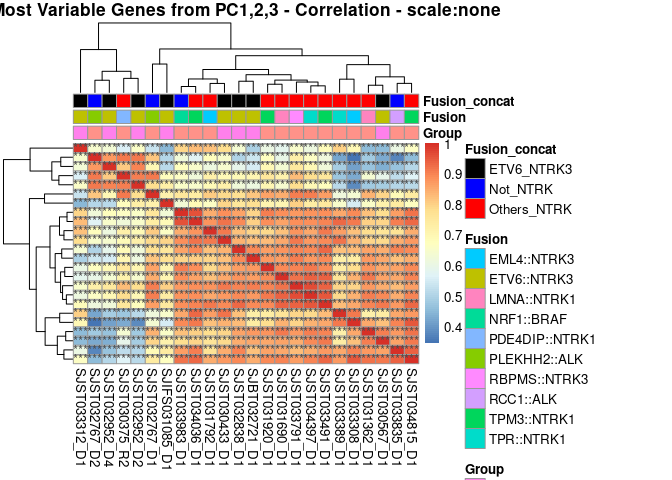<!-- -->

``` r
# No cor stats 
#png(filename = "/mnt/scratch1/maycon/Larissa_inffibrosarcoma/scripts_git/round_4/Plots/RNA_cor_hm.#png",  width = 8, height = 8, units = "in", res = 300)

p <- pheatmap(cor_matrix[,], #smp_ID on columns and rows
              #annotation_row = my_probe_col, 
              annotation_col = my_sample_col[, ],
              show_rownames = FALSE,
              cluster_columns = TRUE,
              #scale = "column",
              #scale = "row",
              scale = "none", #the actual beta-value 0-1.
              #annotation_colors = ann_colors,
              #display_numbers = pvalue_symbol_matrix,
              fontsize_number = 10,
              annotation_colors = ann_colors,
              main = "Most Variable Genes from PC1,2,3 - Correlation - scale:none")

print(p)
```

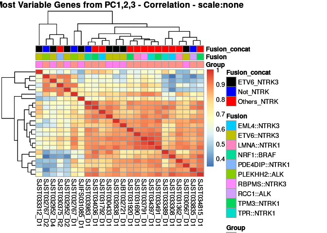<!-- -->

``` r
#dev.off()
```
