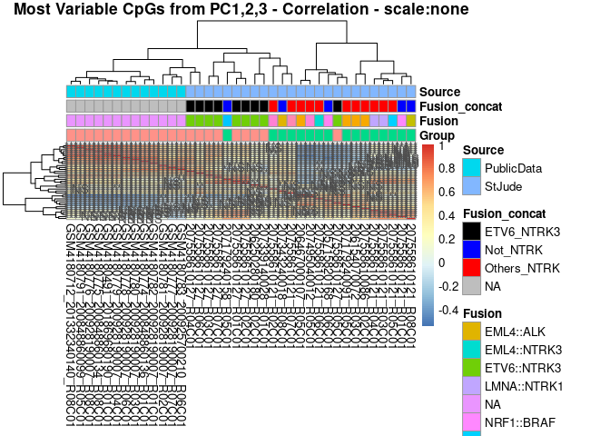
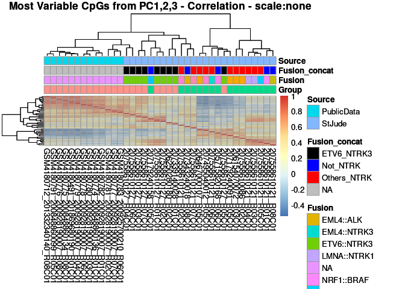
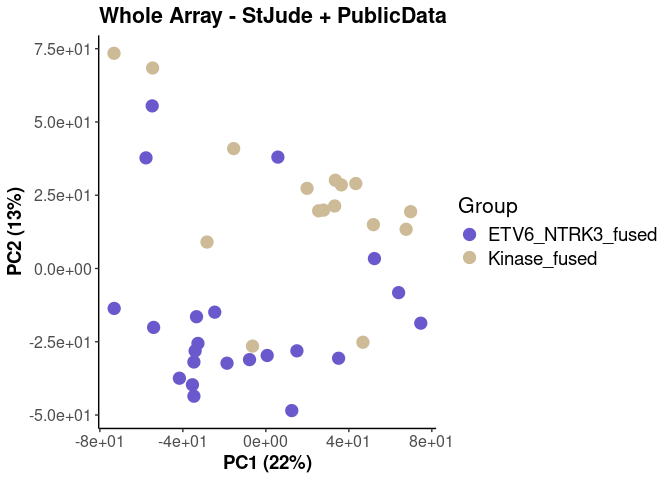
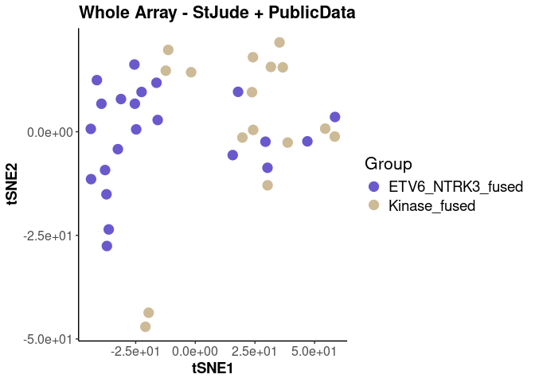
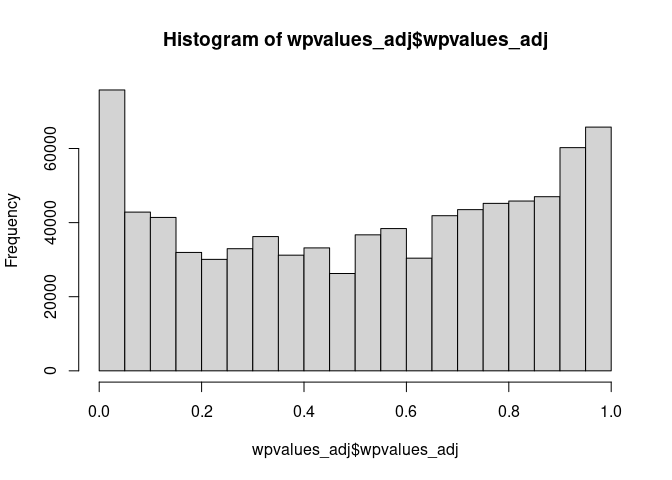
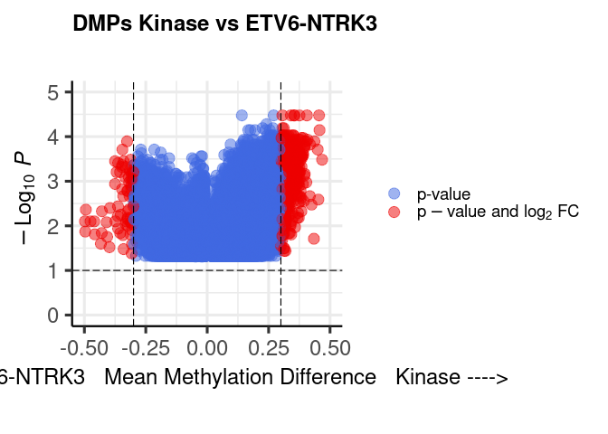
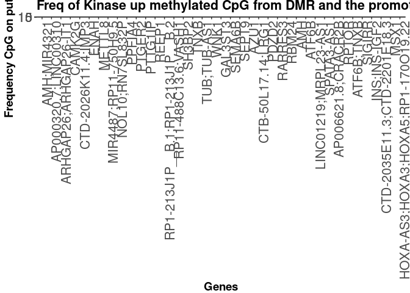
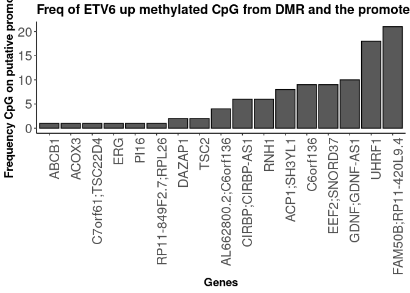
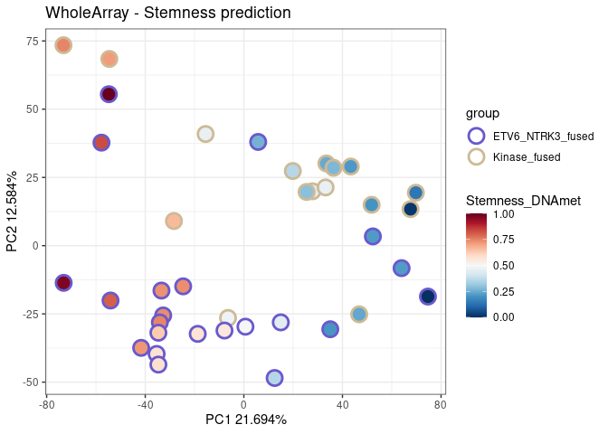
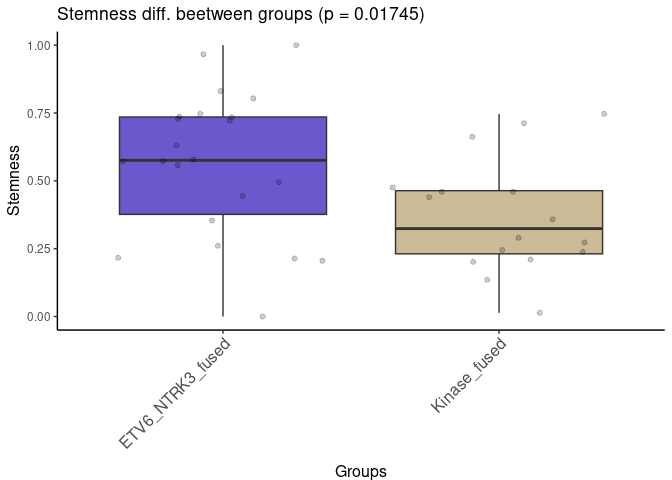

Streamline_DNA_Analysis_ToRender.R
================
mmarcao
2025-02-07

``` r
### Description: from DNAmet matrix (beta-value matrix) to downsteram analysis 
### Technology: 850k DNAmet array

library(BiocManager)
require(IlluminaHumanMethylationEPICmanifest)
require(IlluminaHumanMethylationEPICanno.ilm10b4.hg19) 
library(shinyMethyl)
library(bumphunter)
library(minfi)
library(dplyr)


## Most Variable CpGs  --------------------
load('/mnt/scratch1/maycon/Larissa_inffibrosarcoma/scripts_git/DNAmet/DNAmet_V2/beta_and_meta_data.rda')
beta %>% dim() #856801     38
```

    ## [1] 856801     38

``` r
beta <- as.data.frame(beta)
beta <- na.omit(beta)
beta %>% dim() #836811     38
```

    ## [1] 836811     38

``` r
dim(beta_meta)
```

    ## [1] 38  3

``` r
head(beta_meta)
```

    ##                sample            group source
    ## 1 206250280180_R02C01 ETV6_NTRK3_fused StJude
    ## 2 207339140028_R01C01 ETV6_NTRK3_fused StJude
    ## 3 207558610127_R01C01 ETV6_NTRK3_fused StJude
    ## 4 207558610127_R02C01 ETV6_NTRK3_fused StJude
    ## 5 207558610127_R03C01 ETV6_NTRK3_fused StJude
    ## 6 207558610127_R04C01 ETV6_NTRK3_fused StJude

``` r
names(beta_meta)[names(beta_meta) == "sample"] <- "smp_ID"

df <- data.frame(
  smp_ID = c("207558610121_R01C01", NA, "205715820168_R06C01", "207495040012_R05C01", NA, "206467000107_R05C01", "207558610121_R02C01", "207558610121_R03C01", "207558610121_R04C01", "207558610121_R05C01", NA, "207558610121_R06C01", "207558610121_R07C01", "207179240158_R05C01", NA, "207558610121_R08C01", "207179240091_R05C01", "207343240018_R08C01", "206154070072_R03C01", "207558610086_R02C01", "206250280180_R02C01", NA, "207339140028_R01C01", "207558610127_R01C01", "207558610127_R02C01", "207558610127_R03C01", "207558610127_R04C01", "207558610127_R05C01", "207558610127_R06C01", "207558610127_R07C01", "201869680190_R01C01", "201332340140_R08C01", "200848860136_R01C01", "200848860134_R08C01", "200928190007_R08C01", "200928190007_R07C01", "200928190007_R06C01", "200928190007_R04C01", "200928190007_R03C01", "200928190007_R02C01", "200928190007_R01C01", "200925700210_R06C01", "200848860099_R05C01", "9553932008_R01C02"),
  
  fusion = c("NRF1::BRAF", "PLEKHH2::ALK", "PLEKHH2::ALK", "TPR::NTRK1", "TPM3::NTRK1", "TPM3::NTRK1", "TPR::NTRK1", "LMNA::NTRK1", "LMNA::NTRK1", "PDE4DIP::NTRK1", "PDE4DIP::NTRK1", "EML4::NTRK3", "RBPMS::NTRK3", "RCC1::ALK", "EML4::NTRK3", "TTYH3::BRAF", "TPM3::NTRK1", "EML4::ALK\nOutside lab", "TPM3::NTRK1\nOutside lab", "TPM3::NTRK1", "ETV6:NTRK3", "ETV6:NTRK3", "ETV6:NTRK3", "ETV6::NTRK3", "ETV6::NTRK3", "ETV6::NTRK3", "ETV6::NTRK3", "ETV6::NTRK3", "ETV6::NTRK3", "ETV6::NTRK3", NA, NA, NA, NA, NA, NA, NA, NA, NA, NA, NA, NA, NA, NA),
  
  histologic = c("Spindle cell neoplasm with NRF1::BRAF rearrangement", "Spindle cell neoplasm", "Spindle cell neoplasm", "Spindle cell neoplasm with evidence of TPR::NTRK1 rearrangement", "Spindle cell sarcoma with NTRK1 gene rearrangement", "NTRK-rearranged spindle cell neoplasm", "malignant spindle cell neoplasm with TPR::NTRK1 fusion, most in keeping with infantile fibrosarcoma", "low-grade sarcoma with LMNA-NTRK1 fusion and homozygous deletion of CDKN2A,", "Lipofibromatosis", "Recurrent/residual variant of infantile fibrosarcoma", "Infantile fibrosarcoma, variant with NTRK1 fusion, status post chemotherapy", "Infantile fibrosarcoma-like tumor", "Congenital NTRK-rearranged spindle cell neoplasm of the gastrointestinal tract with evidence of RBPMS::NTRK3 fusion transcript", "Spindle cell neoplasm with ALK gene rearrangement", "Low-grade fibroblastic neoplasm with neural differentiation suggestive of NTRK1-associated mesenchymal tumor.", "suspicious for infantile fibrosarcoma", "Spindle cell neoplasm with TPM3::NTRK1 fusion, most c/w infantile fibrosarcoma", "Spindle cell neoplasm with EML4::ALK fusion", "Spindled cell neoplasm with TPM3-NTRK1 fusion and meningioangiomatosis-like growth pattern;", "NTRK-rearranged sarcoma with evidence of TPM3::NTRK1 fusion", "IFS", "IFS", "IFS", "IFS", "IFS", "IFS", "IFS", "IFS", "IFS", "IFS", NA, NA, NA, NA, NA, NA, NA, NA, NA, NA, NA, NA, NA, NA),
  
  tumor_type = c("kinase-fused tumor", "kinase-fused tumor", "kinase-fused tumor", "kinase-fused tumor", "kinase-fused tumor", "kinase-fused tumor", "kinase-fused tumor", "kinase-fused tumor", "kinase-fused tumor", "kinase-fused tumor", "kinase-fused tumor", "kinase-fused tumor", "kinase-fused tumor", "kinase-fused tumor", "kinase-fused tumor", "kinase-fused tumor", "kinase-fused tumor", "kinase-fused tumor", "kinase-fused tumor", "kinase-fused tumor", "ETV6-NTRK3 fused tumor", "ETV6-NTRK3 fused tumor", "ETV6-NTRK3 fused tumor", "ETV6-NTRK3 fused tumor", "ETV6-NTRK3 fused tumor", "ETV6-NTRK3 fused tumor", "ETV6-NTRK3 fused tumor", "ETV6-NTRK3 fused tumor", "ETV6-NTRK3 fused tumor", "ETV6-NTRK3 fused tumor", "ETV6-NTRK3 fused tumor", "ETV6-NTRK3 fused tumor", "ETV6-NTRK3 fused tumor", "ETV6-NTRK3 fused tumor", "ETV6-NTRK3 fused tumor", "ETV6-NTRK3 fused tumor", "ETV6-NTRK3 fused tumor", "ETV6-NTRK3 fused tumor", "ETV6-NTRK3 fused tumor", "ETV6-NTRK3 fused tumor", "ETV6-NTRK3 fused tumor", "ETV6-NTRK3 fused tumor", "ETV6-NTRK3 fused tumor", "ETV6-NTRK3 fused tumor"),
  
  smp_type = c("FFPE", "FFPE", "Fresh/frozen", "FFPE", "FFPE", "FFPE", "FFPE", "FFPE", "FFPE", "Fresh/frozen", "Fresh/frozen", "FFPE", "FFPE", "FFPE", "FFPE", "FFPE", "FFPE", NA, NA, "FFPE", "Fresh/frozen", "Fresh/frozen", "Fresh/frozen", "Fresh/frozen", "FFPE", "FFPE", "FFPE", "FFPE", "FFPE", NA, NA, NA, NA, NA, NA, NA, NA, NA, NA, NA, NA, NA, NA, NA),
  
  stringsAsFactors = FALSE
)

beta_meta_st <- merge(beta_meta, df, by="smp_ID")
beta_meta_st[beta_meta_st$fusion %in% "ETV6:NTRK3", ]$fusion <- "ETV6::NTRK3"
beta_meta_st[beta_meta_st$fusion %in% "TPM3::NTRK1\nOutside lab", ]$fusion <- "TPM3::NTRK1"
beta_meta_st[beta_meta_st$fusion %in% "EML4::ALK\nOutside lab", ]$fusion <- "EML4::ALK"
beta_meta_GEO <- beta_meta[!beta_meta$smp_ID %in% beta_meta_st$smp_ID, ]
dim(beta_meta_GEO)#13 3
```

    ## [1] 13  3

``` r
beta_meta <- plyr::rbind.fill(beta_meta_st, beta_meta_GEO)
dim(beta_meta) #38  7
```

    ## [1] 38  7

``` r
head(beta_meta)
```

    ##                smp_ID            group source       fusion
    ## 1 205715820168_R06C01     Kinase_fused StJude PLEKHH2::ALK
    ## 2 206154070072_R03C01     Kinase_fused StJude  TPM3::NTRK1
    ## 3 206250280180_R02C01 ETV6_NTRK3_fused StJude  ETV6::NTRK3
    ## 4 206467000107_R05C01     Kinase_fused StJude  TPM3::NTRK1
    ## 5 207179240091_R05C01     Kinase_fused StJude  TPM3::NTRK1
    ## 6 207179240158_R05C01     Kinase_fused StJude    RCC1::ALK
    ##                                                                                    histologic
    ## 1                                                                       Spindle cell neoplasm
    ## 2 Spindled cell neoplasm with TPM3-NTRK1 fusion and meningioangiomatosis-like growth pattern;
    ## 3                                                                                         IFS
    ## 4                                                       NTRK-rearranged spindle cell neoplasm
    ## 5              Spindle cell neoplasm with TPM3::NTRK1 fusion, most c/w infantile fibrosarcoma
    ## 6                                           Spindle cell neoplasm with ALK gene rearrangement
    ##               tumor_type     smp_type
    ## 1     kinase-fused tumor Fresh/frozen
    ## 2     kinase-fused tumor         <NA>
    ## 3 ETV6-NTRK3 fused tumor Fresh/frozen
    ## 4     kinase-fused tumor         FFPE
    ## 5     kinase-fused tumor         FFPE
    ## 6     kinase-fused tumor         FFPE

``` r
library(pheatmap)
library(RColorBrewer)
dim(beta) #
```

    ## [1] 836811     38

``` r
dim(beta_meta)#
```

    ## [1] 38  7

``` r
my_sample_col <- data.frame(row.names = beta_meta$smp_ID, 
                            Group = beta_meta$group, 
                            #Histology = labsheet_hm$histologic_diagnosis,
                            Fusion = beta_meta$fusion) 

NTRK <- my_sample_col[grep('NTRK', my_sample_col$Fusion), ]
NTRK_butETV6 <- rownames(NTRK[!NTRK$Fusion %in% c('ETV6::NTRK3'), ])
NTRK_onlyETV6 <- rownames(NTRK[!rownames(NTRK) %in% NTRK_butETV6, ])

my_sample_col$Fusion_concat <- NA
my_sample_col[rownames(my_sample_col) %in% NTRK_butETV6, ]$Fusion_concat <- 'Others_NTRK'
my_sample_col[rownames(my_sample_col) %in% NTRK_onlyETV6, ]$Fusion_concat <- 'ETV6_NTRK3'

my_sample_col[my_sample_col$Fusion_concat %in% NA, ]$Fusion_concat[1:5] <- "Not_NTRK" 

my_sample_col[my_sample_col$Fusion_concat %in% NA, ]$Fusion_concat <- "NA"

my_sample_col[my_sample_col$Fusion %in% NA, ]$Fusion <- "NA"

my_sample_col$Source <- NA
my_sample_col[my_sample_col$Fusion %in% "NA", ]$Source <- "PublicData" 
my_sample_col[!my_sample_col$Fusion %in% "NA", ]$Source <- "StJude" 


ann_colors = list(
  Fusion_concat = c(ETV6_NTRK3 = 'black', Not_NTRK = 'blue', Others_NTRK = 'red', `NA` = "gray"))


# Most variable feature - from PC1 components 
pca_data <- na.omit(beta)
pca_result <- prcomp(t(pca_data))
summary(pca_result) # "Proportion of Variance" gets in a platou at PC4. So Let's use 1000 CpGs from PC1, 2, 3, and 4. This we will call "Most Variable Feature"
```

    ## Importance of components:
    ##                            PC1     PC2      PC3      PC4      PC5
    ## Standard deviation     43.3084 32.9842 28.19907 22.58120 19.26391
    ## Proportion of Variance  0.2169  0.1258  0.09198  0.05898  0.04292
    ## Cumulative Proportion   0.2169  0.3428  0.43476  0.49374  0.53666
    ##                            PC6      PC7      PC8      PC9     PC10
    ## Standard deviation     17.8374 15.46614 14.97660 14.30374 13.98230
    ## Proportion of Variance  0.0368  0.02767  0.02594  0.02366  0.02261
    ## Cumulative Proportion   0.5735  0.60113  0.62707  0.65074  0.67335
    ##                            PC11     PC12     PC13     PC14     PC15
    ## Standard deviation     13.40033 12.99288 12.34004 11.88159 11.70126
    ## Proportion of Variance  0.02077  0.01953  0.01761  0.01633  0.01584
    ## Cumulative Proportion   0.69412  0.71365  0.73126  0.74759  0.76342
    ##                            PC16     PC17     PC18     PC19     PC20
    ## Standard deviation     11.59676 11.54410 11.20526 10.87842 10.62302
    ## Proportion of Variance  0.01556  0.01541  0.01452  0.01369  0.01305
    ## Cumulative Proportion   0.77898  0.79439  0.80892  0.82260  0.83566
    ##                           PC21     PC22     PC23     PC24    PC25
    ## Standard deviation     10.4784 10.25744 10.13537 10.07298 9.87061
    ## Proportion of Variance  0.0127  0.01217  0.01188  0.01174 0.01127
    ## Cumulative Proportion   0.8484  0.86053  0.87241  0.88414 0.89541
    ##                           PC26    PC27    PC28    PC29    PC30
    ## Standard deviation     9.79142 9.74423 9.55119 9.38146 9.18536
    ## Proportion of Variance 0.01109 0.01098 0.01055 0.01018 0.00976
    ## Cumulative Proportion  0.90650 0.91748 0.92804 0.93822 0.94798
    ##                           PC31    PC32    PC33    PC34    PC35
    ## Standard deviation     9.11881 8.90647 8.40950 8.17434 7.38812
    ## Proportion of Variance 0.00962 0.00918 0.00818 0.00773 0.00631
    ## Cumulative Proportion  0.95759 0.96677 0.97495 0.98268 0.98899
    ##                           PC36    PC37      PC38
    ## Standard deviation     6.99118 6.80516 7.288e-14
    ## Proportion of Variance 0.00565 0.00536 0.000e+00
    ## Cumulative Proportion  0.99464 1.00000 1.000e+00

``` r
loadings_PC1 <- pca_result$rotation[, 1]
abs_loadings_PC1 <- abs(loadings_PC1)
top_n <- 1000
top_cpg_indices <- order(abs_loadings_PC1, decreasing = TRUE)[1:top_n]
top_cpg_sites_PC1 <- rownames(pca_data)[top_cpg_indices]

loadings_PC2 <- pca_result$rotation[, 2]
abs_loadings_PC2 <- abs(loadings_PC2)
top_n <- 1000
top_cpg_indices <- order(abs_loadings_PC2, decreasing = TRUE)[1:top_n]
top_cpg_sites_PC2 <- rownames(pca_data)[top_cpg_indices]

loadings_PC3 <- pca_result$rotation[, 3]
abs_loadings_PC3 <- abs(loadings_PC3)
top_n <- 1000
top_cpg_indices <- order(abs_loadings_PC3, decreasing = TRUE)[1:top_n]
top_cpg_sites_PC3 <- rownames(pca_data)[top_cpg_indices]


MVC_PC1_2_3 <- c(top_cpg_sites_PC1,
                 top_cpg_sites_PC2,
                 top_cpg_sites_PC3)

# Correlation test
beta_sub <- beta[MVC_PC1_2_3, ]
library(ggplot2)
library(corrplot)
length(colnames(beta_sub))
```

    ## [1] 38

``` r
length(rownames(beta_meta))
```

    ## [1] 38

``` r
intersect(colnames(beta_sub),
          rownames(beta_meta))
```

    ## character(0)

``` r
identical(colnames(beta_sub),
          rownames(beta_meta)) #FALSE
```

    ## [1] FALSE

``` r
rownames(beta_meta) <- beta_meta$smp_ID
beta_meta <- beta_meta[colnames(beta_sub), ]
identical(colnames(beta_sub),
          rownames(beta_meta)) #TRUE
```

    ## [1] TRUE

``` r
cor_test_mat <- cor.mtest(beta_sub, conf.level = 0.95)
cor_test_mat <- cor_test_mat$p
cor_matrix <- cor(beta_sub)

# To add statistics to the heatmap
convert_to_symbols <- function(p_value) {
  if (is.na(p_value) || p_value > 0.05) {
    return("NS")
  } else if (p_value <= 0.05 && p_value > 0.01) {
    return("*")
  } else if (p_value <= 0.01 && p_value > 0.001) {
    return("**")
  } else if (p_value <= 0.001) {
    return("***")
  }
}
# Assuming your matrix is named 'p_value_matrix'
# Apply the function to each element of the matrix
pvalue_symbol_matrix <- apply(cor_test_mat, c(1, 2), convert_to_symbols)


pheatmap(cor_matrix[,], #smp_ID on columns and rows
         #annotation_row = my_probe_col, 
         annotation_col = my_sample_col[, ],
         show_rownames = FALSE,
         cluster_columns = TRUE,
         #scale = "column",
         #scale = "row",
         scale = "none", #the actual beta-value 0-1.
         #annotation_colors = ann_colors,
         display_numbers = pvalue_symbol_matrix,
         fontsize_number = 10,
         annotation_colors = ann_colors,
         main = "Most Variable CpGs from PC1,2,3 - Correlation - scale:none")
```

<!-- -->

``` r
## Without displying pvalue_symbol_matrix

#png(filename = "/mnt/scratch1/maycon/Larissa_inffibrosarcoma/scripts_git/round_4/Plots/DNAmet_cor_hm.#png",  width = 8, height = 8, units = "in", res = 300)

p <- pheatmap(cor_matrix[,], #smp_ID on columns and rows
              #annotation_row = my_probe_col, 
              annotation_col = my_sample_col[, ],
              show_rownames = FALSE,
              cluster_columns = TRUE,
              #scale = "column",
              #scale = "row",
              scale = "none", #the actual beta-value 0-1.
              #annotation_colors = ann_colors,
              #display_numbers = pvalue_symbol_matrix,
              fontsize_number = 10,
              annotation_colors = ann_colors,
              main = "Most Variable CpGs from PC1,2,3 - Correlation - scale:none")

print(p)
```

<!-- -->

``` r
#dev.off()


## PCA and tSNE --------------
# Stjude + PublicData 
load('/mnt/scratch1/maycon/Larissa_inffibrosarcoma/scripts_git/DNAmet/DNAmet_V2/beta_and_meta_data.rda')
beta[1:3,1:3]
```

    ##            206250280180_R02C01 207339140028_R01C01
    ## cg18478105           0.1429570          0.04128567
    ## cg14361672           0.4093098          0.43504532
    ## cg01763666           0.7315027          0.85232415
    ##            207558610127_R01C01
    ## cg18478105          0.02591762
    ## cg14361672          0.44070880
    ## cg01763666          0.74124634

``` r
beta_meta[1:3,]
```

    ##                sample            group source
    ## 1 206250280180_R02C01 ETV6_NTRK3_fused StJude
    ## 2 207339140028_R01C01 ETV6_NTRK3_fused StJude
    ## 3 207558610127_R01C01 ETV6_NTRK3_fused StJude

``` r
names(beta_meta)[names(beta_meta) == "sample"] <- "smp_ID"

df <- data.frame(
  smp_ID = c("207558610121_R01C01", NA, "205715820168_R06C01", "207495040012_R05C01", NA, "206467000107_R05C01", "207558610121_R02C01", "207558610121_R03C01", "207558610121_R04C01", "207558610121_R05C01", NA, "207558610121_R06C01", "207558610121_R07C01", "207179240158_R05C01", NA, "207558610121_R08C01", "207179240091_R05C01", "207343240018_R08C01", "206154070072_R03C01", "207558610086_R02C01", "206250280180_R02C01", NA, "207339140028_R01C01", "207558610127_R01C01", "207558610127_R02C01", "207558610127_R03C01", "207558610127_R04C01", "207558610127_R05C01", "207558610127_R06C01", "207558610127_R07C01", "201869680190_R01C01", "201332340140_R08C01", "200848860136_R01C01", "200848860134_R08C01", "200928190007_R08C01", "200928190007_R07C01", "200928190007_R06C01", "200928190007_R04C01", "200928190007_R03C01", "200928190007_R02C01", "200928190007_R01C01", "200925700210_R06C01", "200848860099_R05C01", "9553932008_R01C02"),
  
  fusion = c("NRF1::BRAF", "PLEKHH2::ALK", "PLEKHH2::ALK", "TPR::NTRK1", "TPM3::NTRK1", "TPM3::NTRK1", "TPR::NTRK1", "LMNA::NTRK1", "LMNA::NTRK1", "PDE4DIP::NTRK1", "PDE4DIP::NTRK1", "EML4::NTRK3", "RBPMS::NTRK3", "RCC1::ALK", "EML4::NTRK3", "TTYH3::BRAF", "TPM3::NTRK1", "EML4::ALK\nOutside lab", "TPM3::NTRK1\nOutside lab", "TPM3::NTRK1", "ETV6:NTRK3", "ETV6:NTRK3", "ETV6:NTRK3", "ETV6::NTRK3", "ETV6::NTRK3", "ETV6::NTRK3", "ETV6::NTRK3", "ETV6::NTRK3", "ETV6::NTRK3", "ETV6::NTRK3", NA, NA, NA, NA, NA, NA, NA, NA, NA, NA, NA, NA, NA, NA),
  
  histologic = c("Spindle cell neoplasm with NRF1::BRAF rearrangement", "Spindle cell neoplasm", "Spindle cell neoplasm", "Spindle cell neoplasm with evidence of TPR::NTRK1 rearrangement", "Spindle cell sarcoma with NTRK1 gene rearrangement", "NTRK-rearranged spindle cell neoplasm", "malignant spindle cell neoplasm with TPR::NTRK1 fusion, most in keeping with infantile fibrosarcoma", "low-grade sarcoma with LMNA-NTRK1 fusion and homozygous deletion of CDKN2A,", "Lipofibromatosis", "Recurrent/residual variant of infantile fibrosarcoma", "Infantile fibrosarcoma, variant with NTRK1 fusion, status post chemotherapy", "Infantile fibrosarcoma-like tumor", "Congenital NTRK-rearranged spindle cell neoplasm of the gastrointestinal tract with evidence of RBPMS::NTRK3 fusion transcript", "Spindle cell neoplasm with ALK gene rearrangement", "Low-grade fibroblastic neoplasm with neural differentiation suggestive of NTRK1-associated mesenchymal tumor.", "suspicious for infantile fibrosarcoma", "Spindle cell neoplasm with TPM3::NTRK1 fusion, most c/w infantile fibrosarcoma", "Spindle cell neoplasm with EML4::ALK fusion", "Spindled cell neoplasm with TPM3-NTRK1 fusion and meningioangiomatosis-like growth pattern;", "NTRK-rearranged sarcoma with evidence of TPM3::NTRK1 fusion", "IFS", "IFS", "IFS", "IFS", "IFS", "IFS", "IFS", "IFS", "IFS", "IFS", NA, NA, NA, NA, NA, NA, NA, NA, NA, NA, NA, NA, NA, NA),
  
  tumor_type = c("kinase-fused tumor", "kinase-fused tumor", "kinase-fused tumor", "kinase-fused tumor", "kinase-fused tumor", "kinase-fused tumor", "kinase-fused tumor", "kinase-fused tumor", "kinase-fused tumor", "kinase-fused tumor", "kinase-fused tumor", "kinase-fused tumor", "kinase-fused tumor", "kinase-fused tumor", "kinase-fused tumor", "kinase-fused tumor", "kinase-fused tumor", "kinase-fused tumor", "kinase-fused tumor", "kinase-fused tumor", "ETV6-NTRK3 fused tumor", "ETV6-NTRK3 fused tumor", "ETV6-NTRK3 fused tumor", "ETV6-NTRK3 fused tumor", "ETV6-NTRK3 fused tumor", "ETV6-NTRK3 fused tumor", "ETV6-NTRK3 fused tumor", "ETV6-NTRK3 fused tumor", "ETV6-NTRK3 fused tumor", "ETV6-NTRK3 fused tumor", "ETV6-NTRK3 fused tumor", "ETV6-NTRK3 fused tumor", "ETV6-NTRK3 fused tumor", "ETV6-NTRK3 fused tumor", "ETV6-NTRK3 fused tumor", "ETV6-NTRK3 fused tumor", "ETV6-NTRK3 fused tumor", "ETV6-NTRK3 fused tumor", "ETV6-NTRK3 fused tumor", "ETV6-NTRK3 fused tumor", "ETV6-NTRK3 fused tumor", "ETV6-NTRK3 fused tumor", "ETV6-NTRK3 fused tumor", "ETV6-NTRK3 fused tumor"),
  
  smp_type = c("FFPE", "FFPE", "Fresh/frozen", "FFPE", "FFPE", "FFPE", "FFPE", "FFPE", "FFPE", "Fresh/frozen", "Fresh/frozen", "FFPE", "FFPE", "FFPE", "FFPE", "FFPE", "FFPE", NA, NA, "FFPE", "Fresh/frozen", "Fresh/frozen", "Fresh/frozen", "Fresh/frozen", "FFPE", "FFPE", "FFPE", "FFPE", "FFPE", NA, NA, NA, NA, NA, NA, NA, NA, NA, NA, NA, NA, NA, NA, NA),
  
  stringsAsFactors = FALSE
)

# Review $fusion labels 
beta_meta_st <- merge(beta_meta, df, by="smp_ID")
beta_meta_st[beta_meta_st$fusion %in% "ETV6:NTRK3", ]$fusion <- "ETV6::NTRK3"
beta_meta_st[beta_meta_st$fusion %in% "TPM3::NTRK1\nOutside lab", ]$fusion <- "TPM3::NTRK1"
beta_meta_st[beta_meta_st$fusion %in% "EML4::ALK\nOutside lab", ]$fusion <- "EML4::ALK"
beta_meta_GEO <- beta_meta[!beta_meta$smp_ID %in% beta_meta_st$smp_ID, ]
dim(beta_meta_GEO)#13 3
```

    ## [1] 13  3

``` r
beta_meta <- plyr::rbind.fill(beta_meta_st, beta_meta_GEO)
dim(beta_meta) #38  7
```

    ## [1] 38  7

``` r
# Run-plot PCA
beta <- na.omit(beta)
pca <- prcomp(t(beta)) 
aux <- as.data.frame(pca$x[, 1:3]) 
scores <- merge(beta_meta, aux, by.y=0, by.x="smp_ID", all.x=T)

#png(filename = "/mnt/scratch1/maycon/Larissa_inffibrosarcoma/scripts_git/round_4/Plots/DNAmet_PCA_supplementary.#png",  width = 8, height = 6, units = "in", res = 300)

library(ggplot2); theme_set(theme_classic())
p <- ggplot(scores, aes(x=PC1, y=PC2, colour=factor(group), 
                        #shape = smp_type
)) +
  geom_point(size = 4) +
  scale_color_manual(values=c('slateblue3', 'wheat3'), name="Group") +
  xlab(paste0("PC1 (", prettyNum(summary(pca)$importance[2,1]*100, digits = 2), "%)")) +
  ylab(paste0("PC2 (", prettyNum(summary(pca)$importance[2,2]*100, digits = 2), "%)")) +
  scale_x_continuous(labels = scales::scientific_format()) +
  scale_y_continuous(labels = scales::scientific_format()) +
  theme(axis.text = element_text(size = 12),
        axis.title = element_text(size = 14, face = "bold"),
        legend.title = element_text(size = 16),  
        legend.text = element_text(size = 14),
        plot.title = element_text(size = 16, color = "black", face = "bold")) +
  #geom_text_repel(aes(label = smpID)) +
  ggtitle("Whole Array - StJude + PublicData")

print(p)
```

<!-- -->

``` r
#dev.off()


# Run-plot tSNE (V1)
library(Rtsne)
dim(beta)
```

    ## [1] 836811     38

``` r
set.seed(234234)
tsne_realData <- Rtsne(t(beta), perplexity=3, check_duplicates = FALSE) # #function to run t-sne
pdata.teste.tsne <- scores #renaming metadata
pdata.teste.tsne$tSNE1 <- tsne_realData$Y[,1]
pdata.teste.tsne$tSNE2 <- tsne_realData$Y[,2]

#png(filename = "/mnt/scratch1/maycon/Larissa_inffibrosarcoma/scripts_git/round_4/Plots/DNAmet_tSNE.#png",  width = 8, height = 6, units = "in", res = 300)

library(ggplot2); theme_set(theme_classic())
p <- ggplot(pdata.teste.tsne, aes(x=tSNE1, y=tSNE2, 
                                  colour=factor(group), 
                                  #shape = smp_type
)) +
  geom_point(size = 4) +
  scale_color_manual(values=c('slateblue3', 'wheat3'), name="Group") +
  # xlab(paste0("PC1 (", prettyNum(summary(pca)$importance[2,1]*100, digits = 2), "%)")) +
  # ylab(paste0("PC2 (", prettyNum(summary(pca)$importance[2,2]*100, digits = 2), "%)")) +
  scale_x_continuous(labels = scales::scientific_format()) +
  scale_y_continuous(labels = scales::scientific_format()) +
  theme(axis.text = element_text(size = 12),
        axis.title = element_text(size = 14, face = "bold"),
        legend.title = element_text(size = 16),  
        legend.text = element_text(size = 14),
        plot.title = element_text(size = 16, color = "black", face = "bold")) +
  #geom_text_repel(aes(label = smpID)) +
  ggtitle("Whole Array - StJude + PublicData") 

print(p)
```

<!-- -->

``` r
#dev.off()


# # Plot tSNE (V2)
# library(ggplot2); theme_set(theme_classic())
# ggplot(pdata.teste.tsne, aes(x=tSNE1, y=tSNE2, 
#                              colour=factor(group), 
#                              shape = source
# )) +
#   geom_point(size = 4) +
#   scale_color_manual(values=c('slateblue3', 'wheat3'), name="Group") +
#   # xlab(paste0("PC1 (", prettyNum(summary(pca)$importance[2,1]*100, digits = 2), "%)")) +
#   # ylab(paste0("PC2 (", prettyNum(summary(pca)$importance[2,2]*100, digits = 2), "%)")) +
#   scale_x_continuous(labels = scales::scientific_format()) +
#   scale_y_continuous(labels = scales::scientific_format()) +
#   theme(axis.text = element_text(size = 12),
#         axis.title = element_text(size = 14, face = "bold"),
#         legend.title = element_text(size = 16),  
#         legend.text = element_text(size = 14),
#         plot.title = element_text(size = 16, color = "black", face = "bold")) +
#   #geom_text_repel(aes(label = smpID)) +
#   ggtitle("Whole Array - StJude + PublicData") 


## Differential Methylated Position (DMP) --------------
load('/mnt/scratch1/maycon/Larissa_inffibrosarcoma/scripts_git/DNAmet/DNAmet_V2/beta_and_meta_data.rda')
beta %>% dim() #856801     38
```

    ## [1] 856801     38

``` r
beta <- as.data.frame(beta)
beta <- beta[, colnames(beta) %in% beta_meta$sample]
identical(colnames(beta), beta_meta$sample) #TRUE
```

    ## [1] TRUE

``` r
beta <- na.omit(beta)
dim(beta) #836811     38
```

    ## [1] 836811     38

``` r
# Run dmpFinder (method 1) -----
dmp_allspm <- dmpFinder(as.matrix(beta), pheno = beta_meta$group  , type = "categorical")
table(dmp_allspm$qval < 0.05) #99234 CpGs statistic significant  
```

    ## 
    ##  FALSE   TRUE 
    ## 737577  99234

``` r
dmp_sig <- dmp_allspm[dmp_allspm$qval < 0.05, ]
dmp_sig$CpG <- rownames(dmp_sig)
dmp_sig_method1 <- dmp_sig

# Wilcoxon test (method 2) ---------
identical(colnames(beta), beta_meta$sample) #TRUE
```

    ## [1] TRUE

``` r
# Ordering the samples by group of comparison in beta
etv6 <- beta_meta[beta_meta$group %in% 'ETV6_NTRK3_fused', ]$sample
kinase <- beta_meta[beta_meta$group %in% 'Kinase_fused', ]$sample
etv6_mt <- beta[, colnames(beta) %in% etv6]
length(colnames(etv6_mt)) #22 samples
```

    ## [1] 22

``` r
kinase_mt <- beta[, colnames(beta) %in% kinase]
length(colnames(kinase_mt)) #16 samples
```

    ## [1] 16

``` r
beta <- cbind(kinase_mt, etv6_mt)

# Run Differential Methylation 
require(exactRankTests)
require(parallel)
values <- t(beta) #transpose beta
values <- data.frame(values)
# parallel processing ON for wilcoxon test
wpvalues <- unlist(mclapply(values,
                            function(CpG) {
                              zz <- wilcox.exact(CpG[1:  dim(kinase_mt)[2]],
                                                 CpG[c(dim(kinase_mt)[2]+1) : dim(beta)[2]], exact=T) 
                              z <- zz$p.value
                              return(z)
                            }, mc.cores= 20)) # set n of cores
# adjust pvalue 
wpvalues_adj <- p.adjust(wpvalues, method = "BH")
wpvalues_adj <- data.frame(wpvalues_adj)
wpvalues_adj$CpG <- rownames(wpvalues_adj)
hist(wpvalues_adj$wpvalues_adj)
```

<!-- -->

``` r
table(wpvalues_adj$wpvalues_adj < 0.05) #75795 CpGs statistic significant 
```

    ## 
    ##  FALSE   TRUE 
    ## 761016  75795

``` r
wpvalues_adj_sig <- wpvalues_adj[wpvalues_adj$wpvalues_adj < 0.05, ]
dmp_sig_method2 <- wpvalues_adj_sig

# Merge both DMP results
DMP_CpGs <- merge(dmp_sig_method1, dmp_sig_method2, by = 'CpG') 
dim(DMP_CpGs) #71094 CpGs statistic significant 
```

    ## [1] 71094     6

``` r
# #saveRDS(dmp_sig_merged, '/mnt/scratch1/maycon/Larissa_inffibrosarcoma/scripts_git/DNAmet/DNAmet_V2/dmp_sig_merged.rds')

# It takes a long time to get DMP_CpGs. Start from it's load if you already ran it.


# Calculate Mean Differential DNA methylation ----------
DMP_CpGs <- readRDS('/mnt/scratch1/maycon/Larissa_inffibrosarcoma/scripts_git/DNAmet/DNAmet_V2/dmp_sig_merged.rds')
load('/mnt/scratch1/maycon/Larissa_inffibrosarcoma/scripts_git/DNAmet/DNAmet_V2/beta_and_meta_data.rda')

calculate_diff_mean <- function(data, 
                                metadata, 
                                condition_one, 
                                threshold) {
  
  list_diffmean_dfs <- list()
  data <- as.data.frame(data)
  condition_all_but_one <- group_names[!group_names %in% condition_one]
  ###condition_all_but_one <- 'Mesenchymal-like' #TESTING only. 
  for(i in 1:length(condition_all_but_one)) {
    print(paste0("Processing group: ", condition_all_but_one[i]))
    
    try({ #it ignores any error that might prevent the code of going forward
      #I did it because of the absence of hyper or hypo probes were making the loop stop
      loop_data <- data
      condition_1_sampleID <- metadata[metadata$group %in% condition_one, ]$sample
      condition_2_sampleID <- metadata[metadata$group %in% condition_all_but_one[i], ]$sample
      
      print(paste0("Length of condition_1_sampleID: ", length(condition_1_sampleID)))
      print(paste0("Length of condition_2_sampleID: ", length(condition_2_sampleID)))
      
      loop_data$meanM1 <- apply(loop_data[, condition_1_sampleID], 1, mean, na.rm = TRUE)
      loop_data$meanM2 <- apply(loop_data[, condition_2_sampleID], 1, mean, na.rm = TRUE)
      loop_data$DiffMean <- loop_data$meanM1 - loop_data$meanM2
      loop_data$Comparison <- paste0(condition_one, '_', condition_all_but_one[i], '_', condition_one, '_', 'Orientation')
      
      
      
      loop_data$DNAmet_orientation <- NA
      #loop_data$DNAmet_orientation <- as.character(loop_data$DNAmet_orientation) #this time it's not necessary
      if(dim(loop_data[loop_data$DiffMean > threshold, ])[1] > 0) {
        loop_data[loop_data$DiffMean > threshold, ]$DNAmet_orientation <- 'hyper'
      } else {
        # do nothing
      }
      
      if(dim(loop_data[loop_data$DiffMean < -threshold, ])[1] > 0) {
        loop_data[loop_data$DiffMean < -threshold, ]$DNAmet_orientation <- 'hypo'
      } else {
        # do nothing
      }
      
      loop_data[loop_data$DNAmet_orientation %in% NA, ]$DNAmet_orientation <- 'not_diff'
      
      
      
      loop_data$probeID <- rownames(loop_data)
      
      list_diffmean_dfs[[i]] <- loop_data[, c('DiffMean', 'Comparison', 'DNAmet_orientation', 'probeID')]
      print(paste0(list_diffmean_dfs[[i]]$Comparison[1], ' has been stored into the list.'))
    },  silent = FALSE)
  }
  return(list_diffmean_dfs) 
}

# Filtering beta to only sig. CpGs 
beta <- beta[rownames(beta) %in% DMP_CpGs$CpG, ]
dim(beta) #71094    38
```

    ## [1] 71094    38

``` r
group_names <- names(table(beta_meta$group))
list_diffmean_dfs <- calculate_diff_mean(data = beta,
                                         metadata = beta_meta,
                                         condition_one = group_names[2], #"kinese_fused_tumors" is the direction 
                                         threshold = 0.3)
```

    ## [1] "Processing group: ETV6_NTRK3_fused"
    ## [1] "Length of condition_1_sampleID: 16"
    ## [1] "Length of condition_2_sampleID: 22"
    ## [1] "Kinase_fused_ETV6_NTRK3_fused_Kinase_fused_Orientation has been stored into the list."

``` r
dmp_diffmean <- do.call('rbind', list_diffmean_dfs)
head(dmp_diffmean)
```

    ##               DiffMean
    ## cg13417420 -0.01729308
    ## cg11890956 -0.04631202
    ## cg24176744 -0.01156034
    ## cg09955683 -0.06859126
    ## cg02294730 -0.04721920
    ## cg14085177  0.19897617
    ##                                                        Comparison
    ## cg13417420 Kinase_fused_ETV6_NTRK3_fused_Kinase_fused_Orientation
    ## cg11890956 Kinase_fused_ETV6_NTRK3_fused_Kinase_fused_Orientation
    ## cg24176744 Kinase_fused_ETV6_NTRK3_fused_Kinase_fused_Orientation
    ## cg09955683 Kinase_fused_ETV6_NTRK3_fused_Kinase_fused_Orientation
    ## cg02294730 Kinase_fused_ETV6_NTRK3_fused_Kinase_fused_Orientation
    ## cg14085177 Kinase_fused_ETV6_NTRK3_fused_Kinase_fused_Orientation
    ##            DNAmet_orientation    probeID
    ## cg13417420           not_diff cg13417420
    ## cg11890956           not_diff cg11890956
    ## cg24176744           not_diff cg24176744
    ## cg09955683           not_diff cg09955683
    ## cg02294730           not_diff cg02294730
    ## cg14085177           not_diff cg14085177

``` r
length(names(table(dmp_diffmean$Comparison))) # it should be equal to the number if groups you are comparing - 1
```

    ## [1] 1

``` r
names(DMP_CpGs)[names(DMP_CpGs) == "CpG"] <- "probeID"
DMP_CpGs <- DMP_CpGs[, c('probeID', 'wpvalues_adj')]
dmp_diffmean <- merge(dmp_diffmean, DMP_CpGs, by = 'probeID')
# #saveRDS(dmp_diffmean, '/mnt/scratch1/maycon/Larissa_inffibrosarcoma/scripts_git/DNAmet/DNAmet_V2/dmp_diffmean.rds')


## Plot Volcano 
load('/mnt/scratch1/maycon/Larissa_inffibrosarcoma/scripts_git/DNAmet/DNAmet_V2/beta_and_meta_data.rda')
volcano_plot_input <- readRDS("/mnt/scratch1/maycon/Larissa_inffibrosarcoma/scripts_git/DNAmet/DNAmet_V2/dmp_diffmean.rds")

table(volcano_plot_input$DNAmet_orientation)
```

    ## 
    ##    hyper     hypo not_diff 
    ##      580       75    70439

``` r
## Volcano V1
library(EnhancedVolcano) # ISSUE: somehow I can't add gene names onto volcano plot using EnhancedVolcano
rownames(volcano_plot_input) <- volcano_plot_input$probeID # don't run it if it doesn't need to

#png(filename = "/mnt/scratch1/maycon/Larissa_inffibrosarcoma/scripts_git/round_4/Plots/DNAmet_DMP_Volcano.#png",  width = 10, height = 6, units = "in", res = 300)

p <- EnhancedVolcano(
  volcano_plot_input, # DMP
  #lab = rownames(res_kinaseDirection),
  #lab = as.character(rownames(res_kinaseDirection)),
  lab = '',
  x = 'DiffMean',
  y = 'wpvalues_adj',
  #selectLab = selecected_features,
  pCutoff = 10e-2, # p-value cutoff line
  FCcutoff = 0.30, # fold change cutoff line
  xlab = paste0("<---- ", "ETV6-NTRK3", "   ", "Mean Methylation Difference", "   ", "Kinase", " ---->"),
  pointSize = 4.0,
  labSize = 6.0,
  labCol = 'black',
  labFace = 'bold',
  boxedLabels = TRUE,
  # colAlpha = 4/5,
  legendPosition = 'right',
  legendLabSize = 14,
  legendIconSize = 4.0,
  drawConnectors = TRUE,
  widthConnectors = 1.0,
  colConnectors = 'black',
  max.overlaps = Inf,
  caption = "", # Caption is empty as per your original code
  title = paste0("DMPs ", "Kinase", " vs ", "ETV6-NTRK3"), 
  subtitle = "", # Subtitle should be on the same line as title
  ylim = c(0, 5),
  xlim = c(-0.5, 0.5)
)

print(p)
```

<!-- -->

``` r
#dev.off()

## Volcano V2
# dim(beta) # 856801     38
# beta <- as.data.frame(beta)
# beta$probeID <- rownames(beta)
# volcano <- merge(dmp_diffmean, beta, by = "probeID")
# dim(volcano)
# table(volcano$DNAmet_orientation)
# # hyper   hypo  not_diff 
# # 75      580    70439
# 
# 
# volcano$Statistical_Sig <- "not_stat_sig"
# volcano[volcano$wpvalues_adj <= 0.05 &
#           volcano$DNAmet_orientation %in% c("hypo"), ]$Statistical_Sig <- "hypo"
# volcano[volcano$wpvalues_adj <= 0.05 &
#           volcano$DNAmet_orientation %in% c("hyper"), ]$Statistical_Sig <- "hyper"
# 
# 
# library(ggplot2); theme_set(theme_classic()) 
# ggplot(data=volcano[, ], aes(x=DiffMean, y=-1*log10(wpvalues_adj), colour=Statistical_Sig)) +
#   geom_point() +
#   xlab("Diff Mean Methylation") + ylab("-1 * log10 Significance") + 
#   scale_color_manual(breaks=c("hyper","hypo","not_stat_sig"), # color scale (for points) 
#                      values=c("red","blue","black"),
#                      labels=c('Hyper methylated',"Hypo methylated","< |0.3| Diff Mean"),
#                      name="Legend")  +
#   theme(axis.text = element_text(size = 12),
#         axis.title = element_text(size = 14, face = "bold"),
#         legend.title = element_text(size = 20),  
#         legend.text = element_text(size = 18),
#         plot.title = element_text(size = 16, color = "black", face = "bold")) +
#   ggtitle("Kinase_fused vs ETV6_NTRK3_fused")


## Differential Methylated Region (DMR) --------------
library(dplyr)
library(minfi)
# if (!require("BiocManager", quietly = TRUE))
#   install.packages("BiocManager")
# 
# BiocManager::install("DMRcate")
library(DMRcate)
library(Gviz)
library(RColorBrewer)
library(GenomicRanges)
library(rtracklayer)
library(HelpersMG)
library(data.table)


# Generate DMRs table (DNAmet orientation, CpGs regions, n of CpGs, CpGs probe_ID etc) 
load("/mnt/scratch1/maycon/Larissa_inffibrosarcoma/scripts_git/DNAmet/beta_and_meta_data.rda")
head(beta)
```

    ##            206250280180_R02C01 207339140028_R01C01
    ## cg18478105          0.08111461          0.02034959
    ## cg14361672          0.41212817          0.39249277
    ## cg01763666          0.79174434          0.91624209
    ## cg12950382          0.77730508          0.71074433
    ## cg02115394          0.24217157          0.06031654
    ## cg13417420          0.05613277          0.03275405
    ##            207558610127_R01C01 207558610127_R02C01
    ## cg18478105          0.02096058          0.01953419
    ## cg14361672          0.40915865          0.49554115
    ## cg01763666          0.76811669          0.79018077
    ## cg12950382          0.66309686          0.85424595
    ## cg02115394          0.11262926          0.11077865
    ## cg13417420          0.02723781          0.03353035
    ##            207558610127_R03C01 207558610127_R04C01
    ## cg18478105          0.01942827          0.01378229
    ## cg14361672          0.25106103          0.16091891
    ## cg01763666          0.83378834          0.90666334
    ## cg12950382          0.86816409          0.75837380
    ## cg02115394          0.08086900          0.07550828
    ## cg13417420          0.02468229          0.02003204
    ##            207558610127_R05C01 207558610127_R06C01
    ## cg18478105          0.02574314          0.01524952
    ## cg14361672          0.18465217          0.07639679
    ## cg01763666          0.85807656          0.86154936
    ## cg12950382          0.89574854          0.91770008
    ## cg02115394          0.08236591          0.07001924
    ## cg13417420          0.02471416          0.01974109
    ##            207558610127_R07C01 GSM4180491_201869680190_R01C01
    ## cg18478105          0.01179316                     0.03755071
    ## cg14361672          0.42107202                     0.38867875
    ## cg01763666          0.90866802                     0.89596960
    ## cg12950382          0.86732172                     0.86037281
    ## cg02115394          0.06489114                     0.09572793
    ## cg13417420          0.01849199                     0.03046560
    ##            GSM4180712_201332340140_R08C01
    ## cg18478105                     0.04081355
    ## cg14361672                     0.36018455
    ## cg01763666                     0.85386105
    ## cg12950382                     0.88826713
    ## cg02115394                     0.14844832
    ## cg13417420                     0.05273612
    ##            GSM4180774_200848860136_R01C01
    ## cg18478105                     0.03325174
    ## cg14361672                     0.17682065
    ## cg01763666                     0.84892921
    ## cg12950382                     0.93898181
    ## cg02115394                     0.10451060
    ## cg13417420                     0.03454612
    ##            GSM4180775_200848860134_R08C01
    ## cg18478105                     0.02637460
    ## cg14361672                     0.27078182
    ## cg01763666                     0.92153589
    ## cg12950382                     0.93832712
    ## cg02115394                     0.04758935
    ## cg13417420                     0.02807312
    ##            GSM4180776_200928190007_R08C01
    ## cg18478105                     0.02377559
    ## cg14361672                     0.40480398
    ## cg01763666                     0.91278083
    ## cg12950382                     0.94162852
    ## cg02115394                     0.07454351
    ## cg13417420                     0.02657623
    ##            GSM4180777_200928190007_R07C01
    ## cg18478105                     0.02247055
    ## cg14361672                     0.09207341
    ## cg01763666                     0.75566260
    ## cg12950382                     0.91445367
    ## cg02115394                     0.06486323
    ## cg13417420                     0.01892209
    ##            GSM4180778_200928190007_R06C01
    ## cg18478105                     0.02467077
    ## cg14361672                     0.16310751
    ## cg01763666                     0.92499812
    ## cg12950382                     0.94498989
    ## cg02115394                     0.07408942
    ## cg13417420                     0.02801862
    ##            GSM4180779_200928190007_R04C01
    ## cg18478105                     0.02095852
    ## cg14361672                     0.21181185
    ## cg01763666                     0.93536997
    ## cg12950382                     0.81991026
    ## cg02115394                     0.08878673
    ## cg13417420                     0.02174319
    ##            GSM4180780_200928190007_R03C01
    ## cg18478105                     0.03364069
    ## cg14361672                     0.23243229
    ## cg01763666                     0.93588311
    ## cg12950382                     0.84895171
    ## cg02115394                     0.06731311
    ## cg13417420                     0.01959740
    ##            GSM4180781_200928190007_R02C01
    ## cg18478105                     0.02237285
    ## cg14361672                     0.20808185
    ## cg01763666                     0.75483397
    ## cg12950382                     0.92453070
    ## cg02115394                     0.09376320
    ## cg13417420                     0.02610200
    ##            GSM4180782_200928190007_R01C01
    ## cg18478105                     0.05133220
    ## cg14361672                     0.12744205
    ## cg01763666                     0.88665800
    ## cg12950382                     0.95234460
    ## cg02115394                     0.12143700
    ## cg13417420                     0.06418638
    ##            GSM4180783_200925700210_R06C01
    ## cg18478105                     0.02351899
    ## cg14361672                     0.14713884
    ## cg01763666                     0.93905242
    ## cg12950382                     0.94558655
    ## cg02115394                     0.08111632
    ## cg13417420                     0.03034383
    ##            GSM4180791_200848860099_R05C01 205715820168_R06C01
    ## cg18478105                     0.04058553          0.01134807
    ## cg14361672                     0.28706289          0.14579388
    ## cg01763666                     0.90931794          0.89915149
    ## cg12950382                     0.87545539          0.92420298
    ## cg02115394                     0.14991514          0.04179887
    ## cg13417420                     0.04124281          0.01067661
    ##            206154070072_R03C01 206467000107_R05C01
    ## cg18478105          0.01739013          0.01359007
    ## cg14361672          0.54582430          0.17226211
    ## cg01763666          0.90401659          0.88836384
    ## cg12950382          0.73184338          0.85433111
    ## cg02115394          0.07765254          0.11408154
    ## cg13417420          0.01753969          0.03083800
    ##            207179240091_R05C01 207179240158_R05C01
    ## cg18478105          0.02765605          0.01939917
    ## cg14361672          0.23178928          0.73567866
    ## cg01763666          0.91951192          0.89345239
    ## cg12950382          0.81933346          0.87708283
    ## cg02115394          0.08567948          0.06293791
    ## cg13417420          0.03502458          0.02483873
    ##            207343240018_R08C01 207495040012_R05C01
    ## cg18478105          0.01221591          0.02537493
    ## cg14361672          0.07827936          0.42312837
    ## cg01763666          0.76306222          0.90351929
    ## cg12950382          0.88616467          0.83735497
    ## cg02115394          0.04769584          0.08638421
    ## cg13417420          0.01436796          0.02191443
    ##            207558610086_R02C01 207558610121_R01C01
    ## cg18478105          0.01432307          0.01732277
    ## cg14361672          0.23582923          0.54888990
    ## cg01763666          0.85424469          0.94417592
    ## cg12950382          0.68833619          0.82729620
    ## cg02115394          0.06490499          0.07719197
    ## cg13417420          0.02135164          0.02167215
    ##            207558610121_R02C01 207558610121_R03C01
    ## cg18478105          0.01564767          0.02032169
    ## cg14361672          0.22862798          0.51655274
    ## cg01763666          0.89074372          0.88260320
    ## cg12950382          0.79893314          0.85647114
    ## cg02115394          0.08156079          0.07140560
    ## cg13417420          0.03730950          0.02279027
    ##            207558610121_R04C01 207558610121_R05C01
    ## cg18478105          0.02633627          0.01811484
    ## cg14361672          0.44669672          0.41015775
    ## cg01763666          0.88861020          0.90780042
    ## cg12950382          0.74966148          0.73714648
    ## cg02115394          0.08358038          0.06208858
    ## cg13417420          0.02798214          0.02295911
    ##            207558610121_R06C01 207558610121_R07C01
    ## cg18478105          0.01608591          0.01302461
    ## cg14361672          0.11581483          0.21374227
    ## cg01763666          0.92599632          0.85219484
    ## cg12950382          0.82258292          0.78236233
    ## cg02115394          0.06206254          0.05512284
    ## cg13417420          0.02455147          0.01461149
    ##            207558610121_R08C01
    ## cg18478105         0.008418204
    ## cg14361672         0.477774136
    ## cg01763666         0.941098777
    ## cg12950382         0.752743833
    ## cg02115394         0.048114854
    ## cg13417420         0.016161041

``` r
dim(beta) #856801     38
```

    ## [1] 856801     38

``` r
table(is.na(beta))
```

    ## 
    ##    FALSE     TRUE 
    ## 32506123    52315

``` r
# FALSE     TRUE 
# 32506123    52315
beta <- na.omit(beta)
dim(beta) #36811     38
```

    ## [1] 836811     38

``` r
head(beta_meta)
```

    ##                sample            group source
    ## 1 206250280180_R02C01 ETV6_NTRK3_fused StJude
    ## 2 207339140028_R01C01 ETV6_NTRK3_fused StJude
    ## 3 207558610127_R01C01 ETV6_NTRK3_fused StJude
    ## 4 207558610127_R02C01 ETV6_NTRK3_fused StJude
    ## 5 207558610127_R03C01 ETV6_NTRK3_fused StJude
    ## 6 207558610127_R04C01 ETV6_NTRK3_fused StJude

``` r
dim(beta_meta) #38  3
```

    ## [1] 38  3

``` r
rownames(beta_meta) <- beta_meta$sample

identical(rownames(beta_meta), colnames(beta)) #TRUE
```

    ## [1] TRUE

``` r
# #write.csv(beta_meta, "/mnt/scratch1/maycon/Larissa_inffibrosarcoma/scripts_git/round_3/objects/objects_from_to_rmd/metadata_DNAmet_sample_ID.csv")

# Prepare metadata as "design" for the DMR
beta_meta$group <- as.factor(beta_meta$group)
beta_meta$group <- relevel(beta_meta$group, ref = "ETV6_NTRK3_fused") # this set Kinase_fused as the direction of DNAmeth  
design <- model.matrix(~ group, data = beta_meta)
# setting some annotation
myAnnotation <- cpg.annotate(object = beta, datatype = "array", 
                             what = "Beta", 
                             analysis.type = "differential", 
                             design = design, 
                             contrasts = FALSE, 
                             coef = 2, # groupKinase_fused design column - the orientation we want to see (same orientation we set for RNAseq)
                             arraytype = "EPIC",
                             fdr = 0.001)
```

    ## Your contrast returned 3760 individually significant probes. We recommend the default setting of pcutoff in dmrcate().

``` r
str(myAnnotation)
```

    ## Formal class 'CpGannotated' [package "DMRcate"] with 1 slot
    ##   ..@ ranges:Formal class 'GRanges' [package "GenomicRanges"] with 7 slots
    ##   .. .. ..@ seqnames       :Formal class 'Rle' [package "S4Vectors"] with 4 slots
    ##   .. .. .. .. ..@ values         : Factor w/ 24 levels "chr1","chr2",..: 1 2 3 4 5 6 7 8 9 10 ...
    ##   .. .. .. .. ..@ lengths        : int [1:24] 80057 63175 47555 35693 43473 52713 46271 37498 25627 40942 ...
    ##   .. .. .. .. ..@ elementMetadata: NULL
    ##   .. .. .. .. ..@ metadata       : list()
    ##   .. .. ..@ ranges         :Formal class 'IRanges' [package "IRanges"] with 6 slots
    ##   .. .. .. .. ..@ start          : int [1:836811] 10525 10848 10850 15865 18827 29407 29425 68849 68889 69591 ...
    ##   .. .. .. .. ..@ width          : int [1:836811] 1 1 1 1 1 1 1 1 1 1 ...
    ##   .. .. .. .. ..@ NAMES          : chr [1:836811] "cg14817997" "cg26928153" "cg16269199" "cg13869341" ...
    ##   .. .. .. .. ..@ elementType    : chr "ANY"
    ##   .. .. .. .. ..@ elementMetadata: NULL
    ##   .. .. .. .. ..@ metadata       : list()
    ##   .. .. ..@ strand         :Formal class 'Rle' [package "S4Vectors"] with 4 slots
    ##   .. .. .. .. ..@ values         : Factor w/ 3 levels "+","-","*": 3
    ##   .. .. .. .. ..@ lengths        : int 836811
    ##   .. .. .. .. ..@ elementMetadata: NULL
    ##   .. .. .. .. ..@ metadata       : list()
    ##   .. .. ..@ seqinfo        :Formal class 'Seqinfo' [package "GenomeInfoDb"] with 4 slots
    ##   .. .. .. .. ..@ seqnames   : chr [1:24] "chr1" "chr2" "chr3" "chr4" ...
    ##   .. .. .. .. ..@ seqlengths : int [1:24] NA NA NA NA NA NA NA NA NA NA ...
    ##   .. .. .. .. ..@ is_circular: logi [1:24] NA NA NA NA NA NA ...
    ##   .. .. .. .. ..@ genome     : chr [1:24] NA NA NA NA ...
    ##   .. .. ..@ elementMetadata:Formal class 'DFrame' [package "S4Vectors"] with 6 slots
    ##   .. .. .. .. ..@ rownames       : NULL
    ##   .. .. .. .. ..@ nrows          : int 836811
    ##   .. .. .. .. ..@ elementType    : chr "ANY"
    ##   .. .. .. .. ..@ elementMetadata: NULL
    ##   .. .. .. .. ..@ metadata       : list()
    ##   .. .. .. .. ..@ listData       :List of 4
    ##   .. .. .. .. .. ..$ stat   : num [1:836811] -1.665 1.427 -0.893 0.683 -0.495 ...
    ##   .. .. .. .. .. ..$ diff   : num [1:836811] -0.0361 0.0117 -0.0209 0.0118 -0.0118 ...
    ##   .. .. .. .. .. ..$ ind.fdr: num [1:836811] 0.337 0.425 0.649 0.741 0.821 ...
    ##   .. .. .. .. .. ..$ is.sig : logi [1:836811] FALSE FALSE FALSE FALSE FALSE FALSE ...
    ##   .. .. ..@ elementType    : chr "ANY"
    ##   .. .. ..@ metadata       : list()

``` r
# DMR analysis
DMRs <- dmrcate(myAnnotation, lambda=1000, C=2) #pcutoff = defaut
```

    ## Fitting chr1...

    ## Fitting chr2...

    ## Fitting chr3...

    ## Fitting chr4...

    ## Fitting chr5...

    ## Fitting chr6...

    ## Fitting chr7...

    ## Fitting chr8...

    ## Fitting chr9...

    ## Fitting chr10...

    ## Fitting chr11...

    ## Fitting chr12...

    ## Fitting chr13...

    ## Fitting chr14...

    ## Fitting chr15...

    ## Fitting chr16...

    ## Fitting chr17...

    ## Fitting chr18...

    ## Fitting chr19...

    ## Fitting chr20...

    ## Fitting chr21...

    ## Fitting chr22...

    ## Fitting chrX...

    ## Fitting chrY...

    ## Demarcating regions...

    ## Done!

``` r
results.ranges <- extractRanges(DMRs, genome = 'hg38')
```

    ## snapshotDate(): 2023-10-24

    ## see ?DMRcatedata and browseVignettes('DMRcatedata') for documentation

    ## loading from cache

``` r
print(results.ranges) # DMR results 
```

    ## GRanges object with 572 ranges and 8 metadata columns:
    ##         seqnames              ranges strand |   no.cpgs
    ##            <Rle>           <IRanges>  <Rle> | <integer>
    ##     [1]     chr4     4866047-4868356      * |        15
    ##     [2]     chr4     4859772-4861398      * |        25
    ##     [3]     chr4     4856380-4858598      * |        13
    ##     [4]     chr7   27141774-27144302      * |        25
    ##     [5]    chr11     2161445-2164208      * |        30
    ##     ...      ...                 ...    ... .       ...
    ##   [568]     chr6   30615000-30615352      * |         3
    ##   [569]    chr15 101419506-101419518      * |         2
    ##   [570]     chr2 224903977-224904347      * |         2
    ##   [571]     chr2   10262311-10262323      * |         2
    ##   [572]     chr6   30881842-30881920      * |         3
    ##         min_smoothed_fdr    Stouffer       HMFDR      Fisher
    ##                <numeric>   <numeric>   <numeric>   <numeric>
    ##     [1]      3.35344e-94 1.08245e-34 1.35461e-05 3.31349e-32
    ##     [2]      1.22862e-93 3.85158e-30 3.49253e-04 4.60598e-31
    ##     [3]      1.24020e-86 3.11863e-31 7.11663e-06 4.34233e-30
    ##     [4]      1.07578e-78 5.48993e-34 1.75911e-03 1.14422e-29
    ##     [5]      5.38225e-72 2.38259e-29 3.17548e-03 2.83297e-27
    ##     ...              ...         ...         ...         ...
    ##   [568]      9.90242e-17   0.0735337   0.0615574   0.0452385
    ##   [569]      8.57996e-17   0.0493019   0.0720785   0.0621877
    ##   [570]      4.47643e-17   0.2292869   0.0422226   0.0906192
    ##   [571]      3.37755e-16   0.1085719   0.0854366   0.1066044
    ##   [572]      3.38093e-16   0.2303243   0.1719518   0.2566273
    ##            maxdiff    meandiff      overlapping.genes
    ##          <numeric>   <numeric>            <character>
    ##     [1]   0.426826    0.264866                   <NA>
    ##     [2]   0.462510    0.220240                   MSX1
    ##     [3]   0.454968    0.271732                   <NA>
    ##     [4]   0.381897    0.269155 HOXA-AS3, HOXA3, AC0..
    ##     [5]   0.322993    0.165348                     TH
    ##     ...        ...         ...                    ...
    ##   [568] -0.0274741 -0.01015782                PPP1R10
    ##   [569] -0.0125619 -0.00956918                  PCSK6
    ##   [570] -0.0149549 -0.00885204                 DOCK10
    ##   [571] -0.0159397 -0.01254044                   <NA>
    ##   [572] -0.0200808 -0.00613542                   DDR1
    ##   -------
    ##   seqinfo: 22 sequences from an unspecified genome; no seqlengths

``` r
dmr.table <- as.data.frame(results.ranges)
dim(dmr.table) #572  13 
```

    ## [1] 572  13

``` r
### Saving
# #saveRDS(dmr.table, '/mnt/scratch1/maycon/Larissa_inffibrosarcoma/scripts_git/DNAmet/Round_2/reviewed_DM_direction/dmr_table.rds')
# dmr.table <- readRDS("/mnt/scratch1/maycon/Larissa_inffibrosarcoma/scripts_git/DNAmet/Round_2/reviewed_DM_direction/dmr_table.rds")

## Retrieving CpGs from DMRs
# CpGs to promoters 
### Retrieving CpGs from DMRs ----------
# Turn illumina manifest (CpG-gene annotation) into GRange object
# So we can get info. from indiviudal CpGs and gene annotations from the manifest
library(readr)
EPIC.hg38.anno <- read_csv("/mnt/scratch1/maycon/Larissa_inffibrosarcoma/scripts_git/DNAmet/Round_2/infinium-methylationepic-v-1-0-b5-manifest-file.csv", skip = 7)
```

    ## Warning: One or more parsing issues, call `problems()` on your data frame for
    ## details, e.g.:
    ##   dat <- vroom(...)
    ##   problems(dat)

    ## Rows: 866554 Columns: 52

    ## ── Column specification ─────────────────────────────────────────────
    ## Delimiter: ","
    ## chr (39): IlmnID, Name, AddressA_ID, AlleleA_ProbeSeq, AddressB_I...
    ## dbl  (8): Genome_Build, MAPINFO, DNase_Hypersensitivity_Evidence_...
    ## lgl  (5): 450k_Enhancer, Methyl27_Loci, Methyl450_Loci, Random_Lo...
    ## 
    ## ℹ Use `spec()` to retrieve the full column specification for this data.
    ## ℹ Specify the column types or set `show_col_types = FALSE` to quiet this message.

``` r
# Make it a genomic range object
EPIC.hg38.anno.gr <- makeGRangesFromDataFrame(EPIC.hg38.anno, keep.extra.columns=T, start.field = "Start_hg38", end.field = "End_hg38", seqnames.field = "CHR_hg38", strand.field="Strand_hg38", na.rm=TRUE) 

# Components from DMR 
chr <- dmr.table$seqnames
start <- dmr.table$start
end <- dmr.table$end
# Merging illumina manifest annotation to DMR output
filtered_gr <- subsetByOverlaps(EPIC.hg38.anno.gr, GRanges(seqnames = chr, ranges = IRanges(start = start, end = end), keep.extra.columns = TRUE))
df <- as.data.frame(filtered_gr)
length(df$Name) #426 CpGs from DMR output
```

    ## [1] 426

``` r
df$UCSC_RefGene_Name
```

    ##   [1] NA                                                              
    ##   [2] "JSRP1"                                                         
    ##   [3] "SORCS2"                                                        
    ##   [4] NA                                                              
    ##   [5] NA                                                              
    ##   [6] "C19orf35"                                                      
    ##   [7] "DHX16;DHX16"                                                   
    ##   [8] "DAZAP1;DAZAP1"                                                 
    ##   [9] NA                                                              
    ##  [10] "C19orf23;CIRBP;CIRBP;CIRBP"                                    
    ##  [11] "C1orf86"                                                       
    ##  [12] "HOXA5"                                                         
    ##  [13] "HOXA5"                                                         
    ##  [14] NA                                                              
    ##  [15] "ACP1;ACP1;SH3YL1;ACP1;ACP1;ACP1;ACP1;ACP1;SH3YL1"              
    ##  [16] "DAZAP1;DAZAP1"                                                 
    ##  [17] "HOXA5"                                                         
    ##  [18] "FAM50B;FAM50B"                                                 
    ##  [19] "INS;INS-IGF2;INS-IGF2"                                         
    ##  [20] "C6orf136;C6orf136;C6orf136;C6orf136;C6orf136;C6orf136"         
    ##  [21] "EFCAB4A"                                                       
    ##  [22] "GDNF"                                                          
    ##  [23] "PIAS4"                                                         
    ##  [24] "RUNX2;RUNX2"                                                   
    ##  [25] NA                                                              
    ##  [26] "UHRF1;UHRF1;UHRF1;UHRF1;UHRF1"                                 
    ##  [27] "KIAA0430"                                                      
    ##  [28] "PPP1R10"                                                       
    ##  [29] "FAM50B"                                                        
    ##  [30] "FAM50B"                                                        
    ##  [31] "SH3BP2;SH3BP2"                                                 
    ##  [32] "FBRSL1"                                                        
    ##  [33] "CIRBP;C19orf23;CIRBP;CIRBP"                                    
    ##  [34] "DHX16;DHX16"                                                   
    ##  [35] NA                                                              
    ##  [36] NA                                                              
    ##  [37] NA                                                              
    ##  [38] NA                                                              
    ##  [39] "SEMA6B"                                                        
    ##  [40] "LOC648987;LOC648987;LOC648987;LOC648987;LOC648987"             
    ##  [41] NA                                                              
    ##  [42] "HOXA5"                                                         
    ##  [43] "SPATA3-AS1"                                                    
    ##  [44] "CIRBP;C19orf23;CIRBP;CIRBP"                                    
    ##  [45] "ATF6B;ATF6B"                                                   
    ##  [46] "DAZAP1;DAZAP1"                                                 
    ##  [47] "EEF2;SNORD37"                                                  
    ##  [48] NA                                                              
    ##  [49] "FAM50B"                                                        
    ##  [50] "SNORD37;EEF2"                                                  
    ##  [51] "CANT1;CANT1;CANT1"                                             
    ##  [52] "C19orf23;CIRBP;CIRBP;CIRBP"                                    
    ##  [53] NA                                                              
    ##  [54] "LOC100133545"                                                  
    ##  [55] "UHRF1;UHRF1;UHRF1;UHRF1;UHRF1"                                 
    ##  [56] "AMH"                                                           
    ##  [57] "C6orf136;C6orf136;C6orf136"                                    
    ##  [58] "HTR3D;HTR3D;HTR3D"                                             
    ##  [59] "DPEP3;DPEP3"                                                   
    ##  [60] NA                                                              
    ##  [61] "RPTOR;RPTOR;RPTOR;RPTOR"                                       
    ##  [62] "FAM50B"                                                        
    ##  [63] "HOXA5;HOXA-AS3"                                                
    ##  [64] "SCNN1D;SCNN1D"                                                 
    ##  [65] "METTL8"                                                        
    ##  [66] "DHX16;DHX16"                                                   
    ##  [67] NA                                                              
    ##  [68] "TNXB"                                                          
    ##  [69] "C6orf136;C6orf136;C6orf136"                                    
    ##  [70] "HOXA5"                                                         
    ##  [71] "ATP4B"                                                         
    ##  [72] "AMH"                                                           
    ##  [73] "RPTOR;RPTOR;RPTOR;RPTOR"                                       
    ##  [74] "UHRF1;UHRF1;UHRF1;UHRF1;UHRF1;UHRF1"                           
    ##  [75] "AMH"                                                           
    ##  [76] NA                                                              
    ##  [77] "SAE1;SAE1;SAE1;SAE1"                                           
    ##  [78] "C6orf136;C6orf136;C6orf136;C6orf136;C6orf136;C6orf136"         
    ##  [79] "MSX1"                                                          
    ##  [80] "UHRF1;UHRF1"                                                   
    ##  [81] NA                                                              
    ##  [82] "UHRF1;UHRF1"                                                   
    ##  [83] "PDZD2"                                                         
    ##  [84] "TNXB"                                                          
    ##  [85] "C6orf136;C6orf136;C6orf136"                                    
    ##  [86] "SEC14L1;SEC14L1;SEC14L1;SEC14L1;SEC14L1"                       
    ##  [87] "UHRF1;UHRF1"                                                   
    ##  [88] NA                                                              
    ##  [89] "ATF6B;ATF6B"                                                   
    ##  [90] "HRNBP3"                                                        
    ##  [91] "UHRF1;UHRF1"                                                   
    ##  [92] "INS;INS-IGF2;INS-IGF2"                                         
    ##  [93] "ARHGAP26-IT1;ARHGAP26;ARHGAP26"                                
    ##  [94] "SH3YL1;ACP1;ACP1;ACP1;ACP1;SH3YL1"                             
    ##  [95] "DLGAP1;DLGAP1;DLGAP1;DLGAP1;DLGAP1;DLGAP1;DLGAP1;DLGAP1;DLGAP1"
    ##  [96] "C7orf61"                                                       
    ##  [97] "LOC648987;LOC648987;LOC648987;LOC648987;LOC648987"             
    ##  [98] NA                                                              
    ##  [99] "RPTOR;RPTOR;RPTOR;RPTOR"                                       
    ## [100] "METRN"                                                         
    ## [101] NA                                                              
    ## [102] "PIAS4"                                                         
    ## [103] "FRMD6-AS2;FRMD6;FRMD6-AS2"                                     
    ## [104] "CRACR2B;CRACR2B;CRACR2B;CRACR2B"                               
    ## [105] "C6orf136;C6orf136;C6orf136"                                    
    ## [106] "FAM50B"                                                        
    ## [107] "EFCAB4A"                                                       
    ## [108] "MSX1"                                                          
    ## [109] "EEF2;SNORD37"                                                  
    ## [110] NA                                                              
    ## [111] "UHRF1;UHRF1"                                                   
    ## [112] "C19orf35"                                                      
    ## [113] "FAM50B"                                                        
    ## [114] "C6orf136;C6orf136;C6orf136"                                    
    ## [115] "INS;INS-IGF2;INS-IGF2"                                         
    ## [116] "MSX1"                                                          
    ## [117] "SNORD37;EEF2"                                                  
    ## [118] "GDNF-AS1;GDNF"                                                 
    ## [119] "FAM50B"                                                        
    ## [120] NA                                                              
    ## [121] "LIPK"                                                          
    ## [122] "GDNF;GDNF-AS1"                                                 
    ## [123] "ATF6B;ATF6B"                                                   
    ## [124] "LRG1"                                                          
    ## [125] "MAD1L1;MAD1L1;MAD1L1"                                          
    ## [126] "SDC1;SDC1"                                                     
    ## [127] NA                                                              
    ## [128] "SH3YL1;ACP1;ACP1;ACP1;ACP1;SH3YL1"                             
    ## [129] NA                                                              
    ## [130] "MSX1"                                                          
    ## [131] "ATF6B;ATF6B"                                                   
    ## [132] "GNG7"                                                          
    ## [133] NA                                                              
    ## [134] "SH3YL1;ACP1;ACP1;ACP1;ACP1;SH3YL1"                             
    ## [135] "UHRF1;UHRF1"                                                   
    ## [136] "POM121C"                                                       
    ## [137] NA                                                              
    ## [138] "MSX1"                                                          
    ## [139] NA                                                              
    ## [140] "HRNBP3"                                                        
    ## [141] "ACOX3;ACOX3"                                                   
    ## [142] "MSX1"                                                          
    ## [143] NA                                                              
    ## [144] "C6orf136;C6orf136;C6orf136"                                    
    ## [145] "C1orf86"                                                       
    ## [146] NA                                                              
    ## [147] "MMP24"                                                         
    ## [148] "KLHDC4"                                                        
    ## [149] "TNXB"                                                          
    ## [150] "GALNT9"                                                        
    ## [151] "SPON1"                                                         
    ## [152] NA                                                              
    ## [153] "GAL3ST3"                                                       
    ## [154] "SH3YL1;ACP1;ACP1;ACP1;ACP1;SH3YL1"                             
    ## [155] "UHRF1;UHRF1;UHRF1;UHRF1;UHRF1;UHRF1"                           
    ## [156] "WNK1;WNK1;WNK1;WNK1"                                           
    ## [157] "ENAH;ENAH;ENAH;ENAH"                                           
    ## [158] "UHRF1;UHRF1;UHRF1;UHRF1;UHRF1"                                 
    ## [159] NA                                                              
    ## [160] NA                                                              
    ## [161] "HOXA5"                                                         
    ## [162] NA                                                              
    ## [163] "TH;TH;TH"                                                      
    ## [164] "PDZD2"                                                         
    ## [165] NA                                                              
    ## [166] NA                                                              
    ## [167] "JSRP1"                                                         
    ## [168] NA                                                              
    ## [169] "CTBP1;CTBP1"                                                   
    ## [170] "SIGIRR;SIGIRR;SIGIRR"                                          
    ## [171] "PTTG1IP;PTTG1IP;PTTG1IP"                                       
    ## [172] "C19orf23;CIRBP;CIRBP;CIRBP"                                    
    ## [173] "JSRP1"                                                         
    ## [174] NA                                                              
    ## [175] "PI16;PI16"                                                     
    ## [176] "FBRSL1"                                                        
    ## [177] "LIPK"                                                          
    ## [178] "IL31RA;IL31RA;IL31RA;IL31RA;IL31RA;IL31RA;IL31RA"              
    ## [179] "UHRF1;UHRF1"                                                   
    ## [180] "GNG7"                                                          
    ## [181] NA                                                              
    ## [182] "DPEP3;DPEP3"                                                   
    ## [183] "SH3YL1;ACP1;ACP1;ACP1;ACP1;SH3YL1"                             
    ## [184] "HTR3D;HTR3D;HTR3D"                                             
    ## [185] "GDNF"                                                          
    ## [186] "INS;INS-IGF2;INS-IGF2"                                         
    ## [187] "GNG7"                                                          
    ## [188] NA                                                              
    ## [189] "SEPT9;SEPT9;SEPT9;SEPT9;SEPT9;SEPT9;SEPT9"                     
    ## [190] "KLHDC4"                                                        
    ## [191] NA                                                              
    ## [192] "MAD1L1;MAD1L1;MAD1L1"                                          
    ## [193] "DHX16;DHX16"                                                   
    ## [194] NA                                                              
    ## [195] "GNG7"                                                          
    ## [196] "SULF1;SULF1;SULF1;SULF1"                                       
    ## [197] NA                                                              
    ## [198] "HOXA5;HOXA-AS3"                                                
    ## [199] "TNXB"                                                          
    ## [200] "CAMK2G;CAMK2G;CAMK2G;CAMK2G;CAMK2G;CAMK2G"                     
    ## [201] "SEPT9;SEPT9;SEPT9;SEPT9;SEPT9"                                 
    ## [202] "AMH"                                                           
    ## [203] "JSRP1"                                                         
    ## [204] "INS;INS-IGF2;INS-IGF2"                                         
    ## [205] "KCNAB2;KCNAB2"                                                 
    ## [206] "C19orf35"                                                      
    ## [207] "INS;INS-IGF2;INS-IGF2"                                         
    ## [208] "HOXA5"                                                         
    ## [209] "MSX1"                                                          
    ## [210] "ATP4B"                                                         
    ## [211] "RPTOR;RPTOR;RPTOR;RPTOR"                                       
    ## [212] "DHX16;DHX16"                                                   
    ## [213] "C6orf136;C6orf136;C6orf136"                                    
    ## [214] "RBM24;RBM24;RBM24"                                             
    ## [215] "TNXB"                                                          
    ## [216] "ATF6B;ATF6B"                                                   
    ## [217] "MSX1"                                                          
    ## [218] "HOXA5"                                                         
    ## [219] "PTGER2"                                                        
    ## [220] NA                                                              
    ## [221] "RPL26"                                                         
    ## [222] NA                                                              
    ## [223] NA                                                              
    ## [224] "RBM24;RBM24;RBM24"                                             
    ## [225] "KLHDC4"                                                        
    ## [226] "PPFIA4;PPFIA4"                                                 
    ## [227] "C19orf23;CIRBP;CIRBP;CIRBP"                                    
    ## [228] "C11orf61"                                                      
    ## [229] "UHRF1;UHRF1;UHRF1"                                             
    ## [230] "GAL3ST3"                                                       
    ## [231] "SIGIRR;SIGIRR;SIGIRR"                                          
    ## [232] "FAM50B"                                                        
    ## [233] "FAM50B"                                                        
    ## [234] NA                                                              
    ## [235] "C19orf23;CIRBP;CIRBP;CIRBP"                                    
    ## [236] "PITPNA"                                                        
    ## [237] NA                                                              
    ## [238] "ATP4B"                                                         
    ## [239] NA                                                              
    ## [240] "EEF2;SNORD37"                                                  
    ## [241] "MSX1"                                                          
    ## [242] "HOXA5"                                                         
    ## [243] "HRNBP3"                                                        
    ## [244] "SH3YL1;ACP1;ACP1;ACP1;ACP1;SH3YL1"                             
    ## [245] "DHX16;DHX16"                                                   
    ## [246] "TNXB"                                                          
    ## [247] "ATP4B"                                                         
    ## [248] "HOXA5"                                                         
    ## [249] "KRT35"                                                         
    ## [250] "C6orf136;C6orf136;C6orf136"                                    
    ## [251] "RARRES3;RARRES3"                                               
    ## [252] "MSX1"                                                          
    ## [253] "INS;INS-IGF2;INS-IGF2"                                         
    ## [254] "MSX1"                                                          
    ## [255] "RARRES3"                                                       
    ## [256] "HOXA5"                                                         
    ## [257] NA                                                              
    ## [258] "CRLS1;CRLS1"                                                   
    ## [259] "RBM24;RBM24;RBM24"                                             
    ## [260] "INS;INS-IGF2;INS-IGF2"                                         
    ## [261] "ACP1;ACP1;ACP1;ACP1;SH3YL1;SH3YL1;SH3YL1;SH3YL1;SH3YL1;SH3YL1" 
    ## [262] "C1orf86"                                                       
    ## [263] "GDNF"                                                          
    ## [264] "FAM50B;FAM50B"                                                 
    ## [265] "SEMA6B"                                                        
    ## [266] "UHRF1;UHRF1;UHRF1"                                             
    ## [267] "AMH"                                                           
    ## [268] NA                                                              
    ## [269] "CTBP1;CTBP1"                                                   
    ## [270] "MSX1"                                                          
    ## [271] NA                                                              
    ## [272] NA                                                              
    ## [273] "C6orf136;C6orf136;C6orf136"                                    
    ## [274] "GMDS"                                                          
    ## [275] "GMDS"                                                          
    ## [276] "IMP3;IMP3"                                                     
    ## [277] NA                                                              
    ## [278] "UHRF1;UHRF1;UHRF1;UHRF1;UHRF1"                                 
    ## [279] "HOXA5"                                                         
    ## [280] "SIGIRR;SIGIRR;SIGIRR;SIGIRR;SIGIRR;SIGIRR"                     
    ## [281] "FAM50B"                                                        
    ## [282] "C6orf136;C6orf136;C6orf136"                                    
    ## [283] "PLCXD2;PLCXD2"                                                 
    ## [284] "HOXA5"                                                         
    ## [285] "FBRSL1"                                                        
    ## [286] NA                                                              
    ## [287] "TBXAS1;TBXAS1;TBXAS1;TBXAS1;TBXAS1;TBXAS1"                     
    ## [288] "MIR4516;PKD1;PKD1"                                             
    ## [289] "TUB"                                                           
    ## [290] "GDNF"                                                          
    ## [291] "SIGIRR;SIGIRR;SIGIRR"                                          
    ## [292] "DHX16;DHX16"                                                   
    ## [293] "LINC00310"                                                     
    ## [294] "PPARG;PPARG;PPARG"                                             
    ## [295] "PPP1R9A;PPP1R9A;PPP1R9A;PPP1R9A;PPP1R9A"                       
    ## [296] "DHX16;DHX16"                                                   
    ## [297] "GDNF"                                                          
    ## [298] "UHRF1;UHRF1;UHRF1;UHRF1;UHRF1"                                 
    ## [299] NA                                                              
    ## [300] "VASH1"                                                         
    ## [301] "ATF6B;ATF6B"                                                   
    ## [302] NA                                                              
    ## [303] "ATF6B;ATF6B"                                                   
    ## [304] "MSX1"                                                          
    ## [305] "FAM50B"                                                        
    ## [306] NA                                                              
    ## [307] "MSX1"                                                          
    ## [308] NA                                                              
    ## [309] "KLHDC4"                                                        
    ## [310] NA                                                              
    ## [311] NA                                                              
    ## [312] NA                                                              
    ## [313] "PLCXD2;PLCXD2"                                                 
    ## [314] "FAM50B;FAM50B"                                                 
    ## [315] "AMH"                                                           
    ## [316] NA                                                              
    ## [317] NA                                                              
    ## [318] NA                                                              
    ## [319] "RNH1;RNH1;RNH1;RNH1;RNH1;RNH1;RNH1;RNH1"                       
    ## [320] "SPATA3-AS1"                                                    
    ## [321] "ERG;ERG;ERG;ERG;ERG;ERG;ERG;ERG"                               
    ## [322] "FAM50B"                                                        
    ## [323] "UHRF1;UHRF1"                                                   
    ## [324] NA                                                              
    ## [325] "AMH"                                                           
    ## [326] NA                                                              
    ## [327] "MSX1;MSX1"                                                     
    ## [328] "RNH1;RNH1;RNH1;RNH1;RNH1;RNH1;RNH1;RNH1"                       
    ## [329] "ATF6B;ATF6B"                                                   
    ## [330] "LOC100133545"                                                  
    ## [331] NA                                                              
    ## [332] "EEF2;SNORD37"                                                  
    ## [333] "DHX16;DHX16"                                                   
    ## [334] NA                                                              
    ## [335] "SIGIRR;SIGIRR;SIGIRR"                                          
    ## [336] NA                                                              
    ## [337] "NOL10"                                                         
    ## [338] "TUB"                                                           
    ## [339] "GDNF"                                                          
    ## [340] "INS;INS-IGF2;INS-IGF2"                                         
    ## [341] "ABCB1"                                                         
    ## [342] "FAM50B"                                                        
    ## [343] "REEP1;REEP1;REEP1;REEP1"                                       
    ## [344] "RPTOR;RPTOR;RPTOR;RPTOR"                                       
    ## [345] "DHX16;DHX16"                                                   
    ## [346] "SNORD37;EEF2"                                                  
    ## [347] "LIPK"                                                          
    ## [348] "LOC100133545"                                                  
    ## [349] "RARRES3"                                                       
    ## [350] "MSX1"                                                          
    ## [351] "ATF6B;ATF6B"                                                   
    ## [352] "SDC1;SDC1"                                                     
    ## [353] "ATF6B;ATF6B"                                                   
    ## [354] "TSC2;TSC2;TSC2"                                                
    ## [355] "TSC2;TSC2;TSC2"                                                
    ## [356] "AMH"                                                           
    ## [357] NA                                                              
    ## [358] NA                                                              
    ## [359] "PDZD2"                                                         
    ## [360] "CMIP;CMIP"                                                     
    ## [361] "HOXA5"                                                         
    ## [362] "FAM50B"                                                        
    ## [363] "CTBP1;CTBP1"                                                   
    ## [364] "LOC102723927;LINC01237"                                        
    ## [365] "HOXA5"                                                         
    ## [366] "FAM50B"                                                        
    ## [367] "RNH1;RNH1;RNH1;RNH1;RNH1;RNH1;RNH1;RNH1"                       
    ## [368] "RNH1;RNH1;RNH1;RNH1;RNH1;RNH1;RNH1;RNH1"                       
    ## [369] "C19orf35"                                                      
    ## [370] "FAM50B"                                                        
    ## [371] "UHRF1;UHRF1"                                                   
    ## [372] "FAM50B"                                                        
    ## [373] NA                                                              
    ## [374] "FAM50B"                                                        
    ## [375] "RNH1;RNH1;RNH1;RNH1;RNH1;RNH1;RNH1;RNH1"                       
    ## [376] "RPTOR;RPTOR;RPTOR;RPTOR"                                       
    ## [377] "GDNF;GDNF-AS1"                                                 
    ## [378] "FAM50B"                                                        
    ## [379] "HOXA5;HOXA5"                                                   
    ## [380] "DHX16;DHX16"                                                   
    ## [381] "LRG1"                                                          
    ## [382] NA                                                              
    ## [383] NA                                                              
    ## [384] "CANT1;CANT1;CANT1"                                             
    ## [385] NA                                                              
    ## [386] "C6orf136;C6orf136;C6orf136"                                    
    ## [387] NA                                                              
    ## [388] NA                                                              
    ## [389] "MSX1"                                                          
    ## [390] "EEF2;SNORD37"                                                  
    ## [391] "LOC102723927;LINC01237"                                        
    ## [392] "HOXA5;HOXA-AS3"                                                
    ## [393] "RNH1;RNH1;RNH1;RNH1;RNH1;RNH1;RNH1;RNH1"                       
    ## [394] "HRNBP3"                                                        
    ## [395] "FAM50B"                                                        
    ## [396] "GDNF"                                                          
    ## [397] "DHX16;DHX16"                                                   
    ## [398] "ATF6B;ATF6B"                                                   
    ## [399] "AMH"                                                           
    ## [400] "C19orf23;CIRBP;CIRBP;CIRBP"                                    
    ## [401] "SIGIRR;SIGIRR;SIGIRR"                                          
    ## [402] "JSRP1"                                                         
    ## [403] "DLGAP1;DLGAP1;DLGAP1;DLGAP1;DLGAP1;DLGAP1;DLGAP1;DLGAP1;DLGAP1"
    ## [404] "AMH"                                                           
    ## [405] "EEF2;SNORD37"                                                  
    ## [406] "HOXA5"                                                         
    ## [407] "EFCAB4A"                                                       
    ## [408] "SIGIRR;SIGIRR;SIGIRR"                                          
    ## [409] "MCCD1"                                                         
    ## [410] NA                                                              
    ## [411] "CAND1.11"                                                      
    ## [412] "UHRF1;UHRF1;UHRF1;UHRF1;UHRF1"                                 
    ## [413] "MSX1"                                                          
    ## [414] "CRLS1;CRLS1"                                                   
    ## [415] "CRACR2B;CRACR2B"                                               
    ## [416] "FAM193A"                                                       
    ## [417] "TNXB"                                                          
    ## [418] "LRG1"                                                          
    ## [419] "PPP1R10"                                                       
    ## [420] NA                                                              
    ## [421] NA                                                              
    ## [422] "PCMT1;PCMT1;PCMT1;PCMT1;PCMT1"                                 
    ## [423] "CDA"                                                           
    ## [424] "SEPT9;SEPT9;SEPT9;SEPT9;SEPT9;SEPT9;SEPT9"                     
    ## [425] "LOC100133545"                                                  
    ## [426] NA

``` r
df_CpGs_DMR <- data.frame(df$Name)

#Saving 
# #saveRDS(df_CpGs_DMR, '/mnt/scratch1/maycon/Larissa_inffibrosarcoma/scripts_git/DNAmet/Round_2/df_CpGs_DMR.rds')


df_CpGs_DMR <- readRDS("/mnt/scratch1/maycon/Larissa_inffibrosarcoma/scripts_git/DNAmet/Round_2/reviewed_DM_direction/df_CpGs_DMR.rds")
names(df_CpGs_DMR) <- "CpG_ID"

dmr_table <- readRDS("/mnt/scratch1/maycon/Larissa_inffibrosarcoma/scripts_git/DNAmet/Round_2/reviewed_DM_direction/dmr_table.rds")
# transforming both back in a Genomic Range obj to retrieve all dmr_table columns but with the specific CpGs in each genomic interval 
library(readr)
EPIC.hg38.anno <- read_csv("/mnt/scratch1/maycon/Larissa_inffibrosarcoma/scripts_git/DNAmet/Round_2/infinium-methylationepic-v-1-0-b5-manifest-file.csv", skip = 7)
```

    ## Warning: One or more parsing issues, call `problems()` on your data frame for
    ## details, e.g.:
    ##   dat <- vroom(...)
    ##   problems(dat)

    ## Rows: 866554 Columns: 52
    ## ── Column specification ─────────────────────────────────────────────
    ## Delimiter: ","
    ## chr (39): IlmnID, Name, AddressA_ID, AlleleA_ProbeSeq, AddressB_I...
    ## dbl  (8): Genome_Build, MAPINFO, DNase_Hypersensitivity_Evidence_...
    ## lgl  (5): 450k_Enhancer, Methyl27_Loci, Methyl450_Loci, Random_Lo...
    ## 
    ## ℹ Use `spec()` to retrieve the full column specification for this data.
    ## ℹ Specify the column types or set `show_col_types = FALSE` to quiet this message.

``` r
EPIC.hg38.anno <- as.data.frame(EPIC.hg38.anno)
df_CpGs_DMR <- EPIC.hg38.anno[EPIC.hg38.anno$Name %in% df_CpGs_DMR$CpG_ID, ]


# Reference Genome Annotation (illumina manifest annotation)
EPIC.hg38.anno.gr <- makeGRangesFromDataFrame(EPIC.hg38.anno, keep.extra.columns=T, start.field = "Start_hg38", end.field = "End_hg38", seqnames.field = "CHR_hg38", strand.field="Strand_hg38", na.rm=TRUE) 

# DMR anno output 
dmr_table.anno.gr <- makeGRangesFromDataFrame(dmr_table, keep.extra.columns=T, start.field = "start", end.field = "end", seqnames.field = "seqnames", strand.field="strand", na.rm=TRUE)

## Retrieving DMR CpGs - because in DMR ouput we don't have "probe_ID" information + Mapping CpGs top promoter regions 
library(ELMER)
promoter.gr <- get.feature.probe(promoter = TRUE, TSS.range = list(upstream = 2000, downstream = 500), rm.chr=c("chrX", "chrY"), met.platform = "EPIC")
```

    ## Accessing DNAm annotation from sesame package for: hg38 - EPIC
    ## snapshotDate(): 2023-10-24
    ## see ?sesameData and browseVignettes('sesameData') for documentation
    ## loading from cache
    ## Returning promoter probes: 366144

``` r
# Interact to one genomic interval at a time
df_CpG_list <- list()
for(i in 1:length(dmr_table.anno.gr$no.cpgs)) {
  dmr_table_gr_1 <- dmr_table.anno.gr[i, ]
  # Merging them both - illumina manifest annotation to DMR output
  filtered_gr <- subsetByOverlaps(promoter.gr, dmr_table_gr_1)
  df_CpG <- as.data.frame(filtered_gr)
  if(nrow(df_CpG) != 0){ 
    df_dmr <- as.data.frame(dmr_table_gr_1)
    df_CpG$maxdiff <- NA
    df_CpG$meandiff <- NA
    df_CpG$meth_status <- NA
    df_CpG$maxdiff <- df_dmr$maxdiff
    df_CpG$meandiff <- df_dmr$meandiff
    
    table(df_CpG$meandiff > 0)
    if(any(df_CpG$meandiff > 0)){
      df_CpG[df_CpG$meandiff > 0,]$meth_status <- "hyper"
    }
    if(any(df_CpG$meandiff < 0)){
      df_CpG[df_CpG$meandiff < 0,]$meth_status <- "hypo"
    }
    df_CpG_list[[i]] <- df_CpG
  } 
  
}

df_CpG_promoter <- do.call(rbind, df_CpG_list) # basic way to get DMR CpGs + meth_status + promoter regions  


# Hyper meth CpGs (Kinase hyper methylated compared to ETV6) 
hyper_CpG_promoter_df <- df_CpG_promoter[df_CpG_promoter$meth_status %in% "hyper", ]

df <- table(hyper_CpG_promoter_df$gene) %>% data.frame()
df <- df[order(df$Freq, decreasing = TRUE), ]

#png(filename = "/mnt/scratch1/maycon/Larissa_inffibrosarcoma/scripts_git/round_4/Plots/DNAmet_hist_Kinase_UpMet_CpGfreq_to_promoter.#png",  width = 8, height = 8, units = "in", res = 300)

library(ggplot2); theme_set(theme_classic())
p <- ggplot(df[, ], aes(reorder(x = factor(Var1), Freq), y = Freq, )) +
  geom_bar(stat = "identity", color = "black") +
  labs(#title = "Frequency of Cells by Sample ID",
    x = "Genes",
    y = "Frequency CpG on putative promoters") +
  theme(axis.text = element_text(size = 16),
        axis.title = element_text(size = 14, face = "bold"),
        legend.title = element_text(size = 16),  
        legend.text = element_text(size = 14),
        axis.text.x = element_text(angle = 90, hjust = 1),
        plot.title = element_text(size = 16, color = "black", face = "bold")) +
  labs(fill = "") +
  #facet_wrap(~ factor(Var1), ncol = 3) +
  
  ggtitle("Freq of Kinase up methylated CpG from DMR and the promoter-genes annotation") 

print(p)
```

<!-- -->

``` r
#dev.off()

# Hypo meth CpGs (Kinase hypo methylated compared to ETV6) 
hypo_CpG_promoter_df <- df_CpG_promoter[df_CpG_promoter$meth_status %in% "hypo", ]

df <- table(hypo_CpG_promoter_df$gene) %>% data.frame()
df <- df[order(df$Freq, decreasing = TRUE), ]

#png(filename = "/mnt/scratch1/maycon/Larissa_inffibrosarcoma/scripts_git/round_4/Plots/DNAmet_hist_Etv6_UpMet_CpGfreq_to_promoter.#png",  width = 8, height = 8, units = "in", res = 300)

library(ggplot2); theme_set(theme_classic())
p <- ggplot(df[, ], aes(reorder(x = factor(Var1), Freq), y = Freq, )) +
  geom_bar(stat = "identity", color = "black") +
  labs(#title = "Frequency of Cells by Sample ID",
    x = "Genes",
    y = "Frequency CpG on putative promoters") +
  theme(axis.text = element_text(size = 16),
        axis.title = element_text(size = 14, face = "bold"),
        legend.title = element_text(size = 16),  
        legend.text = element_text(size = 14),
        axis.text.x = element_text(angle = 90, hjust = 1),
        plot.title = element_text(size = 16, color = "black", face = "bold")) +
  labs(fill = "") +
  #facet_wrap(~ factor(Var1), ncol = 3) +
  
  ggtitle("Freq of ETV6 up methylated CpG from DMR and the promoter-genes annotation") 

print(p)
```

<!-- -->

``` r
#dev.off()


## Stemness score ------------
load('/mnt/scratch1/maycon/Larissa_inffibrosarcoma/scripts_git/DNAmet/DNAmet_V2/beta_and_meta_data.rda')
names(beta_meta)[names(beta_meta) == "sample"] <- "smp_ID"
load("/mnt/scratch1/maycon/Larissa_inffibrosarcoma/scripts_git/round_3/objects/DNAmet_stemness_model.Rda") 
w <- mm$w
w[1:5]
```

    ##  cg02927655  cg15948871  cg17676824  cg25552705  cg21434327 
    ## -0.03251136 -0.03270579 -0.03151675 -0.04281638 -0.02921891

``` r
w_df <- as.data.frame(w)
w_df$probeID <- rownames(w_df)
X <- as.data.frame(beta)
X <- na.omit(X) 
# Make DNA mtx (X) and the stemness weigth (w_df) be the same dim and in the same order
X <- X[rownames(X) %in%  rownames(w_df) ,]
w_df <- w_df[rownames(X), ]
length(intersect(rownames(X),rownames(w_df))) # 206
```

    ## [1] 206

``` r
identical(rownames(X),rownames(w_df)) # TRUE
```

    ## [1] TRUE

``` r
X <- as.matrix(X)
dim(X) # 208  38
```

    ## [1] 206  38

``` r
dim(w_df) #208   2
```

    ## [1] 206   2

``` r
length(intersect(rownames(w_df),rownames(X))) # 206
```

    ## [1] 206

``` r
identical(rownames(w_df),rownames(X)) #TRUE
```

    ## [1] TRUE

``` r
w_df$probeID <- NULL 
# Apply stemness model into DNA mtx 
ss <- t(w_df) %*% X 
ss[1,1:3]
```

    ## 206250280180_R02C01 207339140028_R01C01 207558610127_R01C01 
    ##           -3.763139           -3.585860           -4.410331

``` r
# Scale the scores into a ratio from 0 to 1 and store as data frame.
ss <- ss - min(ss)
ss <- ss / max(ss)
ss <- as.data.frame(t(ss))
colnames(ss) <- "Stemness_DNAmet" 
ss$smp_ID <- rownames(ss)

# Plot PCA 
beta_meta <- merge(beta_meta, ss, by="smp_ID")
beta <- na.omit(beta)
pca <- prcomp(t(beta)) 
aux <- as.data.frame(pca$x[, 1:3]) 
scores <- merge(beta_meta, aux, by.y=0, by.x="smp_ID", all.x=T)

#png(filename = "/mnt/scratch1/maycon/Larissa_inffibrosarcoma/scripts_git/round_4/Plots/DNAmet_PCA_Stemness.#png",  width = 8, height = 6, units = "in", res = 300)

library(ggplot2); theme_set(theme_classic())
p <- ggplot(scores, aes(PC1, PC2)) + geom_point(size=5, aes( fill=Stemness_DNAmet, color = group), pch = 21, stroke = 1.5) + 
  scale_fill_gradientn(colours = rev(brewer.pal(n = 11, name = "RdBu"))) +
  scale_color_manual(values = c('slateblue3', 'wheat3')) +
  ylab(paste0('PC2 ', summary(pca)$importance[2, 2] * 100, '%')) +
  xlab(paste0('PC1 ', summary(pca)$importance[2, 1] * 100, '%') ) + theme_bw() +
  ggtitle('WholeArray - Stemness prediction')

print(p)
```

<!-- -->

``` r
#dev.off()


# Plot Boxplot 
# Statistical tests
t.test(scores[scores$group %in% "ETV6_NTRK3_fused", ]$Stemness_DNAmet,
       scores[scores$group %in% "Kinase_fused", ]$Stemness_DNAmet) # p-value = 0.01745
```

    ## 
    ##  Welch Two Sample t-test
    ## 
    ## data:  scores[scores$group %in% "ETV6_NTRK3_fused", ]$Stemness_DNAmet and scores[scores$group %in% "Kinase_fused", ]$Stemness_DNAmet
    ## t = 2.4929, df = 35.681, p-value = 0.01745
    ## alternative hypothesis: true difference in means is not equal to 0
    ## 95 percent confidence interval:
    ##  0.03580416 0.34879168
    ## sample estimates:
    ## mean of x mean of y 
    ## 0.5622351 0.3699372

``` r
library(rstatix)
scores %>%
  wilcox_test(Stemness_DNAmet ~ group, p.adjust.method = "none") %>%
  add_significance() #p-value = 0.0224
```

    ## # A tibble: 1 × 8
    ##   .y.             group1 group2    n1    n2 statistic      p p.signif
    ##   <chr>           <chr>  <chr>  <int> <int>     <dbl>  <dbl> <chr>   
    ## 1 Stemness_DNAmet ETV6_… Kinas…    22    16       253 0.0224 *

``` r
#png(filename = "/mnt/scratch1/maycon/Larissa_inffibrosarcoma/scripts_git/round_4/Plots/DNAmet_Boxplot_Stemness.#png",  width = 8, height = 6, units = "in", res = 300)

library(ggplot2); theme_set(theme_classic())
p <- ggplot(scores[, ], aes(x=group, y=Stemness_DNAmet)) + 
  geom_boxplot(fill= c('slateblue3', 'wheat3'), 
               outlier.color = NA) + 
  geom_jitter (alpha=0.2)  +
  xlab("Groups") + 
  ylab("Stemness") + 
  theme(axis.title.x = element_text(colour="black", size = 12, vjust=-1), 
        axis.title.y = element_text(colour="black", size = 12), 
        axis.text.x = element_text(angle = 45, vjust= 1, size = 12, hjust = 1)) +
  #facet_wrap(~ sample_char) +
  ggtitle("Stemness diff. beetween groups (p = 0.01745)") 

print(p)
```

<!-- -->

``` r
#dev.off()


print(sessionInfo())
```

    ## R version 4.3.1 (2023-06-16)
    ## Platform: x86_64-pc-linux-gnu (64-bit)
    ## Running under: Ubuntu 22.04.3 LTS
    ## 
    ## Matrix products: default
    ## BLAS:   /usr/lib/x86_64-linux-gnu/atlas/libblas.so.3.10.3 
    ## LAPACK: /usr/lib/x86_64-linux-gnu/atlas/liblapack.so.3.10.3;  LAPACK version 3.10.0
    ## 
    ## locale:
    ##  [1] LC_CTYPE=en_US.UTF-8       LC_NUMERIC=C              
    ##  [3] LC_TIME=en_US.UTF-8        LC_COLLATE=en_US.UTF-8    
    ##  [5] LC_MONETARY=en_US.UTF-8    LC_MESSAGES=en_US.UTF-8   
    ##  [7] LC_PAPER=en_US.UTF-8       LC_NAME=C                 
    ##  [9] LC_ADDRESS=C               LC_TELEPHONE=C            
    ## [11] LC_MEASUREMENT=en_US.UTF-8 LC_IDENTIFICATION=C       
    ## 
    ## time zone: Etc/UTC
    ## tzcode source: system (glibc)
    ## 
    ## attached base packages:
    ##  [1] grid      parallel  stats4    stats     graphics  grDevices
    ##  [7] utils     datasets  methods   base     
    ## 
    ## other attached packages:
    ##  [1] rstatix_0.7.2                                      
    ##  [2] sesameData_1.20.0                                  
    ##  [3] ELMER_2.26.0                                       
    ##  [4] ELMER.data_2.26.0                                  
    ##  [5] readr_2.1.5                                        
    ##  [6] DMRcatedata_2.20.3                                 
    ##  [7] ExperimentHub_2.10.0                               
    ##  [8] AnnotationHub_3.10.0                               
    ##  [9] BiocFileCache_2.10.1                               
    ## [10] dbplyr_2.4.0                                       
    ## [11] exactRankTests_0.8-35                              
    ## [12] Rtsne_0.17                                         
    ## [13] shinyMethyl_1.38.0                                 
    ## [14] IlluminaHumanMethylationEPICanno.ilm10b4.hg19_0.6.0
    ## [15] IlluminaHumanMethylationEPICmanifest_0.3.0         
    ## [16] BiocManager_1.30.22                                
    ## [17] data.table_1.15.4                                  
    ## [18] HelpersMG_6.1                                      
    ## [19] Matrix_1.6-5                                       
    ## [20] coda_0.19-4.1                                      
    ## [21] rlang_1.1.4                                        
    ## [22] MASS_7.3-60                                        
    ## [23] rtracklayer_1.62.0                                 
    ## [24] Gviz_1.46.1                                        
    ## [25] DMRcate_2.16.1                                     
    ## [26] minfi_1.48.0                                       
    ## [27] bumphunter_1.44.0                                  
    ## [28] locfit_1.5-9.8                                     
    ## [29] iterators_1.0.14                                   
    ## [30] foreach_1.5.2                                      
    ## [31] Biostrings_2.70.2                                  
    ## [32] XVector_0.42.0                                     
    ## [33] corrplot_0.92                                      
    ## [34] RColorBrewer_1.1-3                                 
    ## [35] pheatmap_1.0.12                                    
    ## [36] clusterProfiler_4.10.1                             
    ## [37] UpSetR_1.4.0                                       
    ## [38] org.Hs.eg.db_3.18.0                                
    ## [39] AnnotationDbi_1.64.1                               
    ## [40] EnhancedVolcano_1.13.2                             
    ## [41] ggrepel_0.9.5                                      
    ## [42] ggplot2_3.5.1                                      
    ## [43] stringr_1.5.1                                      
    ## [44] dplyr_1.1.4                                        
    ## [45] sva_3.50.0                                         
    ## [46] BiocParallel_1.36.0                                
    ## [47] genefilter_1.84.0                                  
    ## [48] mgcv_1.9-0                                         
    ## [49] nlme_3.1-162                                       
    ## [50] DESeq2_1.42.0                                      
    ## [51] SummarizedExperiment_1.32.0                        
    ## [52] Biobase_2.62.0                                     
    ## [53] MatrixGenerics_1.14.0                              
    ## [54] matrixStats_1.4.1                                  
    ## [55] GenomicRanges_1.54.1                               
    ## [56] GenomeInfoDb_1.38.8                                
    ## [57] IRanges_2.36.0                                     
    ## [58] S4Vectors_0.40.2                                   
    ## [59] BiocGenerics_0.48.1                                
    ## 
    ## loaded via a namespace (and not attached):
    ##   [1] igraph_2.0.3                                      
    ##   [2] plotly_4.10.4                                     
    ##   [3] Formula_1.2-5                                     
    ##   [4] scater_1.30.1                                     
    ##   [5] zlibbioc_1.48.0                                   
    ##   [6] rvest_1.0.4                                       
    ##   [7] tidyselect_1.2.1                                  
    ##   [8] bit_4.0.5                                         
    ##   [9] doParallel_1.0.17                                 
    ##  [10] clue_0.3-65                                       
    ##  [11] lattice_0.21-8                                    
    ##  [12] rjson_0.2.21                                      
    ##  [13] nor1mix_1.3-2                                     
    ##  [14] blob_1.2.4                                        
    ##  [15] rngtools_1.5.2                                    
    ##  [16] S4Arrays_1.2.0                                    
    ##  [17] base64_2.0.1                                      
    ##  [18] dichromat_2.0-0.1                                 
    ##  [19] scrime_1.3.5                                      
    ##  [20] png_0.1-8                                         
    ##  [21] cli_3.6.3                                         
    ##  [22] ggplotify_0.1.2                                   
    ##  [23] ProtGenerics_1.34.0                               
    ##  [24] askpass_1.2.0                                     
    ##  [25] MultiAssayExperiment_1.28.0                       
    ##  [26] multtest_2.58.0                                   
    ##  [27] openssl_2.2.1                                     
    ##  [28] BiocIO_1.12.0                                     
    ##  [29] bluster_1.12.0                                    
    ##  [30] purrr_1.0.2                                       
    ##  [31] BiocNeighbors_1.20.2                              
    ##  [32] shadowtext_0.1.3                                  
    ##  [33] curl_5.2.2                                        
    ##  [34] mime_0.12                                         
    ##  [35] evaluate_0.23                                     
    ##  [36] tidytree_0.4.6                                    
    ##  [37] ComplexHeatmap_2.18.0                             
    ##  [38] stringi_1.8.4                                     
    ##  [39] backports_1.4.1                                   
    ##  [40] BioQC_1.30.0                                      
    ##  [41] SpatialFeatureExperiment_1.4.0                    
    ##  [42] XML_3.99-0.17                                     
    ##  [43] httpuv_1.6.15                                     
    ##  [44] magrittr_2.0.3                                    
    ##  [45] rappdirs_0.3.3                                    
    ##  [46] splines_4.3.1                                     
    ##  [47] mclust_6.1                                        
    ##  [48] jpeg_0.1-10                                       
    ##  [49] doRNG_1.8.6                                       
    ##  [50] ggraph_2.2.1                                      
    ##  [51] wk_0.9.1                                          
    ##  [52] ggbeeswarm_0.7.2                                  
    ##  [53] bsseq_1.38.0                                      
    ##  [54] DBI_1.2.3                                         
    ##  [55] terra_1.7-71                                      
    ##  [56] HDF5Array_1.30.1                                  
    ##  [57] jquerylib_0.1.4                                   
    ##  [58] withr_3.0.0                                       
    ##  [59] class_7.3-22                                      
    ##  [60] enrichplot_1.22.0                                 
    ##  [61] ggnewscale_0.4.10                                 
    ##  [62] tidygraph_1.3.1                                   
    ##  [63] htmlwidgets_1.6.4                                 
    ##  [64] fs_1.6.4                                          
    ##  [65] biomaRt_2.58.2                                    
    ##  [66] SingleCellExperiment_1.24.0                       
    ##  [67] missMethyl_1.36.0                                 
    ##  [68] labeling_0.4.3                                    
    ##  [69] SparseArray_1.2.4                                 
    ##  [70] cellranger_1.1.0                                  
    ##  [71] annotate_1.80.0                                   
    ##  [72] VariantAnnotation_1.48.1                          
    ##  [73] knitr_1.46                                        
    ##  [74] beanplot_1.3.1                                    
    ##  [75] fansi_1.0.6                                       
    ##  [76] Voyager_1.4.0                                     
    ##  [77] patchwork_1.2.0                                   
    ##  [78] ggtree_3.10.1                                     
    ##  [79] rhdf5_2.46.1                                      
    ##  [80] R.oo_1.26.0                                       
    ##  [81] RSpectra_0.16-1                                   
    ##  [82] irlba_2.3.5.1                                     
    ##  [83] gridGraphics_0.5-1                                
    ##  [84] lazyeval_0.2.2                                    
    ##  [85] yaml_2.3.8                                        
    ##  [86] survival_3.5-5                                    
    ##  [87] SpatialExperiment_1.12.0                          
    ##  [88] BiocVersion_3.18.1                                
    ##  [89] crayon_1.5.3                                      
    ##  [90] TCGAbiolinksGUI.data_1.22.0                       
    ##  [91] tidyr_1.3.1                                       
    ##  [92] tweenr_2.0.3                                      
    ##  [93] later_1.3.2                                       
    ##  [94] TCGAbiolinks_2.30.0                               
    ##  [95] codetools_0.2-19                                  
    ##  [96] base64enc_0.1-3                                   
    ##  [97] GlobalOptions_0.1.2                               
    ##  [98] KEGGREST_1.42.0                                   
    ##  [99] shape_1.4.6.1                                     
    ## [100] limma_3.58.1                                      
    ## [101] Rsamtools_2.18.0                                  
    ## [102] filelock_1.0.3                                    
    ## [103] foreign_0.8-82                                    
    ## [104] pkgconfig_2.0.3                                   
    ## [105] IlluminaHumanMethylation450kanno.ilmn12.hg19_0.6.1
    ## [106] ggpubr_0.6.0                                      
    ## [107] xml2_1.3.6                                        
    ## [108] GenomicAlignments_1.38.2                          
    ## [109] aplot_0.2.2                                       
    ## [110] BSgenome_1.70.2                                   
    ## [111] ape_5.7-1                                         
    ## [112] viridisLite_0.4.2                                 
    ## [113] biovizBase_1.50.0                                 
    ## [114] xtable_1.8-4                                      
    ## [115] interp_1.1-6                                      
    ## [116] coop_0.6-3                                        
    ## [117] car_3.1-2                                         
    ## [118] highr_0.11                                        
    ## [119] plyr_1.8.9                                        
    ## [120] httr_1.4.7                                        
    ## [121] tools_4.3.1                                       
    ## [122] broom_1.0.5                                       
    ## [123] beeswarm_0.4.0                                    
    ## [124] htmlTable_2.4.2                                   
    ## [125] checkmate_2.3.1                                   
    ## [126] HDO.db_0.99.1                                     
    ## [127] digest_0.6.37                                     
    ## [128] permute_0.9-7                                     
    ## [129] farver_2.1.2                                      
    ## [130] tzdb_0.4.0                                        
    ## [131] AnnotationFilter_1.26.0                           
    ## [132] reshape2_1.4.4                                    
    ## [133] yulab.utils_0.1.4                                 
    ## [134] viridis_0.6.5                                     
    ## [135] rpart_4.1.19                                      
    ## [136] glue_1.7.0                                        
    ## [137] cachem_1.1.0                                      
    ## [138] polyclip_1.10-6                                   
    ## [139] Hmisc_5.1-1                                       
    ## [140] generics_0.1.3                                    
    ## [141] classInt_0.4-10                                   
    ## [142] spdep_1.3-3                                       
    ## [143] statmod_1.5.0                                     
    ## [144] ScaledMatrix_1.10.0                               
    ## [145] carData_3.0-5                                     
    ## [146] GEOquery_2.70.0                                   
    ## [147] vroom_1.6.5                                       
    ## [148] gson_0.1.0                                        
    ## [149] utf8_1.2.4                                        
    ## [150] siggenes_1.76.0                                   
    ## [151] graphlayouts_1.1.1                                
    ## [152] gtools_3.9.5                                      
    ## [153] readxl_1.4.3                                      
    ## [154] preprocessCore_1.64.0                             
    ## [155] ggsignif_0.6.4                                    
    ## [156] gridExtra_2.3                                     
    ## [157] shiny_1.8.1.1                                     
    ## [158] GenomeInfoDbData_1.2.11                           
    ## [159] R.utils_2.12.3                                    
    ## [160] rhdf5filters_1.14.1                               
    ## [161] RCurl_1.98-1.16                                   
    ## [162] memoise_2.0.1                                     
    ## [163] rmarkdown_2.29                                    
    ## [164] downloader_0.4                                    
    ## [165] scales_1.3.0                                      
    ## [166] R.methodsS3_1.8.2                                 
    ## [167] reshape_0.8.9                                     
    ## [168] illuminaio_0.44.0                                 
    ## [169] rstudioapi_0.16.0                                 
    ## [170] cluster_2.1.4                                     
    ## [171] hms_1.1.3                                         
    ## [172] munsell_0.5.1                                     
    ## [173] cowplot_1.1.3                                     
    ## [174] colorspace_2.1-0                                  
    ## [175] quadprog_1.5-8                                    
    ## [176] s2_1.1.6                                          
    ## [177] DelayedMatrixStats_1.24.0                         
    ## [178] sparseMatrixStats_1.14.0                          
    ## [179] ggforce_0.4.2                                     
    ## [180] circlize_0.4.16                                   
    ## [181] scuttle_1.12.0                                    
    ## [182] xfun_0.44                                         
    ## [183] e1071_1.7-14                                      
    ## [184] abind_1.4-5                                       
    ## [185] GOSemSim_2.28.1                                   
    ## [186] tibble_3.2.1                                      
    ## [187] interactiveDisplayBase_1.40.0                     
    ## [188] treeio_1.26.0                                     
    ## [189] Rhdf5lib_1.24.2                                   
    ## [190] bitops_1.0-8                                      
    ## [191] promises_1.3.0                                    
    ## [192] scatterpie_0.2.1                                  
    ## [193] RSQLite_2.3.7                                     
    ## [194] qvalue_2.34.0                                     
    ## [195] fgsea_1.28.0                                      
    ## [196] DelayedArray_0.28.0                               
    ## [197] proxy_0.4-27                                      
    ## [198] GO.db_3.18.0                                      
    ## [199] compiler_4.3.1                                    
    ## [200] prettyunits_1.2.0                                 
    ## [201] boot_1.3-28                                       
    ## [202] beachmat_2.18.1                                   
    ## [203] scico_1.5.0                                       
    ## [204] Rcpp_1.0.13                                       
    ## [205] edgeR_4.0.16                                      
    ## [206] BiocSingular_1.18.0                               
    ## [207] units_0.8-5                                       
    ## [208] progress_1.2.3                                    
    ## [209] R6_2.5.1                                          
    ## [210] fastmap_1.2.0                                     
    ## [211] fastmatch_1.1-4                                   
    ## [212] vipor_0.4.7                                       
    ## [213] ensembldb_2.26.0                                  
    ## [214] rsvd_1.0.5                                        
    ## [215] nnet_7.3-19                                       
    ## [216] gtable_0.3.5                                      
    ## [217] KernSmooth_2.23-22                                
    ## [218] latticeExtra_0.6-30                               
    ## [219] deldir_2.0-4                                      
    ## [220] htmltools_0.5.8.1                                 
    ## [221] bit64_4.0.5                                       
    ## [222] lifecycle_1.0.4                                   
    ## [223] sf_1.0-16                                         
    ## [224] spData_2.3.0                                      
    ## [225] restfulr_0.0.15                                   
    ## [226] sass_0.4.9                                        
    ## [227] vctrs_0.6.5                                       
    ## [228] DOSE_3.28.2                                       
    ## [229] ggfun_0.1.4                                       
    ## [230] sp_2.1-4                                          
    ## [231] bslib_0.7.0                                       
    ## [232] pillar_1.9.0                                      
    ## [233] GenomicFeatures_1.54.3                            
    ## [234] magick_2.8.3                                      
    ## [235] jsonlite_1.8.8                                    
    ## [236] GetoptLong_1.0.5
