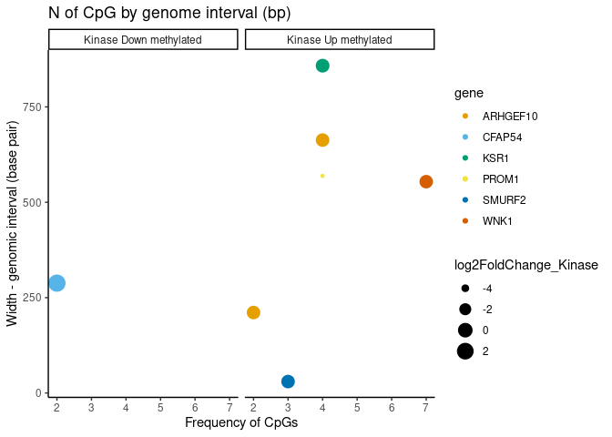
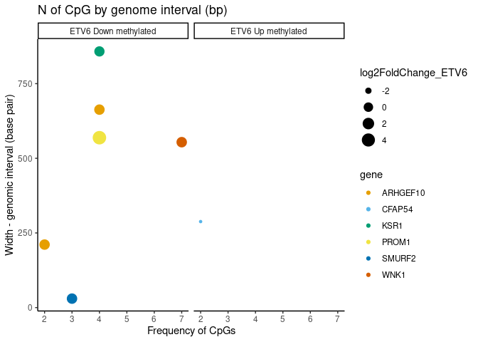

Streamline_RNA_DNA_Integration_ToRender.R
================
mmarcao
2025-02-07

``` r
library(dplyr)
library(minfi)
library(DMRcate)
library(Gviz)
library(RColorBrewer)
library(GenomicRanges)
library(rtracklayer)
library(HelpersMG)
library(data.table)


### Loading Differential Methylated Regions (DMRs) and Differential Expression Genes
dmr.table <- readRDS("/mnt/scratch1/maycon/Larissa_inffibrosarcoma/scripts_git/DNAmet/Round_2/reviewed_DM_direction/dmr_table.rds")
DEGs <- readRDS("/mnt/scratch1/maycon/Larissa_inffibrosarcoma/scripts_git/bulk_RNA/objects/Round2/reviewed_DEGs_direction/Volcano_Kinase_direction_DEGs_plot.rds")
DEGs$gene <- rownames(DEGs)


# Find intersecting genes within DMR-gene annotations and DEGs
# Get DMR-genes list  (making it a flat gene list)
dmr_genes <- dmr.table$overlapping.genes
list_chars <- list()
for(i in 1:length(dmr_genes)) {
  chars <- strsplit(dmr_genes, split = ",")[[i]]
  chars <- gsub(' ','', chars)
  list_chars[[i]] <- chars
  
}

dmr_genes <- as.vector(do.call(rbind, list_chars))
```

    ## Warning in rbind(...): number of columns of result is not a multiple
    ## of vector length (arg 34)

``` r
dmr_genes <- dmr_genes[!dmr_genes %in% NA]

# Get DEGs genes lits (making it a flat gene list)
deg_genes <- DEGs$gene
list_chars <- list()
for(i in 1:length(deg_genes)) {
  chars <- strsplit(deg_genes, split = ",")[[i]]
  chars <- gsub(' ','', chars)
  list_chars[[i]] <- chars
  
}

deg_genes <- as.vector(do.call(rbind, list_chars))
deg_genes <- deg_genes[!deg_genes %in% NA]

length(dmr_genes) #1556 genes (DMR-CpGs annoated to genes)
```

    ## [1] 1556

``` r
length(deg_genes) #617 genes (the DEGs them selves)
```

    ## [1] 617

``` r
length(intersect(dmr_genes,
                 deg_genes)) # 22 common genes  
```

    ## [1] 22

``` r
inters_genes <- intersect(dmr_genes,
                          deg_genes)


# Add regulation directions to the intersected genes
##### eg: gene A is in a hypo methylated region AND it's expression is up regulated

# inters_genes in DEGs - adding directions (up and down regulated)
DEGs_inter <- DEGs[DEGs$gene %in% inters_genes, ]
DEGs_inter$regulation <- NA
DEGs_inter[DEGs_inter$log2FoldChange > 0, ]$regulation <- "up"
DEGs_inter[DEGs_inter$log2FoldChange < 0, ]$regulation <- "down"

# inters_genes in DMRs - adding directions (up and down regulated)
subset_dmr_tables <- list()
for (i in seq_along(inters_genes)) {
  subset_dmr_tables[[i]] <- dmr.table[grepl(inters_genes[i], dmr.table$overlapping.genes), ]
}

dmr.table_inter <- do.call(rbind, subset_dmr_tables)
dmr.table_inter$regulation <- NA
dmr.table_inter[dmr.table_inter$meandiff > 0, ]$regulation <- "up"
dmr.table_inter[dmr.table_inter$meandiff < 0, ]$regulation <- "down"

# up-down DNAmet-RNAseq relation 
# Up methylated CpGs
up_1 <- dmr.table_inter[dmr.table_inter$regulation %in% "up", ]$overlapping.genes
# Down regulated DEGs
down_1 <- DEGs_inter[DEGs_inter$regulation %in% "down", ]$gene #right way
# down_1 <- DEGs_inter[DEGs_inter$regulation %in% "up", ]$gene #testing it - this way we will get the same DMRs-DEGs we got at first. It happened because I also updated the DEGs direction 

# up_1 - adjusting elements to 1 gene: 1 element
list_chars <- list()
for(i in 1:length(up_1)) {
  chars <- strsplit(up_1, split = ",")[[i]]
  chars <- gsub(' ','', chars)
  list_chars[[i]] <- chars
  
}

up_1 <- as.vector(do.call(rbind, list_chars))
```

    ## Warning in rbind(...): number of columns of result is not a multiple
    ## of vector length (arg 14)

``` r
up_1 <- up_1[!up_1 %in% NA]

# down_1 - adjusting elements to 1 gene: 1 element
list_chars <- list()
for(i in 1:length(down_1)) {
  chars <- strsplit(down_1, split = ",")[[i]]
  chars <- gsub(' ','', chars)
  list_chars[[i]] <- chars
  
}

down_1 <- as.vector(do.call(rbind, list_chars))
down_1 <- down_1[!down_1 %in% NA]

length(intersect(up_1, down_1)) # 5
```

    ## [1] 5

``` r
intersect(up_1, down_1) # "KSR1"     "WNK1"     "SMURF2"   "ARHGEF10" "PROM1"
```

    ## [1] "KSR1"     "WNK1"     "SMURF2"   "ARHGEF10" "PROM1"

``` r
# down-up DNAmet-RNAseq relation
# Down methylated CpGs
down_2 <- dmr.table_inter[dmr.table_inter$regulation %in% "down", ]$overlapping.genes
# Up regulated DEGs
up_2 <- DEGs_inter[DEGs_inter$regulation %in% "up", ]$gene #right way
# up_2 <- DEGs_inter[DEGs_inter$regulation %in% "down", ]$gene #testing it - this way we will get the same DMRs-DEGs we got at first. It happened because I also updated the DEGs direction 

# up_2
list_chars <- list()
for(i in 1:length(up_2)) {
  chars <- strsplit(up_2, split = ",")[[i]]
  chars <- gsub(' ','', chars)
  list_chars[[i]] <- chars
  
}

up_2 <- as.vector(do.call(rbind, list_chars))
up_2 <- up_2[!up_2 %in% NA]

# down_2
list_chars <- list()
for(i in 1:length(down_2)) {
  chars <- strsplit(down_2, split = ",")[[i]]
  chars <- gsub(' ','', chars)
  list_chars[[i]] <- chars
  
}

down_2 <- as.vector(do.call(rbind, list_chars))
down_2 <- down_2[!down_2 %in% NA]

length(intersect(up_2, down_2)) # 4
```

    ## [1] 4

``` r
intersect(up_2, down_2)  # "NOS1"   "GPT2"   "EFCAB6" "CFAP54" - after reviewing DMRs 
```

    ## [1] "NOS1"   "GPT2"   "EFCAB6" "CFAP54"

``` r
# Subset dmr_tables by interseted genes + inverse DNAmet-GeneExp correlation
# Eg: dmr region 1 that contains high expressed gene A (from RNA seq) and is hypomethylated. That way it would be reasonable to take that gene A could be under DNAmet regulation

subset_dmr_tables <- list()
inters_genes <- c(intersect(up_1, down_1), intersect(up_2, down_2))
inters_genes <- unique(inters_genes)
for (i in seq_along(inters_genes)) {
  subset_dmr_tables[[i]] <- dmr.table[grepl(inters_genes[i], dmr.table$overlapping.genes), ]
}

dmr.table_inter <- do.call(rbind, subset_dmr_tables)
dmr.table_inter$meth_status <- NA
dmr.table_inter[dmr.table_inter$meandiff > 0, ]$meth_status <- "hyper_methylated"
dmr.table_inter[dmr.table_inter$meandiff < 0, ]$meth_status <- "down_methylated"

# From dmr.table_inter$overlapping.genes, get the genes also present in DEG from RNAseq
DEGs[DEGs$gene%in% c('KSR1',
                     'WNK1',
                     'SMURF2',
                     'AC019257.8',
                     'ARHGEF10',
                     'FGFBP2',
                     'PROM1',
                     'NOS1',
                     'GPT2',
                     'EFCAB6-AS1',
                     'EFCAB6',
                     'CFAP54'), ]$gene # "NOS1"     "GPT2"     "EFCAB6"   "CFAP54"   "PROM1"    "WNK1"  "ARHGEF10" "SMURF2"   "KSR1"  
```

    ## [1] "NOS1"     "GPT2"     "EFCAB6"   "CFAP54"   "PROM1"    "WNK1"    
    ## [7] "ARHGEF10" "SMURF2"   "KSR1"

``` r
# Correct multiple genes names from  overlapping.genes
dmr.table_inter$gene <- NA
dmr.table_inter$gene <- dmr.table_inter$overlapping.genes
dmr.table_inter$gene[4] <- "ARHGEF10"
dmr.table_inter$gene[5] <- "ARHGEF10"
dmr.table_inter$gene[6] <- "PROM1"
dmr.table_inter$gene[9] <- "EFCAB6"

# add the FC values manually because there's one gene duplicated cause it has two DMRs methylated. So we can't merge it directly 
DEGs_in_DMR <- DEGs[DEGs$gene%in% c('KSR1',
                                    'WNK1',
                                    'SMURF2',
                                    'ARHGEF10',
                                    'PROM1',
                                    'NOS1',
                                    'GPT2',
                                    'EFCAB6',
                                    'CFAP54'), ]


FC_info <- DEGs_in_DMR[, c("log2FoldChange", "gene")]
dmr.table_inter <- merge(dmr.table_inter, FC_info, by = 'gene')

# dmr.table_inter$log2FoldChange[1] <- -0.7067505
# dmr.table_inter$log2FoldChange[2] <- -0.9193195
# dmr.table_inter$log2FoldChange[3] <- -0.8706579
# dmr.table_inter$log2FoldChange[4] <- -0.8719283 
# dmr.table_inter$log2FoldChange[5] <- -0.8719283 #same FC, yes. It's right
# dmr.table_inter$log2FoldChange[6] <- -4.4897163 
# dmr.table_inter$log2FoldChange[7] <- 3.8963369 
# dmr.table_inter$log2FoldChange[8] <- 1.4430567
# dmr.table_inter$log2FoldChange[9] <- 1.5324998
# dmr.table_inter$log2FoldChange[10] <- 2.5872476


### Visualization
my_colors <- c("#E69F00", "#56B4E9", "#009E73", "#F0E442", "#0072B2", "#D55E00", "#CC79A7", "#999999", "#8DD3C7", "#FFFFB3", "#BEBADA", "#FB8072", "#80B1D3", "#FDB462")

# Plot DMR-DEGs integration scatter plot


library(ggplot2); theme_set(theme_classic())
p <- ggplot(dmr.table_inter, aes(x = no.cpgs, y = width, col = gene, size = log2FoldChange)) +
  geom_point() +
  labs(
    title = "N of CpG by genome interval (bp)",
    x = "Frequency of CpGs",
    y = "Width - genomic interval (base pair)"
  ) +
  theme_classic() +
  scale_color_manual(values = my_colors) +
  facet_wrap(~ meth_status)


## Quciclky check up on DNAmet-GeneExp relationship [sanity check]
dmr.table_inter[dmr.table_inter$overlapping.genes %in% c('NOS1',
                                                         'GPT2',
                                                         'CFAP54'), ]$meandiff # meandiff negative
```

    ## [1] -0.27625759 -0.01385689 -0.09758494

``` r
DEGs[DEGs$gene%in% c('NOS1',
                     'GPT2',
                     'CFAP54'), ]$log2FoldChange #log2FoldChange positive
```

    ## [1] 3.896337 1.443057 2.587248

``` r
# So the directions are making sense. 


## Setting a minimum cutoff for $meandiff ~ 0.2 (by eye)

dmr.table_inter_filtered <- dmr.table_inter[dmr.table_inter$meandiff >= 0.16 |
                                              dmr.table_inter$meandiff <= -0.16, ]

names(dmr.table_inter_filtered)
```

    ##  [1] "gene"              "seqnames"          "start"            
    ##  [4] "end"               "width"             "strand"           
    ##  [7] "no.cpgs"           "min_smoothed_fdr"  "Stouffer"         
    ## [10] "HMFDR"             "Fisher"            "maxdiff"          
    ## [13] "meandiff"          "overlapping.genes" "meth_status"      
    ## [16] "log2FoldChange"

``` r
dmr.table_inter_filtered$meth_status_Kinase <- dmr.table_inter_filtered$meth_status

## Kinase visualization 
dmr.table_inter_filtered[dmr.table_inter_filtered$meth_status %in% "hyper_methylated", ]$meth_status_Kinase <- "Kinase Up methylated"
dmr.table_inter_filtered[dmr.table_inter_filtered$meth_status %in% "down_methylated", ]$meth_status_Kinase <- "Kinase Down methylated"

dmr.table_inter_filtered$log2FoldChange_Kinase <- NA
dmr.table_inter_filtered$log2FoldChange_Kinase <- dmr.table_inter_filtered$log2FoldChange


#png(filename = "/mnt/scratch1/maycon/Larissa_inffibrosarcoma/scripts_git/round_4/Plots/RNA_DNAmet_Kinase_related_genes_summary_plot.#png",  width = 8, height = 6, units = "in", res = 300)

library(ggplot2); theme_set(theme_classic())
p <- ggplot(dmr.table_inter_filtered, aes(x = no.cpgs, y = width, col = gene, size = log2FoldChange_Kinase)) +
  geom_point() +
  labs(
    title = "N of CpG by genome interval (bp)",
    x = "Frequency of CpGs",
    y = "Width - genomic interval (base pair)"
  ) +
  theme_classic() +
  scale_color_manual(values = my_colors) +
  facet_wrap(~ meth_status_Kinase)

print(p)
```

<!-- -->

``` r
#dev.off()


## ETV6 visualization 
dmr.table_inter_filtered$meth_status_ETV6 <- NA
dmr.table_inter_filtered[dmr.table_inter_filtered$meth_status %in% "hyper_methylated", ]$meth_status_ETV6 <- "ETV6 Down methylated"
dmr.table_inter_filtered[dmr.table_inter_filtered$meth_status %in% "down_methylated", ]$meth_status_ETV6 <- "ETV6 Up methylated"

dmr.table_inter_filtered$log2FoldChange_ETV6 <- NA
dmr.table_inter_filtered$log2FoldChange_ETV6 <- dmr.table_inter_filtered$log2FoldChange * -1


#png(filename = "/mnt/scratch1/maycon/Larissa_inffibrosarcoma/scripts_git/round_4/Plots/RNA_DNAmet_ETV6_related_genes_summary_plot.#png",  width = 8, height = 6, units = "in", res = 300)

library(ggplot2); theme_set(theme_classic())
p <- ggplot(dmr.table_inter_filtered, aes(x = no.cpgs, y = width, col = gene, size = log2FoldChange_ETV6)) +
  geom_point() +
  labs(
    title = "N of CpG by genome interval (bp)",
    x = "Frequency of CpGs",
    y = "Width - genomic interval (base pair)"
  ) +
  theme_classic() +
  scale_color_manual(values = my_colors) +
  facet_wrap(~ meth_status_ETV6)

print(p)
```

<!-- -->

``` r
#dev.off()


## A summary table for the RNA-DNAmet integration 
dmr.table_inter_filtered[, c("gene",
                             "meandiff",
                             "maxdiff",
                             "meth_status",
                             "log2FoldChange")]
```

    ##        gene   meandiff    maxdiff      meth_status log2FoldChange
    ## 1  ARHGEF10  0.1968445  0.3527638 hyper_methylated     -0.8719283
    ## 2  ARHGEF10  0.2978963  0.3154143 hyper_methylated     -0.8719283
    ## 3    CFAP54 -0.2762576 -0.3474128  down_methylated      2.5872476
    ## 6      KSR1  0.1829273  0.3239731 hyper_methylated     -0.7067505
    ## 8     PROM1  0.1715747  0.3253250 hyper_methylated     -4.4897163
    ## 9    SMURF2  0.2195195  0.2492091 hyper_methylated     -0.8706579
    ## 10     WNK1  0.1691830  0.3281399 hyper_methylated     -0.9193195

``` r
# Export table with the most reasonable targets to have their exp. regulated by DNA methylation

## Kinase summary table 
summ_table_Kinase <- dmr.table_inter_filtered[, c("gene",
                                                  "meandiff",
                                                  "maxdiff",
                                                  "meth_status_Kinase",
                                                  "log2FoldChange_Kinase")]

summ_table_Kinase$expression_status <- NA
summ_table_Kinase[summ_table_Kinase$log2FoldChange_Kinase < 0, ]$expression_status <- "down_expressed"
summ_table_Kinase[summ_table_Kinase$log2FoldChange_Kinase > 0, ]$expression_status <- "up_expressed"

summ_table_Kinase$Group_direction <- "Kinase"

names(summ_table_Kinase)[names(summ_table_Kinase) == "meandiff"] <- "meandiff_DNAmet"
names(summ_table_Kinase)[names(summ_table_Kinase) == "maxdiff"] <- "maxdiff_DNAmet"


## ETV6 summary table 
summ_table_ETV6 <- dmr.table_inter_filtered[, c("gene",
                                                "meandiff",
                                                "maxdiff",
                                                "meth_status_ETV6",
                                                "log2FoldChange_ETV6")]

summ_table_ETV6$expression_status <- NA
summ_table_ETV6[summ_table_ETV6$log2FoldChange_ETV6 < 0, ]$expression_status <- "down_expressed"
summ_table_ETV6[summ_table_ETV6$log2FoldChange_ETV6 > 0, ]$expression_status <- "up_expressed"

summ_table_ETV6$Group_direction <- "ETV6"

names(summ_table_ETV6)[names(summ_table_ETV6) == "meandiff"] <- "meandiff_DNAmet"
names(summ_table_ETV6)[names(summ_table_ETV6) == "maxdiff"] <- "maxdiff_DNAmet"


# # #save .csv file with target genes to send to Larissa
#write.csv(summ_table_Kinase, file = "/mnt/scratch1/maycon/Larissa_inffibrosarcoma/scripts_git/round_4/Objects/RNA_DNAmet_Kinase_oriented_related_genes.csv")

#write.csv(summ_table_ETV6, file = "/mnt/scratch1/maycon/Larissa_inffibrosarcoma/scripts_git/round_4/Objects/RNA_DNAmet_ETV6_oriented_related_genes.csv")

# END.


print(sessionInfo())
```

    ## R version 4.3.1 (2023-06-16)
    ## Platform: x86_64-pc-linux-gnu (64-bit)
    ## Running under: Ubuntu 22.04.3 LTS
    ## 
    ## Matrix products: default
    ## BLAS:   /usr/lib/x86_64-linux-gnu/atlas/libblas.so.3.10.3 
    ## LAPACK: /usr/lib/x86_64-linux-gnu/atlas/liblapack.so.3.10.3;  LAPACK version 3.10.0
    ## 
    ## locale:
    ##  [1] LC_CTYPE=en_US.UTF-8       LC_NUMERIC=C              
    ##  [3] LC_TIME=en_US.UTF-8        LC_COLLATE=en_US.UTF-8    
    ##  [5] LC_MONETARY=en_US.UTF-8    LC_MESSAGES=en_US.UTF-8   
    ##  [7] LC_PAPER=en_US.UTF-8       LC_NAME=C                 
    ##  [9] LC_ADDRESS=C               LC_TELEPHONE=C            
    ## [11] LC_MEASUREMENT=en_US.UTF-8 LC_IDENTIFICATION=C       
    ## 
    ## time zone: Etc/UTC
    ## tzcode source: system (glibc)
    ## 
    ## attached base packages:
    ##  [1] grid      parallel  stats4    stats     graphics  grDevices
    ##  [7] utils     datasets  methods   base     
    ## 
    ## other attached packages:
    ##  [1] rstatix_0.7.2                                      
    ##  [2] sesameData_1.20.0                                  
    ##  [3] ELMER_2.26.0                                       
    ##  [4] ELMER.data_2.26.0                                  
    ##  [5] readr_2.1.5                                        
    ##  [6] DMRcatedata_2.20.3                                 
    ##  [7] ExperimentHub_2.10.0                               
    ##  [8] AnnotationHub_3.10.0                               
    ##  [9] BiocFileCache_2.10.1                               
    ## [10] dbplyr_2.4.0                                       
    ## [11] exactRankTests_0.8-35                              
    ## [12] Rtsne_0.17                                         
    ## [13] shinyMethyl_1.38.0                                 
    ## [14] IlluminaHumanMethylationEPICanno.ilm10b4.hg19_0.6.0
    ## [15] IlluminaHumanMethylationEPICmanifest_0.3.0         
    ## [16] BiocManager_1.30.22                                
    ## [17] data.table_1.15.4                                  
    ## [18] HelpersMG_6.1                                      
    ## [19] Matrix_1.6-5                                       
    ## [20] coda_0.19-4.1                                      
    ## [21] rlang_1.1.4                                        
    ## [22] MASS_7.3-60                                        
    ## [23] rtracklayer_1.62.0                                 
    ## [24] Gviz_1.46.1                                        
    ## [25] DMRcate_2.16.1                                     
    ## [26] minfi_1.48.0                                       
    ## [27] bumphunter_1.44.0                                  
    ## [28] locfit_1.5-9.8                                     
    ## [29] iterators_1.0.14                                   
    ## [30] foreach_1.5.2                                      
    ## [31] Biostrings_2.70.2                                  
    ## [32] XVector_0.42.0                                     
    ## [33] corrplot_0.92                                      
    ## [34] RColorBrewer_1.1-3                                 
    ## [35] pheatmap_1.0.12                                    
    ## [36] clusterProfiler_4.10.1                             
    ## [37] UpSetR_1.4.0                                       
    ## [38] org.Hs.eg.db_3.18.0                                
    ## [39] AnnotationDbi_1.64.1                               
    ## [40] EnhancedVolcano_1.13.2                             
    ## [41] ggrepel_0.9.5                                      
    ## [42] ggplot2_3.5.1                                      
    ## [43] stringr_1.5.1                                      
    ## [44] dplyr_1.1.4                                        
    ## [45] sva_3.50.0                                         
    ## [46] BiocParallel_1.36.0                                
    ## [47] genefilter_1.84.0                                  
    ## [48] mgcv_1.9-0                                         
    ## [49] nlme_3.1-162                                       
    ## [50] DESeq2_1.42.0                                      
    ## [51] SummarizedExperiment_1.32.0                        
    ## [52] Biobase_2.62.0                                     
    ## [53] MatrixGenerics_1.14.0                              
    ## [54] matrixStats_1.4.1                                  
    ## [55] GenomicRanges_1.54.1                               
    ## [56] GenomeInfoDb_1.38.8                                
    ## [57] IRanges_2.36.0                                     
    ## [58] S4Vectors_0.40.2                                   
    ## [59] BiocGenerics_0.48.1                                
    ## 
    ## loaded via a namespace (and not attached):
    ##   [1] igraph_2.0.3                                      
    ##   [2] plotly_4.10.4                                     
    ##   [3] Formula_1.2-5                                     
    ##   [4] scater_1.30.1                                     
    ##   [5] zlibbioc_1.48.0                                   
    ##   [6] rvest_1.0.4                                       
    ##   [7] tidyselect_1.2.1                                  
    ##   [8] bit_4.0.5                                         
    ##   [9] doParallel_1.0.17                                 
    ##  [10] clue_0.3-65                                       
    ##  [11] lattice_0.21-8                                    
    ##  [12] rjson_0.2.21                                      
    ##  [13] nor1mix_1.3-2                                     
    ##  [14] blob_1.2.4                                        
    ##  [15] rngtools_1.5.2                                    
    ##  [16] S4Arrays_1.2.0                                    
    ##  [17] base64_2.0.1                                      
    ##  [18] dichromat_2.0-0.1                                 
    ##  [19] scrime_1.3.5                                      
    ##  [20] png_0.1-8                                         
    ##  [21] cli_3.6.3                                         
    ##  [22] ggplotify_0.1.2                                   
    ##  [23] ProtGenerics_1.34.0                               
    ##  [24] askpass_1.2.0                                     
    ##  [25] MultiAssayExperiment_1.28.0                       
    ##  [26] multtest_2.58.0                                   
    ##  [27] openssl_2.2.1                                     
    ##  [28] BiocIO_1.12.0                                     
    ##  [29] bluster_1.12.0                                    
    ##  [30] purrr_1.0.2                                       
    ##  [31] BiocNeighbors_1.20.2                              
    ##  [32] shadowtext_0.1.3                                  
    ##  [33] curl_5.2.2                                        
    ##  [34] mime_0.12                                         
    ##  [35] evaluate_0.23                                     
    ##  [36] tidytree_0.4.6                                    
    ##  [37] ComplexHeatmap_2.18.0                             
    ##  [38] stringi_1.8.4                                     
    ##  [39] backports_1.4.1                                   
    ##  [40] BioQC_1.30.0                                      
    ##  [41] SpatialFeatureExperiment_1.4.0                    
    ##  [42] XML_3.99-0.17                                     
    ##  [43] httpuv_1.6.15                                     
    ##  [44] magrittr_2.0.3                                    
    ##  [45] rappdirs_0.3.3                                    
    ##  [46] splines_4.3.1                                     
    ##  [47] mclust_6.1                                        
    ##  [48] jpeg_0.1-10                                       
    ##  [49] doRNG_1.8.6                                       
    ##  [50] ggraph_2.2.1                                      
    ##  [51] wk_0.9.1                                          
    ##  [52] ggbeeswarm_0.7.2                                  
    ##  [53] bsseq_1.38.0                                      
    ##  [54] DBI_1.2.3                                         
    ##  [55] terra_1.7-71                                      
    ##  [56] HDF5Array_1.30.1                                  
    ##  [57] jquerylib_0.1.4                                   
    ##  [58] withr_3.0.0                                       
    ##  [59] class_7.3-22                                      
    ##  [60] enrichplot_1.22.0                                 
    ##  [61] ggnewscale_0.4.10                                 
    ##  [62] tidygraph_1.3.1                                   
    ##  [63] htmlwidgets_1.6.4                                 
    ##  [64] fs_1.6.4                                          
    ##  [65] biomaRt_2.58.2                                    
    ##  [66] SingleCellExperiment_1.24.0                       
    ##  [67] missMethyl_1.36.0                                 
    ##  [68] labeling_0.4.3                                    
    ##  [69] SparseArray_1.2.4                                 
    ##  [70] cellranger_1.1.0                                  
    ##  [71] annotate_1.80.0                                   
    ##  [72] VariantAnnotation_1.48.1                          
    ##  [73] knitr_1.46                                        
    ##  [74] beanplot_1.3.1                                    
    ##  [75] fansi_1.0.6                                       
    ##  [76] Voyager_1.4.0                                     
    ##  [77] patchwork_1.2.0                                   
    ##  [78] ggtree_3.10.1                                     
    ##  [79] rhdf5_2.46.1                                      
    ##  [80] R.oo_1.26.0                                       
    ##  [81] RSpectra_0.16-1                                   
    ##  [82] irlba_2.3.5.1                                     
    ##  [83] gridGraphics_0.5-1                                
    ##  [84] lazyeval_0.2.2                                    
    ##  [85] yaml_2.3.8                                        
    ##  [86] survival_3.5-5                                    
    ##  [87] SpatialExperiment_1.12.0                          
    ##  [88] BiocVersion_3.18.1                                
    ##  [89] crayon_1.5.3                                      
    ##  [90] TCGAbiolinksGUI.data_1.22.0                       
    ##  [91] tidyr_1.3.1                                       
    ##  [92] tweenr_2.0.3                                      
    ##  [93] later_1.3.2                                       
    ##  [94] TCGAbiolinks_2.30.0                               
    ##  [95] codetools_0.2-19                                  
    ##  [96] base64enc_0.1-3                                   
    ##  [97] GlobalOptions_0.1.2                               
    ##  [98] KEGGREST_1.42.0                                   
    ##  [99] shape_1.4.6.1                                     
    ## [100] limma_3.58.1                                      
    ## [101] Rsamtools_2.18.0                                  
    ## [102] filelock_1.0.3                                    
    ## [103] foreign_0.8-82                                    
    ## [104] pkgconfig_2.0.3                                   
    ## [105] IlluminaHumanMethylation450kanno.ilmn12.hg19_0.6.1
    ## [106] ggpubr_0.6.0                                      
    ## [107] xml2_1.3.6                                        
    ## [108] GenomicAlignments_1.38.2                          
    ## [109] aplot_0.2.2                                       
    ## [110] BSgenome_1.70.2                                   
    ## [111] ape_5.7-1                                         
    ## [112] viridisLite_0.4.2                                 
    ## [113] biovizBase_1.50.0                                 
    ## [114] xtable_1.8-4                                      
    ## [115] interp_1.1-6                                      
    ## [116] coop_0.6-3                                        
    ## [117] car_3.1-2                                         
    ## [118] highr_0.11                                        
    ## [119] plyr_1.8.9                                        
    ## [120] httr_1.4.7                                        
    ## [121] tools_4.3.1                                       
    ## [122] broom_1.0.5                                       
    ## [123] beeswarm_0.4.0                                    
    ## [124] htmlTable_2.4.2                                   
    ## [125] checkmate_2.3.1                                   
    ## [126] HDO.db_0.99.1                                     
    ## [127] digest_0.6.37                                     
    ## [128] permute_0.9-7                                     
    ## [129] farver_2.1.2                                      
    ## [130] tzdb_0.4.0                                        
    ## [131] AnnotationFilter_1.26.0                           
    ## [132] reshape2_1.4.4                                    
    ## [133] yulab.utils_0.1.4                                 
    ## [134] viridis_0.6.5                                     
    ## [135] rpart_4.1.19                                      
    ## [136] glue_1.7.0                                        
    ## [137] cachem_1.1.0                                      
    ## [138] polyclip_1.10-6                                   
    ## [139] Hmisc_5.1-1                                       
    ## [140] generics_0.1.3                                    
    ## [141] classInt_0.4-10                                   
    ## [142] spdep_1.3-3                                       
    ## [143] statmod_1.5.0                                     
    ## [144] ScaledMatrix_1.10.0                               
    ## [145] carData_3.0-5                                     
    ## [146] GEOquery_2.70.0                                   
    ## [147] vroom_1.6.5                                       
    ## [148] gson_0.1.0                                        
    ## [149] utf8_1.2.4                                        
    ## [150] siggenes_1.76.0                                   
    ## [151] graphlayouts_1.1.1                                
    ## [152] gtools_3.9.5                                      
    ## [153] readxl_1.4.3                                      
    ## [154] preprocessCore_1.64.0                             
    ## [155] ggsignif_0.6.4                                    
    ## [156] gridExtra_2.3                                     
    ## [157] shiny_1.8.1.1                                     
    ## [158] GenomeInfoDbData_1.2.11                           
    ## [159] R.utils_2.12.3                                    
    ## [160] rhdf5filters_1.14.1                               
    ## [161] RCurl_1.98-1.16                                   
    ## [162] memoise_2.0.1                                     
    ## [163] rmarkdown_2.29                                    
    ## [164] downloader_0.4                                    
    ## [165] scales_1.3.0                                      
    ## [166] R.methodsS3_1.8.2                                 
    ## [167] reshape_0.8.9                                     
    ## [168] illuminaio_0.44.0                                 
    ## [169] rstudioapi_0.16.0                                 
    ## [170] cluster_2.1.4                                     
    ## [171] hms_1.1.3                                         
    ## [172] munsell_0.5.1                                     
    ## [173] cowplot_1.1.3                                     
    ## [174] colorspace_2.1-0                                  
    ## [175] quadprog_1.5-8                                    
    ## [176] s2_1.1.6                                          
    ## [177] DelayedMatrixStats_1.24.0                         
    ## [178] sparseMatrixStats_1.14.0                          
    ## [179] ggforce_0.4.2                                     
    ## [180] circlize_0.4.16                                   
    ## [181] scuttle_1.12.0                                    
    ## [182] xfun_0.44                                         
    ## [183] e1071_1.7-14                                      
    ## [184] abind_1.4-5                                       
    ## [185] GOSemSim_2.28.1                                   
    ## [186] tibble_3.2.1                                      
    ## [187] interactiveDisplayBase_1.40.0                     
    ## [188] treeio_1.26.0                                     
    ## [189] Rhdf5lib_1.24.2                                   
    ## [190] bitops_1.0-8                                      
    ## [191] promises_1.3.0                                    
    ## [192] scatterpie_0.2.1                                  
    ## [193] RSQLite_2.3.7                                     
    ## [194] qvalue_2.34.0                                     
    ## [195] fgsea_1.28.0                                      
    ## [196] DelayedArray_0.28.0                               
    ## [197] proxy_0.4-27                                      
    ## [198] GO.db_3.18.0                                      
    ## [199] compiler_4.3.1                                    
    ## [200] prettyunits_1.2.0                                 
    ## [201] boot_1.3-28                                       
    ## [202] beachmat_2.18.1                                   
    ## [203] scico_1.5.0                                       
    ## [204] Rcpp_1.0.13                                       
    ## [205] edgeR_4.0.16                                      
    ## [206] BiocSingular_1.18.0                               
    ## [207] units_0.8-5                                       
    ## [208] progress_1.2.3                                    
    ## [209] R6_2.5.1                                          
    ## [210] fastmap_1.2.0                                     
    ## [211] fastmatch_1.1-4                                   
    ## [212] vipor_0.4.7                                       
    ## [213] ensembldb_2.26.0                                  
    ## [214] rsvd_1.0.5                                        
    ## [215] nnet_7.3-19                                       
    ## [216] gtable_0.3.5                                      
    ## [217] KernSmooth_2.23-22                                
    ## [218] latticeExtra_0.6-30                               
    ## [219] deldir_2.0-4                                      
    ## [220] htmltools_0.5.8.1                                 
    ## [221] bit64_4.0.5                                       
    ## [222] lifecycle_1.0.4                                   
    ## [223] sf_1.0-16                                         
    ## [224] spData_2.3.0                                      
    ## [225] restfulr_0.0.15                                   
    ## [226] sass_0.4.9                                        
    ## [227] vctrs_0.6.5                                       
    ## [228] DOSE_3.28.2                                       
    ## [229] ggfun_0.1.4                                       
    ## [230] sp_2.1-4                                          
    ## [231] bslib_0.7.0                                       
    ## [232] pillar_1.9.0                                      
    ## [233] GenomicFeatures_1.54.3                            
    ## [234] magick_2.8.3                                      
    ## [235] jsonlite_1.8.8                                    
    ## [236] GetoptLong_1.0.5
